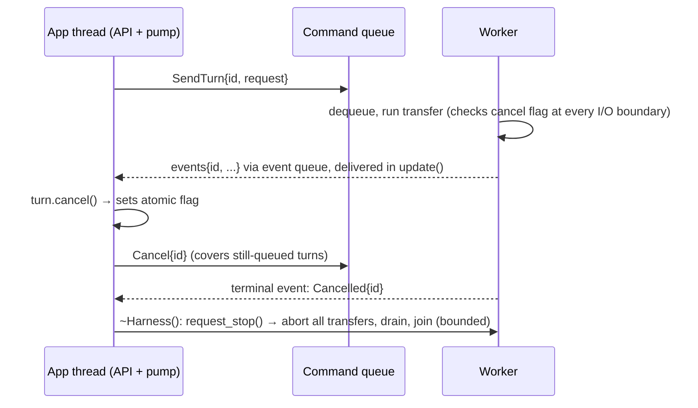

# Scry — Architectural Patterns & Implementation Practices

Companion to [DESIGN.md](DESIGN.md). That document says *what* the pieces are; this one says *how* each piece is built — the C++ design patterns, idioms, and practices we commit to, and why. Deliberately no class listings or method signatures; the public headers are the API source of truth.

---

## 1. Library-Wide Principles

These apply everywhere and settle arguments before they start.

**Value semantics at the boundary, explicit ownership inside.** Public types are
cheap-to-move value types or lightweight handles. Exclusively owned resources
use `std::unique_ptr` or dedicated RAII wrappers. Shared lifetime is deliberate
and enumerated: command/event queues and the per-turn cancellation flag cross
the worker boundary; a Conversation handle and its live pump route share
Conversation state; and a pump-side registration route is owned by the Harness
and observed weakly by the Turn handle. ADR 0009 adds no shared handler:
worker-mode callables move once into worker ownership. Raw pointers are
non-owning observers only, never stored across a suspension point.

**Rule of Zero.** Types define no special member functions unless they manage a resource directly; resource management is pushed into dedicated RAII wrappers (curl handles, threads, queues) so everything above them defaults.

**PImpl on stateful handles; plain values for contracts.** The four stateful handle types (Conversation, ToolRegistry, Turn, Harness) hold a single pointer to an implementation — ABI stays stable across internal refactors, and compile-time cost for consumers stays flat. Everything else the user touches is an ordinary value type: configuration aggregates (designated-initializer friendly), errors, options, enums, event payloads, and the Scry-owned JSON boundary type. The binding rule underneath both is: **no third-party types in public headers, ever** (enforced by include audit). `Harness` is constructed directly from `Config` and is the single owner of provider/auth/connection state; a separate Client handle would add lifetime ambiguity without an independent responsibility. The indirection cost is irrelevant next to network latency — this library's hot path is measured in milliseconds, not nanoseconds.

**No singletons, no globals, no static init order problems.** Everything hangs off a `Harness` instance. Two harnesses in one process (e.g., different providers) must just work. The one unavoidable global — libcurl's `curl_global_init` — is wrapped in a reference-counted RAII guard (Meyers-style function-local static, initialized on first Harness).

**Semantic failures are values; callback exceptions stay synchronous.** Internals may use whatever is idiomatic for the dependency at hand, but Scry-originated semantic and operational failures never throw across the public boundary. Immediate rejection reports through `std::expected`; failure after a turn is accepted reports through its `on_error` callback. Allocation and standard-library construction failure (`std::bad_alloc`) are **excluded from the contract** — we do not pretend to survive OOM, and smearing `noexcept`+expected over every allocating call would buy nothing. Two hard rules stand regardless: nothing ever throws *across* the worker/main thread boundary, and tool-handler exceptions are caught at the dispatch site and converted into tool-error results returned to the model. User callbacks should not throw; if one does, the exception propagates synchronously out of `update()` to the app with the Harness left in a valid state and the event counted as delivered (see §3).

**Concepts over inheritance in templates, interfaces only at seams.** Virtual dispatch appears in exactly two places (provider adapter, transport — §6, §7), both internal. The public API has no inheritable types; extension points are callables and config, not subclassing.

**C++ standard posture.** Core library targets C++23 (`std::expected`, deducing
this where useful). Callable boundaries use Scry's small move-only
`UniqueFunction` because supported macOS standard libraries do not yet
consistently ship `std::move_only_function`; the boundary remains move-only
rather than silently becoming copy-only on one platform. The implemented M3
reflection layer remains an isolated, severable C++26 component (see §5) and
is not part of the stable runtime surface.

## 2. The Concurrency Architecture: Actor, Not Locks

The single most important structural decision. The worker thread is an
**actor**: it exclusively owns all mutable networking and loop state, and (bar
the per-turn cancellation atomic, §3) the only way anything crosses the thread
boundary is **message passing** through two queues. The live commands cover
send, cancel, tool result, worker-handler registration/execution, and shutdown;
events cover deltas, tool requests, worker-result acknowledgements,
completions, and errors. ADR 0009 added those M4 worker messages to the existing
queues, not another channel.

Practices that follow:

- **Enumerated shared state, no user-visible locks.** There is no mutex a user callback can deadlock against. Exactly three things are shared across the thread boundary, all internally synchronized: the command queue, the event queue, and one atomic cancellation flag per turn. Nothing else — worker-side state and pump-side state are exclusively owned (ownership table in §3), and the worker addresses turns only by immutable `TurnId`. Pump-side objects may share lifetime with other pump-side objects; shared ownership does not make them cross-thread state. This enumeration *is* the invariant TSan enforces; anything not on the list found crossing threads is a bug by definition.
- **Messages are immutable values.** Commands and events are `std::variant` of small structs, moved (never copied) through the queue. Variant + `std::visit` gives exhaustive handling — adding an event type breaks the build until every consumer handles it. This is the same closed-set-of-alternatives reasoning that picks variant over inheritance everywhere in this codebase.
- **Queue implementation: boring first.** Mutex + `std::deque` + condition variable, wrapped behind our own minimal interface so a lock-free MPSC queue can be swapped in *if profiling ever demands it*. Premature lock-free is how libraries acquire unfixable bugs.
- **Two cancellation mechanisms, deliberately separate.** The worker's `std::jthread` `stop_token` means one thing only: **Harness shutdown**. Per-turn cancellation is a distinct per-turn `std::atomic<bool>`, checked at every I/O boundary and plumbed into transport progress callbacks. Both are cooperative, never `pthread_cancel`-style. Conflating them was an early ambiguity: shutdown must abort *all* turns and join; cancelling one turn must not disturb its neighbors.
- **The pump is the contract.** `update()` drains the event queue and invokes callbacks on the calling thread, under an optional time budget (deadline-checked between events, excess rolls to the next tick). Because *all* callbacks fire there, user code is single-threaded by construction. This is the harness's most sacred invariant; everything else may change.
- **Backpressure by design.** Streaming deltas are coalesced worker-side (one aggregated text event per pump interval, not per token) so a fast stream cannot flood the queue or starve the frame budget. Coalescing is not the memory bound: configurable byte ceilings on pending turns, per-turn queued events, responses, tool payloads, and conversations are the hard limits.

**Blocking-mode escape hatch:** a synchronous `send`-and-wait exists for CLI tools and tests, implemented *on top of* the async machinery (pump-until-complete internally), never as a second code path.

## 3. Turn Ownership, Lifecycle, and the Handle Pattern

A `Turn` is a **handle**: a move-only PImpl value holding an immutable `TurnId`, a shared reference to the turn's cancellation flag, and a weak route to pump-side registration state — *not* the worker's turn state itself. The weak route makes callback registration and queued-turn cancellation safe when a Turn outlives its Harness: registration returns `invalid_state`, while `cancel()` remains a harmless atomic operation. Copying a handle to in-flight work invites double-cancel ambiguity, hence move-only. This is the `std::future`/`std::stop_source` school: small, thread-safe by narrowness, no behavior hidden in destructors beyond a documented detach.

### Ownership table (implemented invariant)

These rows describe the live M4 system, including ADR 0009 worker-tool
ownership.

| State | Exclusive owner | Notes |
|---|---|---|
| Transport handles, curl state, wire buffers, SSE parser state | Worker | Never visible to any other thread |
| Loop state machines (per turn) | Worker | Addressed by `TurnId` |
| Callback registrations, buffered undelivered events per turn, Turn registration routes | Pump side (Harness main-thread state) | Written/read only inside API calls and `update()`; handles observe routes weakly |
| Conversation contents | App thread via pump | A live route retains shared lifetime on the pump side; contents are mutated only at terminal-event delivery |
| Tool definitions and execution modes | Pump side; immutable per accepted turn | Worker commands receive neutral schemas plus worker tool names/modes, never the live registry |
| App-thread tool handlers | Pump side; immutable per accepted turn | Invoked only by `update()` |
| Worker-thread tool handlers (M4) | Worker table after one FIFO move | Never shared back; registration precedes later send commands |
| Worker-call route gate and acknowledged-result accounting (M4) | Pump side | Pauses later batch calls until the worker machine accepts the result |
| Command queue, event queue | Shared, internally synchronized | Sanctioned crossing points |
| Per-turn cancel flag (`atomic<bool>`) | Shared | Third sanctioned crossing point |
| `TurnId` | Immutable value | Freely copied everywhere |

The worker never touches callbacks or buffers; it emits events tagged with `TurnId`. The pump owns routing, buffering, and delivery. This split is what makes the §2 enumeration true.

### Send / cancel / shutdown



### Turn lifecycle (normative)

```mermaid
stateDiagram-v2
    [*] --> Queued: send()
    Queued --> AwaitingModel: worker picks up (FIFO)
    Queued --> Cancelled: cancel() before start (no I/O ever issued)
    AwaitingModel --> Streaming: first content event
    AwaitingModel --> Completed
    AwaitingModel --> AwaitingTool: valid tool-use response
    AwaitingModel --> RetryWait: retryable failure before semantic output
    RetryWait --> AwaitingModel: retry wake
    RetryWait --> Failed: retry/elapsed cap reached
    RetryWait --> Cancelled: cancel()
    Streaming --> Completed
    Streaming --> AwaitingTool: valid tool-use response
    AwaitingTool --> AwaitingModel: all ordered results ready; resend
    AwaitingTool --> Failed: framework tool-execution failure
    AwaitingTool --> Cancelled: cancel()
    AwaitingModel --> Failed
    Streaming --> Failed
    AwaitingModel --> Cancelled
    Streaming --> Cancelled
    Completed --> [*]
    Failed --> [*]
    Cancelled --> [*]
```



This is the implemented M2 lifecycle. `AwaitingTool` extends the original chat
states: one valid assistant tool-call batch enters it, every result is retained
in provider order, and the final result starts the next model request
automatically. Tool-round limits and malformed batches fail before handlers are
published. The worker admits every call in one response to the event queue as
one atomic batch, so queue pressure can never expose a dispatchable prefix.
Once the pump observes a fatal framework dispatch failure, it latches that
terminal path and suppresses every later handler in the batch.

The machine also carries the Conversation's remaining payload budget across
the entire exchange. It reserves each assistant tool-call message, each tool
result, and the final assistant message before dispatch, resend, or commit.
Crossing the cumulative bound therefore fails the turn without partially
committing history; resource errors retain the provider request ID that was
available at the failing response boundary.

While the Harness remains alive, exactly one observable terminal event is
delivered per accepted turn — never zero, never two. Harness destruction is the
explicit exception: shutdown aborts work and discards undelivered events, so it
does not expose teardown callbacks. The remaining lifecycle contracts, each of
which is a numbered requirement:

- **Conversation commits are transactional.** History is mutated only by the pump at terminal-event delivery: `Completed` commits the full exchange (user message, all tool rounds, final answer) atomically; `Failed`/`Cancelled` commit nothing. This keeps Conversation retry/resubmission mechanically clean, but does not make external handler side effects reversible or idempotent; side-effecting schemas need app-owned operation keys and reconciliation (DESIGN.md §8).
- **Detach semantics.** Dropping the handle detaches: the turn runs to termination, the Conversation still commits on completion, and callbacks already registered in the Harness continue to receive events. Unclaimed buffered events may be discarded once no Turn handle remains; dropping loses future control and registration, not callbacks already registered.
- **Late attachment.** While the handle remains attached, callbacks registered after events began arriving receive buffered prior events in order — no races, no missed deltas within configured buffer limits.
- **Reentrancy.** Callbacks may call `send`, `cancel`, and registration APIs.
  Reentrant `update()` performs no work and reports
  `UpdateStats::reentrant_update_rejected`; it never recurses into callback
  delivery. Accepted turns snapshot immutable registry records, so later or
  reentrant changes affect subsequent turns rather than in-flight ones.
- **Non-preemption.** The `update()` budget is a soft deadline checked *between* callbacks; an individual callback or tool handler is never preempted and may overrun the budget. The budget bounds Scry's scheduling, not user code.
- **Callback exceptions** propagate out of `update()` with the harness valid and the event counted delivered (§1).
- **Callback arguments are borrowed** for the invocation only; apps copy values or text views they retain.
- **Shutdown.** `~Harness()` cancels all turns, aborts Scry-owned transport
  waits within their configured bound, joins the worker, and discards
  undelivered events. No callback ever fires after destruction begins. An M4
  worker-mode application handler is non-preemptive and excluded from that
  Scry-owned bound: opting in carries an application MUST that it return within
  the application's teardown requirement. The destructor cannot safely force
  arbitrary C++ user code to stop and joins after it returns.

### Conversation persistence

Persistence is a public serialization boundary, not a storage subsystem.
`Conversation::to_json()` emits a canonical versioned document containing the
system prompt and committed neutral messages; `Conversation::from_json()`
strictly validates and restores it. Text, tool-call, and tool-result blocks
round-trip without provider wire shapes or Glaze types. Busy state, callbacks,
turn IDs, registry snapshots, and every uncommitted round are intentionally
excluded. The app owns encryption, files/databases, retention, and migration
between future document versions.

## 4. The Agentic Loop: Sans-I/O State Machine

The loop engine — the heart of the library — is written **sans-I/O**: a pure state machine that consumes events (*provider replied with content or a tool call*, *tool result ready*, *stream ended*, *transport failed*) and emits commands (*issue this request*, *run this tool*, *deliver this to the app*), and performs **no I/O itself**. The implemented machine covers chat, retry, cancellation, tool-await, and multi-round completion. The worker thread is a thin driver that feeds it transport events and executes its commands.

Why this is the hill to defend:

- **Testability without a network.** The full agentic loop — multi-round tool use, retries, cancellation mid-tool-call, malformed model output — is tested by feeding event sequences and asserting command sequences. Deterministic, sub-millisecond tests for the most complex logic in the system.
- **Replayability.** A recorded event log reproduces any bug exactly. Given how nondeterministic LLM behavior is, deterministic *harness* behavior is the only debuggable posture.
- **The state machine is explicit, not emergent.** States (queued, awaiting-model, streaming, retry-wait, awaiting-tool, and terminal) are a variant/enum with the transition diagram above, not an implicit property of nested callbacks. An event that is illegal in the current state returns a diagnostic without mutating state or emitting commands, making integration failures observable without relying on debug-only assertions.

Retry policy (backoff + jitter) is machine state driven by *time events*
injected by the driver — the machine never sleeps, it requests "wake me at
T." Attempt and elapsed caps reset for each model request, while completion
reports aggregate attempts and usage across the whole tool loop.

## 5. Tool Registry: Type Erasure Below, Reflection Above in M3

Two layers, one table (as settled in DESIGN.md §8):

**Lower layer — type erasure.** A registered tool is a record: name, description, schema (JSON string), and a type-erased callable (`json → expected<json, error>` in spirit; Scry's `UniqueFunction` keeps captures move-only). This is the `std::function`-style erasure idiom: the registry is runtime-uniform, closed to no one, and has zero knowledge of reflection.

The Registry is owned by its Harness. `send()` snapshots its immutable shared
records for the accepted turn, so registration during `update()` never mutates
an in-flight turn and the live registry never crosses the worker boundary.
Copied neutral schemas, execution modes, and worker tool names cross while every
handler remains exclusively owned. The public registry cannot be moved out of
its Harness, and explicit schemas are parsed and canonicalized at registration.
Mutation is additive-only: duplicate names are rejected, and
replacement/removal remain absent until a real hot-reload contract defines
their snapshot semantics.

**M4 execution ownership (implemented).** Execution policy is a
registration option, not provider metadata. An app-mode record keeps its
handler in the pump-side snapshot. A worker-mode handler moves once through a
FIFO registration command into a worker-owned table; accepted turns snapshot
the definition and mode and identify worker tools by name. A provider batch is
still published atomically. The pump walks it in order: app calls run directly,
while a worker call posts one execute command and closes a per-route gate. The
worker invokes its owned handler, feeds the canonical result to the same
`TurnMachine`, and publishes an acceptance acknowledgement. Only then does the
pump update mirrored budget accounting, run the observer on the update thread,
and admit the next call. A fatal failure emits the existing terminal event
without an acknowledgement, permanently suppressing the batch suffix. Worker
mode is serialized latency isolation, not parallel execution.

**Upper layer — consteval code generation (M3, implemented).**
The accepted P2996 layer is a compile-time *code generator* targeting the lower
layer. Given a plain aggregate, it builds
`scry::reflection::input_schema_v<Args>` in canonical fixed storage and
instantiates a typed deserializer/invoker erased into an ordinary
`ToolHandler`. `scry::reflection::add<Args>(registry, metadata, handler)` then
calls the existing public registry operation. The free function keeps C++26
reflection declarations out of the stable `ToolRegistry` class.

The dependency direction is deliberately split:

```text
app aggregate + handler
        ↓
public reflection header (P2996 + standard/Scry-owned types only)
        ↓
Scry-owned typed wrapper and JSON-view contract
        ↓
compiled optional scry::reflection component
        ↓
private Glaze-backed JSON implementation
        ↓
ToolDefinition + ToolHandler → existing ToolRegistry
```

This keeps both promises real: template instantiation can see application
types, while Glaze remains absent from public headers and installed dependency
metadata. A reflection-OFF build installs only the C++23 core and core headers;
the optional `reflection` package component owns its public/detail headers,
compiled bridge, C++26 flags, and `scry::reflection` target.

Additional practices:

- **Concepts guard the gate.** Root and nested objects are complete,
  default-initializable, non-union aggregates without bases, bit-fields,
  reference/cv members, or unsupported recursive values. Misuse fails at the
  reflected call with Scry-owned diagnostics rather than in a dependency's
  template internals. Nested optionals, scoped enum aliases, and every
  `vector<bool, Allocator>` specialization are rejected because they cannot
  preserve the accepted value semantics unambiguously.
- **One lexical schema.** Object/property keys and `required` member names are
  sorted lexicographically, enum values retain declaration order, and nested
  objects are inlined and closed. The compile-time artifact is the exact text
  passed to the lower registry; there is no runtime schema cache or macro
  registry.
- **One strict value mapping.** Schema, decode, and encode share the ADR 0007
  recursive type matrix. Glaze gaining a serializer does not expand Scry's
  public contract.
- **Presence is declaration-driven.** P2996 default-member-initializer
  reflection controls omission; `std::optional` controls nullability. The
  decoder constructs normal C++ defaults and validates the canonical parsed
  object before invocation.
- **Descriptions have explicit precedence.** P3394 Scry annotations are the
  primary inline source when supported; `tool_traits<Args>` is the portable
  path and per-member override.
- **Canonical parsed input is the seam.** Unknown/missing/type/range checks run
  on the canonical unique-key object. Detecting duplicate lexical JSON keys
  would require a different parser boundary and is not smuggled into M3.

## 6. Provider Adapters: Strategy at a Narrow Seam

One of the two sanctioned virtual interfaces. The pattern is classic
**Strategy**: a small internal interface — translate neutral request → wire
request, parse wire stream events → neutral events. Anthropic and ADR 0008's
M4 OpenAI-compatible Chat Completions subset are implemented on the same seam.

Discipline that keeps it clean:

- **The neutral model is the API of this seam.** Adapters see `Message`/`ContentBlock`/`ToolSchema` and nothing above; nothing above sees JSON or HTTP. Wire-format knowledge concentrated in one file per provider.
- **Adapters are stateless translators** where possible; stream-parsing state (partial SSE event, current content block index) is an explicit per-turn parser object, not adapter member state — one adapter instance serves many turns.
- Selection is config-driven via an internal factory keyed on dialect enum. No plugin registration machinery until a third-party provider actually needs it — **YAGNI applies to extension points too.**
- **Golden-file tests** per adapter: captured real wire payloads checked into the repo, asserted against neutral-model round-trips. This is the layer where upstream API drift bites, so tests are data, easy to re-capture.

The OpenAI strategy owns endpoint normalization, optional Bearer auth,
the common request envelope, one-choice response validation, function-tool
translation, usage/finish mapping, and strict `[DONE]`-terminated streaming.
It deliberately omits Azure shapes, Responses API, structured output,
reasoning-specific token fields, and provider extensions. Adapter objects stay
stateless; `ProviderDecodeState` carries a dialect-specific alternative so
OpenAI chunk IDs, indexed tool fragments, finish state, and usage cannot leak
into the Anthropic lifecycle. HTTP classification and sanitized request IDs
remain transport responsibilities.

## 7. Transport: RAII-Wrapped curl Behind an Injectable Seam

The second sanctioned interface, existing for one reason: **dependency injection of a fake transport in tests** (and of the sans-I/O driver's event source). Practices:

- libcurl used directly (not through a wrapper lib) for SSE control, but every curl object lives in a RAII wrapper with the curl types visible only in the `.cpp`. curl's C callbacks trampoline into C++ via the standard `void* userdata` → object pointer pattern, with all exceptions caught at the trampoline (C stacks must never unwind).
- **SSE parsing is a pure incremental function**: bytes in, zero-or-more events
  out, remainder buffered. It performs no I/O and all retained data is covered
  by the configured event bound, making it property-testable with randomly
  split byte chunks (the classic bug in SSE parsers is
  delimiter-across-chunk; the test generator targets it directly).
- Curl's progress callback checks both the worker `stop_token` (Harness shutdown) and the active turn's atomic cancellation flag. Neither signal is repurposed for the other.
- Connection reuse (curl multi/share) is an internal optimization invisible above the seam.

## 8. Errors as Values, Categorized Once

- Internal fallible paths return `std::expected<T, Error>`; `Error` is one struct with a category enum (`invalid_config`, `invalid_state`, `busy`, `authentication`, `rate_limit`, `network`, `protocol`, `resource_limit`, `tool`, `max_tool_rounds`, `cancelled`) plus message, sanitized provider detail, retryability, and correlation fields. One error type end-to-end — no per-layer error hierarchies to translate between.
- The retry classifier (which categories are retryable) is a pure function owned by the loop state machine, tested as a table.
- At the boundary, failures before work is accepted are returned immediately by `std::expected`. After acceptance, errors become the `on_error` event. `errno`-style status polling is deliberately absent; there is exactly one asynchronous failure channel.

## 9. JSON and Dependency Policy

- **Glaze** for JSON (header-only, fast, and aligned with the pinned
  reflection toolchain); treated as an *internal* dependency — no Glaze header
  or type appears in Scry's public include path. The stable tool boundary uses
  the Scry-owned `Json` value, and the optional reflection component exposes a
  Scry-owned JSON-view bridge whose implementation alone includes Glaze. A
  downstream core or reflection consumer never discovers or links an exported
  Glaze target.
- Dependency bar is high: curl, Glaze, and test frameworks. Each new dependency needs a written justification in this doc. Header hygiene enforced (IWYU in CI) so the PImpl firewall stays real.

**M5 showcase boundary (ADR 0010).** Showcase code depends inward on the
installed/public `scry::scry` surface; the library never depends back on a
showcase. The ImGui panel, its controller seam, and the NPC world live outside
namespace `scry` and are not installed or exported. The host owns the Harness,
Conversation, update cadence, ImGui context/backends/window/loop, and world
lifetime. The panel retains only the active public Turn plus example-local
callback state. Weak callback capture and a submission generation prevent
late events from touching a destroyed panel or replacing newer state;
destruction requests cancellation without waiting.

The deterministic NPC's explicit-schema handlers execute on the app thread and
close over host-owned in-memory state. This is the sanctioned seam for state a
main loop already owns; it does not create an engine abstraction or a second
agent loop. The example's mutations are ephemeral. Durable adaptations require
application-owned idempotency or reconciliation because failed/cancelled turns
do not roll back external state.

**Dear ImGui justification.** Dear ImGui is required to compile the real widget
and execute a headless frame rather than validating a look-alike facade. It is
MIT licensed and pinned to `v1.92.8` commit
`8936b58fe26e8c3da834b8f60b06511d537b4c63`. It is a build-only dependency of
the opt-in `SCRY_BUILD_IMGUI_SHOWCASE` path, which defaults OFF. Only core ImGui
sources are permitted: Scry does not select or acquire a window-system or
renderer backend. A normal build never fetches ImGui, and no ImGui header,
type, target, source, option, or transitive requirement may appear in the
public/install/exported package surface. The core runtime dependency set
therefore remains libcurl plus internal Glaze.

## 10. Testing & Tooling Practices

- **The test pyramid mirrors the architecture:** sans-I/O machine tests (majority, no network, no threads) → adapter golden-file tests → transport tests against a local mock HTTP/SSE server → a thin end-to-end smoke suite against a real local model (Ollama/llama.cpp in CI, nightly not per-commit).
- Threaded code tested under **TSan and ASan in CI** from M0 — sanitizers are cheap the day the code is written and impossible to retrofit onto a flaky foundation. UBSan on the reflection layer especially.
- M4 has deterministic OpenAI request/response/stream goldens, arbitrary-split
  and short `scry_openai_fuzz` coverage, config-only and concurrent
  cross-dialect integration, a full fragmented tool round, and a Curl
  path/header/SSE case. Worker execution covers both thread IDs, FIFO
  snapshots, mixed and all-worker ordered batches, acknowledgements and
  cumulative budgets, failures, cancellation, detached execution, cooperating
  teardown, and observer affinity under TSan.
- The scheduled/manual nightly pipeline is implemented with CodeQL, long
  SSE/Anthropic/OpenAI fuzz runs, Mull mutation reports, and a bounded local
  OpenAI-compatible chat/tool smoke. Ollama v0.32.1 is checksum-pinned and the
  `qwen3:1.7b-q4_K_M` manifest digest is verified before the smoke runs. This
  documents the live pipeline; no completed hosted nightly execution is
  claimed yet.
- M5's live acceptance gate covers deterministic NPC domain/registration cases,
  fake-controller panel send/stream/complete/error/cancel/lifetime cases, a
  warnings-as-errors compile/link against the pinned real Dear ImGui sources,
  one headless ImGui frame, and a clean-package absence audit. The shared
  showcase script passes locally and in hosted CI.
- CI matrix: GCC 16 with `-std=c++26 -freflection` is the supported M3
  component toolchain. The live `scripts/ci-reflection.sh` gate performs a
  fresh P2996-probed build, the reflection header audit, the 27-test schema,
  codec, bridge, registration, and compile-fail suite, a clean component
  install audit, and a downstream
  `find_package(scry CONFIG REQUIRED COMPONENTS reflection)` consumer. A
  separate GCC 16 ASan+UBSan build reruns all 27 reflection-labelled tests.
  `scripts/reflection-coverage.sh` gates the runtime codec's adjusted source
  decisions at 95% and functions at 100%, plus GCC/gcovr CFG branches at 95%
  on the compiled bridge. Exactly one inline-justified GCC-generated enum
  switch artifact is excluded by a validator that rejects any missing or
  broadened exclusion; unadjusted codec decisions and combined CFG arcs remain
  visible diagnostics. Stable GCC/Clang continue to build, test, install, and
  consume the
  reflection-OFF C++23 core on Linux and macOS; its clean-install audit rejects
  every reflection header, detail directory, library, or export. clang-p2996
  is deferred to manual, non-gating compatibility work and never produces
  installable or release artifacts; no manual Clang result is claimed for M3.
  clang-format + clang-tidy configs are checked in at M0.
- **Warnings are errors** (`-Wall -Wextra -Wconversion`), from the first commit.

## 11. Evolution Register: Deliberate Simplifications and Their End States

Every "boring first" choice is recorded here with the condition that triggers evolution and the intended destination — so simplicity stays a decision, not an accident. Additions to this codebase that simplify deliberately must add a row.

| Simplification (now) | Trigger to evolve | Desired end state |
|---|---|---|
| Mutex + deque + condvar queues | Profiling shows queue contention or pump latency in a real app | Lock-free MPSC (commands) / SPSC (events) behind the same interface; interface designed for this swap from day one |
| One worker thread per Harness, one turn in flight per Conversation | A real app needs concurrent turns at scale | curl-multi–driven multiplexing of N turns on one worker; the actor + sans-I/O split means the machine layer is untouched |
| Blocking `send`-and-wait built on pump-until-complete | Coroutine-scheduler apps appear as users | `co_await`-able turn awaitable layered on the event queue; core remains callback/pump-based |
| Provider factory keyed on internal enum, no plugin API | A third-party provider that can't be upstreamed | Public adapter concept + registration hook; only then |
| OpenAI-compatible common Chat Completions subset only | A supported deployment requires Azure, Responses API, structured output, or another extension | Ratify a separate adapter/contract; never grow compatibility by wire-format guessing |
| Closed M3 reflected-value matrix; P3394 descriptions plus `tool_traits` override | A concrete tool needs an unsupported type/constraint or metadata source | Add one schema/decode/encode/diagnostic contract at a time; keep the trait as portable fallback and deliberate override |
| No connection pooling beyond curl defaults | Measured connect/TLS overhead in streaming-heavy use | curl share/multi connection reuse, invisible above the transport seam |
| Scry-owned `UniqueFunction` at callable boundaries | All supported macOS/Linux standard libraries ship a conforming `std::move_only_function` and a pre-1.0 API change is acceptable | Replace the small owned erasure with the standard facility after ABI and allocation benchmarks |
| Additive-only ToolRegistry with immutable accepted-turn snapshots | A concrete hot-reload or dynamic-plugin use case needs mutation | Explicit replace/remove operations with documented snapshot and handler-lifetime semantics |
| Linux + macOS only | Concrete Windows user demand | Windows reflection-OFF via clang; MSVC leg only if/when P2996 ships there |
| Reflection-ON CI leg on Linux only (PORT-005) | A production-grade P2996 toolchain becomes practically distributable on macOS | Gating reflection legs on both platforms |
| Serialized turns: M2 queued turns wait while the active turn awaits a main-thread tool | Serialized scheduling measurably limits a real app | Tool-await releases the slot under curl-multi multiplexing (same trigger as row 2) |
| One serialized worker-mode handler with no injected stop token | A real handler needs cooperative cancellation or parallel execution | Ratify a stop-aware or async handler boundary plus explicit pool, ordering, resource, and teardown policy |
| M5 ImGui panel has no platform/renderer backend and the NPC world is ephemeral | A maintained standalone demo or durable game integration becomes a real deliverable | Ratify its platform matrix and lifecycle separately; keep any backend, persistence, rollback, or idempotency machinery outside the Scry package |

## 12. Pattern Summary

| Piece | Governing pattern / idiom |
|---|---|
| Public types | PImpl handles, plain contract values, Rule of Zero |
| Concurrency | Actor model; message passing over variant commands/events; jthread + stop_token |
| Delivery | Single-threaded-by-construction pump with time budget |
| In-flight turns | Move-only PImpl handle + shared cancel flag + weak pump registration route |
| Agentic loop | Sans-I/O explicit state machine; time as injected events |
| Tool registry | Mode-aware ownership over one type-erased registration substrate; optional M3 consteval codegen and strict Scry-owned JSON bridge above it |
| Providers | Config-selected Strategy at a narrow seam; stateless adapters with per-turn dialect state and golden-file tests |
| Transport | RAII curl, C-callback trampolines, injectable seam; pure incremental SSE parser |
| Errors | One categorized value type; expected before acceptance, one async error event after |
| Showcases | Outermost application adapters over public `scry::scry`; host-owned lifecycle and state; no install/export path |
| Extensibility | Callables and config, not inheritance; YAGNI on plugin machinery |
