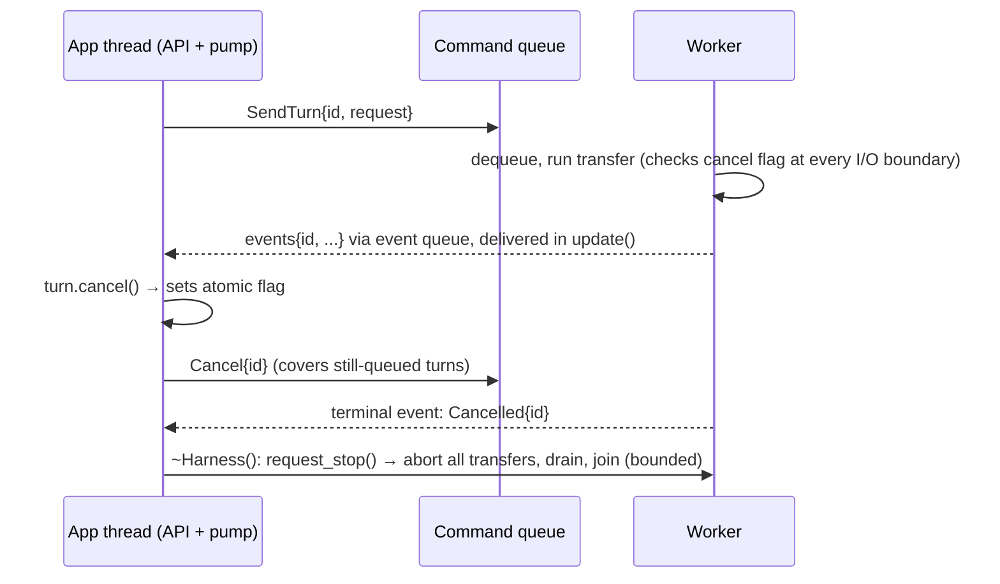
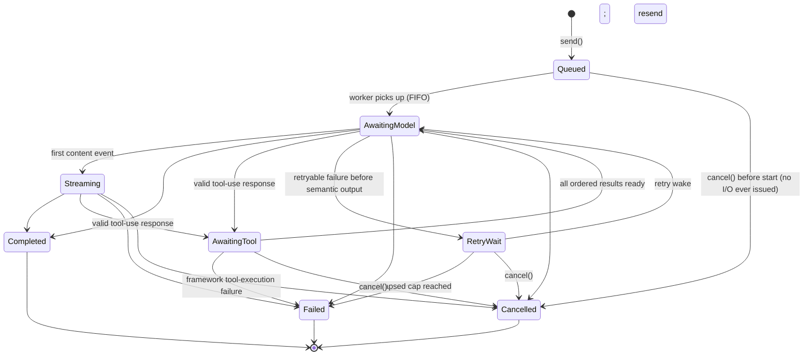

# Scry — Architectural Patterns & Implementation Practices

Companion to [DESIGN.md](DESIGN.md). That document says *what* the pieces are; this one says *how* each piece is built — the C++ design patterns, idioms, and practices we commit to, and why. Deliberately no class listings or method signatures; the public headers are the API source of truth.

---

## 1. Library-Wide Principles

These apply everywhere and settle arguments before they start.

**Value semantics at the boundary, explicit ownership inside.** Public types are
cheap-to-move value types or lightweight handles. Exclusively owned resources
use `std::unique_ptr` or dedicated RAII wrappers. Shared lifetime is deliberate
and enumerated: command/event queues and the per-turn cancellation flag cross
the worker boundary; a Conversation handle and its live pump route share
Conversation state; and a pump-side turn route is owned by the Harness and
observed weakly by the Turn handle. Tool handlers are never shared: each one
stays in the pump-side snapshot of the turn that captured it. Raw pointers are
non-owning observers only, never stored across a suspension point.

**Rule of Zero.** Types define no special member functions unless they manage a resource directly; resource management is pushed into dedicated RAII wrappers (curl handles, threads, queues) so everything above them defaults.

**PImpl on stateful handles; plain values for contracts.** The four stateful handle types (Conversation, ToolRegistry, Turn, Harness) hold a single pointer to an implementation — ABI stays stable across internal refactors, and compile-time cost for consumers stays flat. Everything else the user touches is an ordinary value type: configuration aggregates (designated-initializer friendly), errors, options, enums, event payloads, and the Scry-owned JSON boundary type. The binding rule underneath both is: **no third-party types in public headers, ever** (enforced by include audit). `Harness` is constructed directly from `Config` and is the single owner of provider/auth/connection state; a separate Client handle would add lifetime ambiguity without an independent responsibility. The indirection cost is irrelevant next to network latency — this library's hot path is measured in milliseconds, not nanoseconds.

**No singleton carries library state.** Everything that can vary hangs off a
`Harness` instance, so two Harnesses with different providers remain isolated.
The one process-wide capability is libcurl global state: a function-static RAII
owner performs one initialization attempt, caches that first result, cleans up
immediately when post-init capability validation fails, and otherwise cleans
up exactly once at static teardown. Harness construction and destruction never
churn that global runtime.

**Semantic failures are values; callback exceptions stay synchronous.** Internals may use whatever is idiomatic for the dependency at hand, but Scry-originated semantic and operational failures never throw across the public boundary. Immediate rejection reports through `std::expected`; failure after a turn is accepted reports through the `on_finished` callback supplied to `send()`, which receives the error in place of a completion. Allocation and standard-library construction failure (`std::bad_alloc`) are **excluded from the contract** — we do not pretend to survive OOM, and smearing `noexcept`+expected over every allocating call would buy nothing. Two hard rules stand regardless: nothing ever throws *across* the worker/main thread boundary, and tool-handler exceptions are caught at the dispatch site and converted into tool-error results returned to the model. User callbacks should not throw; if one does, the exception propagates synchronously out of `update()` to the app with the Harness left in a valid state and the event counted as delivered (see §3).

**Concepts over inheritance in templates, interfaces only at seams.** Virtual dispatch appears in exactly two places (provider adapter, transport — §6, §7), both internal. The public API has no inheritable types; extension points are callables and config, not subclassing.

**C++ standard posture.** Core library targets C++23 (`std::expected`, deducing
this where useful). Callable boundaries use Scry's small move-only
`UniqueFunction` because supported macOS standard libraries do not yet
consistently ship `std::move_only_function`; the boundary remains move-only
rather than silently becoming copy-only on one platform. The reflection layer
remains an isolated, severable, experimental C++26 component (see §5) and is
not part of the stable runtime surface.

## 2. The Concurrency Architecture: Actor, Not Locks

The single most important structural decision. The worker thread is an
**actor**: it exclusively owns all mutable networking and loop state, and (bar
the per-turn cancellation atomic, §3) the only way anything crosses the thread
boundary is **message passing** through two queues. Commands cover send,
cancel, tool result, and shutdown; events cover text deltas, tool-call
requests, completions, and errors. Every message type lives on those two
queues; nothing gets its own side channel.

Practices that follow:

- **Enumerated shared state, no user-visible locks.** There is no mutex a user callback can deadlock against. Exactly three things are shared across the thread boundary, all internally synchronized: the command queue, the event queue, and one atomic cancellation flag per turn. Nothing else — worker-side state and pump-side state are exclusively owned (ownership table in §3), and the worker addresses turns only by immutable `TurnId`. Pump-side objects may share lifetime with other pump-side objects; shared ownership does not make them cross-thread state. This enumeration *is* the invariant TSan enforces; anything not on the list found crossing threads is a bug by definition.
- **Messages are immutable values.** Commands and events are `std::variant` of small structs, moved (never copied) through the queue. Variant + `std::visit` gives exhaustive handling — adding an event type breaks the build until every consumer handles it. This is the same closed-set-of-alternatives reasoning that picks variant over inheritance everywhere in this codebase.
- **Queue implementation: boring first.** Mutex + `std::deque` + condition variable, wrapped behind our own minimal interface so a lock-free MPSC queue can be swapped in *if profiling ever demands it*. Premature lock-free is how libraries acquire unfixable bugs.
- **Two cancellation mechanisms, deliberately separate.** The worker's `std::jthread` `stop_token` means one thing only: **Harness shutdown**. Per-turn cancellation is a distinct per-turn `std::atomic<bool>`, checked at every I/O boundary and plumbed into transport progress callbacks. Both are cooperative, never `pthread_cancel`-style. Conflating them was an early ambiguity: shutdown must abort *all* turns and join; cancelling one turn must not disturb its neighbors.
- **The pump is the contract.** `update()` drains the event queue and invokes callbacks on the calling thread, under an optional time budget (deadline-checked between events, excess rolls to the next tick). Because *all* callbacks fire there, user code is single-threaded by construction. This is the harness's most sacred invariant; everything else may change.
- **Backpressure by design.** Streaming deltas are coalesced worker-side (one aggregated text event per pump interval, not per token) so a fast stream cannot flood the queue or starve the frame budget. Coalescing is not the memory bound: configurable byte ceilings on pending turns, per-turn queued events, responses, tool payloads, and conversations are the hard limits.

**Blocking-mode escape hatch:** a synchronous `send`-and-wait exists for CLI tools and tests, implemented *on top of* the async machinery (pump-until-complete internally), never as a second code path.

## 3. Turn Ownership, Lifecycle, and the Handle Pattern

A `Turn` is a **handle**: a move-only PImpl value holding an immutable `TurnId`, a shared reference to the turn's cancellation flag, and a weak route to pump-side turn state — *not* the worker's turn state itself. It exposes exactly two operations, `id()` and `cancel()`; the callbacks belong to the turn and are supplied to `send()`, so there is nothing to register on the handle afterwards. The weak route makes queued-turn cancellation safe when a Turn outlives its Harness: `cancel()` remains a harmless atomic operation. Copying a handle to in-flight work invites double-cancel ambiguity, hence move-only. This is the `std::future`/`std::stop_source` school: small, thread-safe by narrowness, no behavior hidden in destructors beyond a documented detach.

### Ownership table (implemented invariant)

| State | Exclusive owner | Notes |
|---|---|---|
| Transport handles, curl state, wire buffers, SSE parser state | Worker | Never visible to any other thread |
| Loop state machines (per turn) | Worker | Addressed by `TurnId` |
| Turn callbacks, buffered undelivered events per turn, Turn routes | Pump side (Harness main-thread state) | Callbacks move in at `send()`; read only inside `update()`; handles observe routes weakly |
| Conversation contents | App thread via pump | A live route retains shared lifetime on the pump side; contents are mutated only at terminal-event delivery |
| Tool definitions | Pump side; immutable per accepted turn | Worker commands receive copied neutral schemas, never the live registry |
| Tool handlers | Pump side; immutable per accepted turn | Invoked only by `update()`; never cross the thread boundary |
| Command queue, event queue | Shared, internally synchronized | Sanctioned crossing points |
| Per-turn cancel flag (`atomic<bool>`) | Shared | Third sanctioned crossing point |
| `TurnId` | Immutable value | Freely copied everywhere |

The worker never touches callbacks or buffers; it emits events tagged with `TurnId`. The pump owns routing, buffering, and delivery. This split is what makes the §2 enumeration true.

### Send / cancel / shutdown


```mermaid
sequenceDiagram
    participant App as App thread (API + pump)
    participant CQ as Command queue
    participant W as Worker
    App->>CQ: SendTurn{id, request}
    W->>W: dequeue, run transfer (checks cancel flag at every I/O boundary)
    W-->>App: events{id, ...} via event queue, delivered in update()
    App->>App: turn.cancel() → sets atomic flag
    App->>CQ: Cancel{id} (covers still-queued turns)
    W-->>App: terminal event: Cancelled{id}
    App->>W: ~Harness(): request_stop() → abort all transfers, drain, join (bounded)
```

### Turn lifecycle (normative)


```mermaid
stateDiagram-v2
    [*] --> Queued: send()
    Queued --> AwaitingModel: worker picks up (FIFO)
    Queued --> Cancelled: cancel() before start (no I/O ever issued)
    AwaitingModel --> Streaming: first content event
    AwaitingModel --> Completed
    AwaitingModel --> AwaitingTool: valid tool-use response
    AwaitingModel --> RetryWait: retryable failure before semantic output
    RetryWait --> AwaitingModel: retry wake
    RetryWait --> Failed: retry/elapsed cap reached
    RetryWait --> Cancelled: cancel()
    Streaming --> Completed
    Streaming --> AwaitingTool: valid tool-use response
    AwaitingTool --> AwaitingModel: all ordered results ready; resend
    AwaitingTool --> Failed: framework tool-execution failure
    AwaitingTool --> Cancelled: cancel()
    AwaitingModel --> Failed
    Streaming --> Failed
    AwaitingModel --> Cancelled
    Streaming --> Cancelled
    Completed --> [*]
    Failed --> [*]
    Cancelled --> [*]
```

`AwaitingTool` extends the original chat
states: one valid assistant tool-call batch enters it, every result is retained
in provider order, and the final result starts the next model request
automatically. Tool-round limits and malformed batches fail before handlers are
published. The worker admits every call in one response to the event queue as
one atomic batch, so queue pressure can never expose a dispatchable prefix.
Once the pump observes a fatal framework dispatch failure, it latches that
terminal path and suppresses every later handler in the batch.

The machine also carries the Conversation's remaining payload budget across
the entire exchange. It reserves each assistant tool-call message, each tool
result, and the final assistant message before dispatch, resend, or commit.
Crossing the cumulative bound therefore fails the turn without partially
committing history; resource errors retain the provider request ID that was
available at the failing response boundary.

The pump makes every accepted turn terminal exactly once. Terminal processing
commits or rolls back the Conversation and clears its busy state even when no
terminal observer exists. When `on_finished` is non-empty, it is invoked exactly
once with a `Result<Completion>` holding the completion on success or the
`Error` on failure. Cancellation uses that same result channel with
`ErrorCategory::cancelled`. Harness destruction is the explicit exception:
shutdown aborts work and discards undelivered callbacks, so it does not expose
teardown callbacks. The remaining lifecycle contracts, each of which is a
numbered requirement:

- **Conversation commits are transactional.** History is mutated only by the pump at terminal-event delivery: `Completed` commits the full exchange (user message, all tool rounds, final answer) atomically; `Failed`/`Cancelled` commit nothing. This keeps Conversation retry/resubmission mechanically clean, but does not make external handler side effects reversible or idempotent; side-effecting schemas need app-owned operation keys and reconciliation (DESIGN.md §8).
- **Detach semantics.** Dropping the handle detaches: the turn runs to termination, the Conversation still commits on success, and the callbacks supplied at `send()` remain route-owned and deliverable. Dropping loses identity and cancellation control, not callbacks.
- **Atomic callback attachment.** `send()` moves `TurnCallbacks` infallibly into the pump route before it publishes the worker command. No event can precede the immutable callback set, and there is no late registration or replay. An absent callback makes its matching event dead on arrival and returns its bytes to the queue ledger immediately; terminal processing still occurs.
- **Reentrancy.** Callbacks may call `send`, `cancel`, and tool registration APIs.
  Reentrant `update()` performs no work and never recurses into callback
  delivery; it returns immediately, reporting the rejection through
  `UpdateStats::budget_exhausted`. Accepted turns snapshot immutable registry
  records, so later or reentrant changes affect subsequent turns rather than
  in-flight ones.
- **Non-preemption.** The `update()` budget is a soft deadline checked *between* callbacks; an individual callback or tool handler is never preempted and may overrun the budget. The budget bounds Scry's scheduling, not user code.
- **Callback exceptions** propagate out of `update()` with the harness valid and the event counted delivered (§1).
- **Callback ownership follows the signature.** The text-delta view and tool-call reference are borrowed for the invocation only; apps copy data they retain. `on_finished` receives its `Result<Completion>` by value.
- **Shutdown.** `~Harness()` cancels all turns, aborts Scry-owned transport
  waits within their configured bound, joins the worker, and discards
  undelivered events. No callback or tool handler ever fires after destruction begins. Because
  every tool handler runs on the app thread inside `update()`, no application
  code is ever in flight on the worker at teardown, and the shutdown bound
  covers the whole join.

### Conversation persistence

Persistence is a public serialization boundary, not a storage subsystem.
`Conversation::to_json()` emits a canonical versioned document containing the
system prompt and committed neutral messages; `Conversation::from_json()`
strictly validates and restores it. Text, tool-call, and tool-result blocks
round-trip without provider wire shapes or Glaze types. Parsed object keys are
sorted before tool arguments and results enter committed history, so canonical
bytes represent JSON meaning rather than preserving lexical input order. Busy
state, callbacks, turn IDs, registry snapshots, and every uncommitted round are
intentionally excluded. The app owns encryption, files/databases, retention,
and migration between document versions.

**The document format is unstable before 1.0.** The version field exists, but
0.x releases may change the shape or canonical bytes without a migration path:
a document written by one 0.x release is not guaranteed to load in another.
Treat persistence as
session continuity within a pinned Scry version, not an archival format.

## 4. The Agentic Loop: Sans-I/O State Machine

The loop engine — the heart of the library — is written **sans-I/O**: a pure state machine that consumes events (*provider replied with content or a tool call*, *tool result ready*, *stream ended*, *transport failed*) and emits commands (*issue this request*, *run this tool*, *deliver this to the app*), and performs **no I/O itself**. The implemented machine covers chat, retry, cancellation, tool-await, and multi-round completion. The worker thread is a thin driver that feeds it transport events and executes its commands.

Why this is the hill to defend:

- **Testability without a network.** The full agentic loop — multi-round tool use, retries, cancellation mid-tool-call, malformed model output — is tested by feeding event sequences and asserting command sequences. Deterministic, sub-millisecond tests for the most complex logic in the system.
- **Replayability.** A recorded event log reproduces any bug exactly. Given how nondeterministic LLM behavior is, deterministic *harness* behavior is the only debuggable posture.
- **The state machine is explicit, not emergent.** States (queued, awaiting-model, streaming, retry-wait, awaiting-tool, and terminal) are a variant/enum with the transition diagram above, not an implicit property of nested callbacks. An event that is illegal in the current state returns a diagnostic without mutating state or emitting commands, making integration failures observable without relying on debug-only assertions.

Retry policy (backoff + jitter) is machine state driven by *time events*
injected by the driver — the machine never sleeps, it requests "wake me at
T." Attempt and elapsed caps reset for each model request, while completion
reports aggregate attempts and usage across the whole tool loop.

## 5. Tool Registry: Type Erasure Below, Optional Reflection Above

Two layers, one table (as settled in DESIGN.md §8):

**Lower layer — type erasure.** A registered tool is a record: name, description, schema (JSON string), and a type-erased callable (`json → expected<json, error>` in spirit; Scry's `UniqueFunction` keeps captures move-only). This is the `std::function`-style erasure idiom: the registry is runtime-uniform, closed to no one, and has zero knowledge of reflection.

The Registry is owned by its Harness. `send()` snapshots its immutable shared
records for the accepted turn, so registration during `update()` never mutates
an in-flight turn and the live registry never crosses the worker boundary. Only
copied neutral schemas cross; every handler stays exclusively pump-owned. The
public registry cannot be moved out of its Harness, and explicit schemas are
parsed and canonicalized at registration. Mutation is additive-only: duplicate
names are rejected, and replacement/removal remain absent until a real
hot-reload contract defines their snapshot semantics.

**Execution ownership.** There is one execution policy: every handler runs on
the app thread inside `update()`. A provider batch is published atomically; the
pump then walks it in provider order, invoking each handler directly, reserving
the canonical result against the machine's authoritative remaining exchange
budget, posting the result, and only then running the tool observer before
admitting the next call. A fatal framework or cumulative-result-budget failure
latches the route and permanently suppresses the batch suffix before any later
handler can run. Nothing
about a tool call crosses the worker boundary except the resulting neutral
message content, which is why the shutdown bound in §3 needs no carve-out for
application code. A slow handler therefore costs frame time; the intended answer
for that case is an asynchronous/deferred tool-result API (evolution register,
§11), not a second thread quietly executing app callbacks.

**Upper layer — consteval code generation (optional, experimental).**
The P2996 layer is a compile-time *code generator* targeting the lower
layer. Given a plain aggregate, it builds
`scry::reflection::input_schema_v<Args>` in canonical fixed storage and
instantiates a typed deserializer/invoker erased into an ordinary
`ToolHandler`. `scry::reflection::add<Args>(registry, metadata, handler)` then
calls the existing public registry operation. The free function keeps C++26
reflection declarations out of the stable `ToolRegistry` class.

The dependency direction is deliberately split:

```text
app aggregate + handler
        ↓
public reflection header (P2996 + standard/Scry-owned types only)
        ↓
Scry-owned typed wrapper and JSON-view contract
        ↓
compiled optional scry::reflection component
        ↓
private Glaze-backed JSON implementation
        ↓
ToolDefinition + ToolHandler → existing ToolRegistry
```

This keeps both promises real: template instantiation can see application
types, while Glaze remains absent from public headers and installed dependency
metadata. A reflection-OFF build installs only the C++23 core and core headers;
the optional `reflection` package component owns its public/detail headers,
compiled bridge, C++26 flags, and `scry::reflection` target.

Additional practices:

- **Concepts guard the gate.** Root and nested objects are complete,
  default-initializable, non-union aggregates without bases, bit-fields,
  reference/cv members, or unsupported recursive values. Misuse fails at the
  reflected call with Scry-owned diagnostics rather than in a dependency's
  template internals. Nested optionals, scoped enum aliases, and every
  `vector<bool, Allocator>` specialization are rejected because they cannot
  preserve the accepted value semantics unambiguously.
- **One lexical schema.** Object/property keys and `required` member names are
  sorted lexicographically, enum values retain declaration order, and nested
  objects are inlined and closed. The compile-time artifact is the exact text
  passed to the lower registry; there is no runtime schema cache or macro
  registry.
- **One strict value mapping.** Schema, decode, and encode share the ADR 0007
  recursive type matrix. Glaze gaining a serializer does not expand Scry's
  public contract.
- **Presence is declaration-driven.** P2996 default-member-initializer
  reflection controls omission; `std::optional` controls nullability. The
  decoder constructs normal C++ defaults and validates the canonical parsed
  object before invocation.
- **Descriptions have one source.** The P3394 `description` annotation is the
  only way to attach a tool or parameter description; there is no portable
  trait-based fallback or override to keep in agreement with it.
- **Canonical parsed input is the seam.** Unknown/missing/type/range checks run
  on the canonical unique-key object. Detecting duplicate lexical JSON keys
  would require a different parser boundary and is deliberately out of scope.

## 6. Provider Adapters: Strategy at a Narrow Seam

One of the two sanctioned virtual interfaces. The pattern is classic
**Strategy**: a small internal interface — translate neutral request → wire
request, parse wire stream events → neutral events. Anthropic and ADR 0008's
OpenAI-compatible Chat Completions subset are implemented on the same seam.
Adapters receive a `Config` that `Harness::create` has already validated; they
translate, they do not re-check configuration.

Discipline that keeps it clean:

- **The neutral model is the API of this seam.** Adapters see `Message`/`ContentBlock`/`ToolSchema` and nothing above; nothing above sees JSON or HTTP. Wire-format knowledge concentrated in one file per provider.
- **Adapters are stateless translators** where possible; stream-parsing state (partial SSE event, current content block index) is an explicit per-turn parser object, not adapter member state — one adapter instance serves many turns.
- Selection is config-driven via an internal factory keyed on dialect enum. No plugin registration machinery until a third-party provider actually needs it — **YAGNI applies to extension points too.**
- **Golden-file tests** per adapter: captured real wire payloads checked into the repo, asserted against neutral-model round-trips. This is the layer where upstream API drift bites, so tests are data, easy to re-capture.

The OpenAI strategy owns endpoint normalization, optional Bearer auth,
the common request envelope, one-choice response validation, function-tool
translation, usage/finish mapping, and strict `[DONE]`-terminated streaming.
It deliberately omits Azure shapes, Responses API, structured output,
reasoning-specific token fields, and provider extensions. Adapter objects stay
stateless; `ProviderDecodeState` carries a dialect-specific alternative so
OpenAI chunk IDs, indexed tool fragments, finish state, and usage cannot leak
into the Anthropic lifecycle. HTTP classification and sanitized request IDs
remain transport responsibilities.

## 7. Transport: RAII-Wrapped curl Behind an Injectable Seam

The second sanctioned interface, existing for one reason: **dependency injection of a fake transport in tests** (and of the sans-I/O driver's event source). Practices:

- libcurl used directly (not through a wrapper lib) for SSE control, but every curl object lives in a RAII wrapper with the curl types visible only in the `.cpp`. curl's C callbacks trampoline into C++ via the standard `void* userdata` → object pointer pattern, with all exceptions caught at the trampoline (C stacks must never unwind).
- **SSE parsing is a pure incremental function**: bytes in, zero-or-more events
  out, remainder buffered. It performs no I/O and all retained data is covered
  by the configured event bound, making it property-testable with randomly
  split byte chunks (the classic bug in SSE parsers is
  delimiter-across-chunk; the test generator targets it directly).
- Curl's progress callback checks both the worker `stop_token` (Harness shutdown) and the active turn's atomic cancellation flag. Neither signal is repurposed for the other.
- Connection reuse (curl multi/share) is an internal optimization invisible above the seam.

## 8. Errors as Values, Categorized Once

- Internal fallible paths return `std::expected<T, Error>`; `Error` is one struct with a category enum (`invalid_config`, `invalid_state`, `busy`, `authentication`, `rate_limit`, `network`, `protocol`, `resource_limit`, `tool`, `max_tool_rounds`, `cancelled`) plus message, sanitized provider detail, retryability, and correlation fields. One error type end-to-end — no per-layer error hierarchies to translate between.
- The retry classifier (which categories are retryable) is a pure function owned by the loop state machine, tested as a table.
- At the boundary, failures before work is accepted are returned immediately by `std::expected`. After acceptance, the same `Error` arrives through `on_finished` in place of the completion — including cancellation, as category `cancelled`. `errno`-style status polling is deliberately absent; there is exactly one asynchronous outcome channel.

## 9. JSON and Dependency Policy

- **Glaze** for JSON (header-only, fast, and aligned with the pinned
  reflection toolchain); treated as an *internal* dependency — no Glaze header
  or type appears in Scry's public include path. The stable tool boundary uses
  the Scry-owned `Json` value, and the optional reflection component exposes a
  Scry-owned JSON-view bridge whose implementation alone includes Glaze. A
  downstream core or reflection consumer never discovers or links an exported
  Glaze target.
- **One codec, one canonical form.** A single internal JSON codec serves every
  seam — provider wire encoding and decoding, the tool boundary, Conversation
  persistence, and the reflection bridge — and it emits exactly one canonical
  form, with object keys sorted lexicographically. There is no second encoder
  and no per-seam canonicalization to keep in agreement, so "canonical JSON"
  means one thing throughout the codebase.
- Dependency bar is high: curl, Glaze, and test frameworks. Each new dependency needs a written justification in this doc. Header hygiene enforced (IWYU in CI) so the PImpl firewall stays real.

**Showcase boundary ([ADR 0010](docs/adr/0010-m5-showcase-contract.md)).**
Dependency direction is one-way: showcase code depends inward on the public
`scry::scry` surface, and the library never depends back. The ImGui panel, its
controller seam, and the NPC world live outside namespace `scry` and are
neither installed nor exported; the host owns the Harness, Conversation, update
cadence, ImGui context/backends/window/loop, and world lifetime. Their
explicit-schema handlers close over host-owned in-memory state — the sanctioned
seam for state a main loop already owns, not an engine abstraction or a second
agent loop. Dear ImGui is a build-only, default-OFF, pinned MIT dependency that
must compile the real widget rather than a look-alike facade; no ImGui header,
type, target, source, option, or transitive requirement may appear in the
public, installed, or exported package surface, so the core runtime dependency
set remains libcurl plus internal Glaze. SHOW-001–004 state the binding form.

## 10. Testing & Tooling Practices

- **The test pyramid mirrors the architecture** — that is the point of the seams in §2, §4, §6, and §7, and ENGINEERING.md §2 lays out the resulting layers.
- Threaded code is tested under **TSan and ASan in CI** — sanitizers are cheap the day the code is written and impossible to retrofit onto a flaky foundation. UBSan on the reflection layer especially.
- Each provider dialect carries deterministic request/response/stream goldens,
  arbitrary-split stream coverage, a checked fuzz corpus, and a public Curl
  path/header/SSE case; cross-dialect integration proves two configured
  Harnesses cannot contaminate each other's decode state.
- **The package boundary is tested, not asserted.** The core matrix installs to
  a clean prefix, audits it for any reflection header, detail directory,
  library, or export, and builds a downstream `find_package(scry)` consumer.
  The reflection gate mirrors that for its component and adds the compiled
  proof of TOOL-003: a core-only C++23 consumer built with a non-reflection
  compiler against the same reflection-enabled installation. ENGINEERING.md §6
  owns the ring shape and which leg runs where.
- **Warnings are errors** (`-Wall -Wextra -Wconversion`), from the first commit.
- **Diagnostic logging build:** `-DSCRY_ENABLE_LOGGING=ON` (preset `dev-logging`)
  compiles the internal `SCRY_LOG` macro into a small thread-safe file logger
  (`src/core/log.*`); every other build compiles the macro to nothing. Even in
  a logging build, output is off until the `SCRY_LOG_FILE` environment variable
  names a destination — Scry never writes a log file the host did not ask for.
  When enabled it appends timestamped lifecycle lines: turn
  start/completion/failure, model-request attempts and retries, tool dispatch,
  and ignored provider stream events. Lines carry only turn ids, tool names,
  attempt counts, and error categories; prompt/tool content and credentials
  never reach the log (ERR-004), and this remains an internal diagnostic, not
  the public logging surface PROV-008 notes is absent.

## 11. Evolution Register: Deliberate Simplifications and Their End States

Every "boring first" choice is recorded here with the condition that triggers evolution and the intended destination — so simplicity stays a decision, not an accident. Additions to this codebase that simplify deliberately must add a row.

| Simplification (now) | Trigger to evolve | Desired end state |
|---|---|---|
| Mutex + deque + condvar queues | Profiling shows queue contention or pump latency in a real app | Lock-free MPSC (commands) / SPSC (events) behind the same interface; interface designed for this swap from day one |
| One worker thread per Harness, one turn in flight per Conversation | A real app needs concurrent turns at scale | curl-multi–driven multiplexing of N turns on one worker; the actor + sans-I/O split means the machine layer is untouched |
| Blocking `send`-and-wait built on pump-until-complete | Coroutine-scheduler apps appear as users | `co_await`-able turn awaitable layered on the event queue; core remains callback/pump-based |
| Provider factory keyed on internal enum, no plugin API | A third-party provider that can't be upstreamed | Public adapter concept + registration hook; only then |
| OpenAI-compatible common Chat Completions subset only | A supported deployment requires Azure, Responses API, structured output, or another extension | Ratify a separate adapter/contract; never grow compatibility by wire-format guessing |
| Closed reflected-value matrix; P3394 annotations are the only description source | A concrete tool needs an unsupported type/constraint, or a description that cannot be an annotation | Add one schema/decode/encode/diagnostic contract at a time; ratify a second description source only with an explicit precedence rule |
| No connection pooling beyond curl defaults | Measured connect/TLS overhead in streaming-heavy use | curl share/multi connection reuse, invisible above the transport seam |
| Scry-owned `UniqueFunction` at callable boundaries | All supported macOS/Linux standard libraries ship a conforming `std::move_only_function` and a pre-1.0 API change is acceptable | Replace the small owned erasure with the standard facility after ABI and allocation benchmarks |
| Additive-only ToolRegistry with immutable accepted-turn snapshots | A concrete hot-reload or dynamic-plugin use case needs mutation | Explicit replace/remove operations with documented snapshot and handler-lifetime semantics |
| Linux + macOS only | Concrete Windows user demand | Windows reflection-OFF via clang; MSVC leg only if/when P2996 ships there |
| Reflection-ON CI leg on Linux only (PORT-005) | A production-grade P2996 toolchain becomes practically distributable on macOS | Gating reflection legs on both platforms |
| Serialized turns: queued turns wait while the active turn awaits a tool result | Serialized scheduling measurably limits a real app | Tool-await releases the slot under curl-multi multiplexing (same trigger as row 2) |
| All tool handlers run synchronously on the app thread inside `update()` | A real tool is slow enough that running it on the app thread costs the host its frame budget | An asynchronous/deferred tool-result API: the handler accepts the call, returns immediately, and completes the result later through the pump — with its own cancellation, ordering, and budget rules ratified up front |
| Showcase ImGui panel has no platform/renderer backend and the NPC world is ephemeral | A maintained standalone demo or durable game integration becomes a real deliverable | Ratify its platform matrix and lifecycle separately; keep any backend, persistence, rollback, or idempotency machinery outside the Scry package |
| Streaming-only provider seam: adapters always request `stream: true` and decode through the stream path; the parallel non-streaming response decoders were removed as production-dead | A supported deployment genuinely cannot serve SSE, or a consumer needs non-streaming completions | Reintroduce a `parse_response` seam together with a runtime mode that actually exercises it, plus its golden and fuzz coverage — never as untested parallel code |
| Compile-time diagnostic file logger (`SCRY_ENABLE_LOGGING`): fixed line format, one file sink chosen by environment variable, no runtime configuration or public API | A consumer needs runtime-toggleable, structured, or callback-driven diagnostics | Ratify a public logging/observer surface (the one PROV-008 records as absent) and route the same call sites through it |
| Release-posture verification (ADR 0012): behavioral gates only — matrix, tests, sanitizers, tidy, package audits; no coverage/CRAP metric gating, no mutation testing, fuzz and showcase on the scheduled ring | Unattended agent-driven development resumes at scale, or coverage erosion on the pure components is observed in review | Restore targeted pieces per ADR 0012 — starting with a single non-gating coverage report line, never the full retired apparatus by default |
| Reflection CI gating is path-aware (ADR 0012 amendment): the GCC 16 leg — with its ASan+UBSan rerun, the component's only sanitizer coverage — gates reflection-affecting pull requests and runs unconditionally in the weekly scheduled ring | A reflection regression merges through a gap in the path filter, or the experimental toolchain stabilizes into a plain distribution package | Widen the path filter first; return the leg to the unconditional pull-request ring only if filtering itself proves unsound |
| v0.0.1 runtime simplification (ADR 0012): worker-thread tool execution and its registration options removed, turn callbacks supplied once at `send()` with a single terminal outcome, one JSON codec with one canonical form | A slow tool, a coroutine host, or a second serialization shape presents a concrete need the simplified surface cannot express | Reintroduce capability by contract, not by restoring the old machinery: an async/deferred tool-result API for slow tools (row above), a `co_await`-able turn for coroutine hosts, and a ratified second document contract before any second canonical form |

## 12. Pattern Summary

| Piece | Governing pattern / idiom |
|---|---|
| Public types | PImpl handles, plain contract values, Rule of Zero |
| Concurrency | Actor model; message passing over variant commands/events; jthread + stop_token |
| Delivery | Single-threaded-by-construction pump with time budget |
| In-flight turns | Move-only PImpl handle (`id()`/`cancel()`) + shared cancel flag + weak pump route; callbacks owned by the turn from `send()` |
| Agentic loop | Sans-I/O explicit state machine; time as injected events |
| Tool registry | One type-erased registration substrate, app-thread dispatch; optional consteval codegen and strict Scry-owned JSON bridge above it |
| Providers | Config-selected Strategy at a narrow seam; stateless adapters with per-turn dialect state and golden-file tests |
| Transport | RAII curl, C-callback trampolines, injectable seam; pure incremental SSE parser |
| Errors | One categorized value type; expected before acceptance, one async error event after |
| Showcases | Outermost application adapters over public `scry::scry`; host-owned lifecycle and state; no install/export path |
| Extensibility | Callables and config, not inheritance; YAGNI on plugin machinery |
