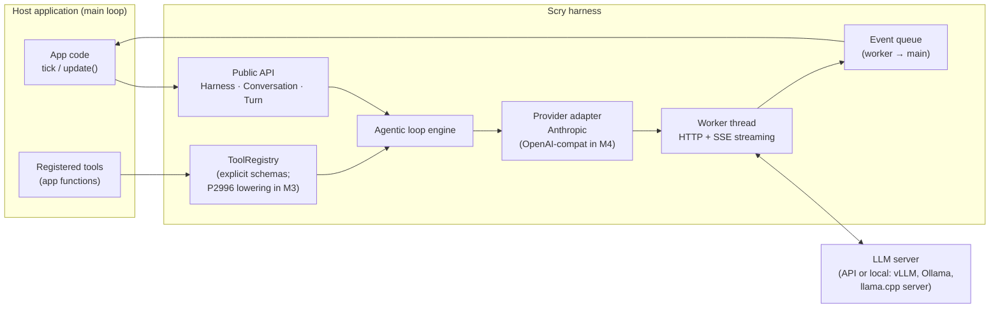
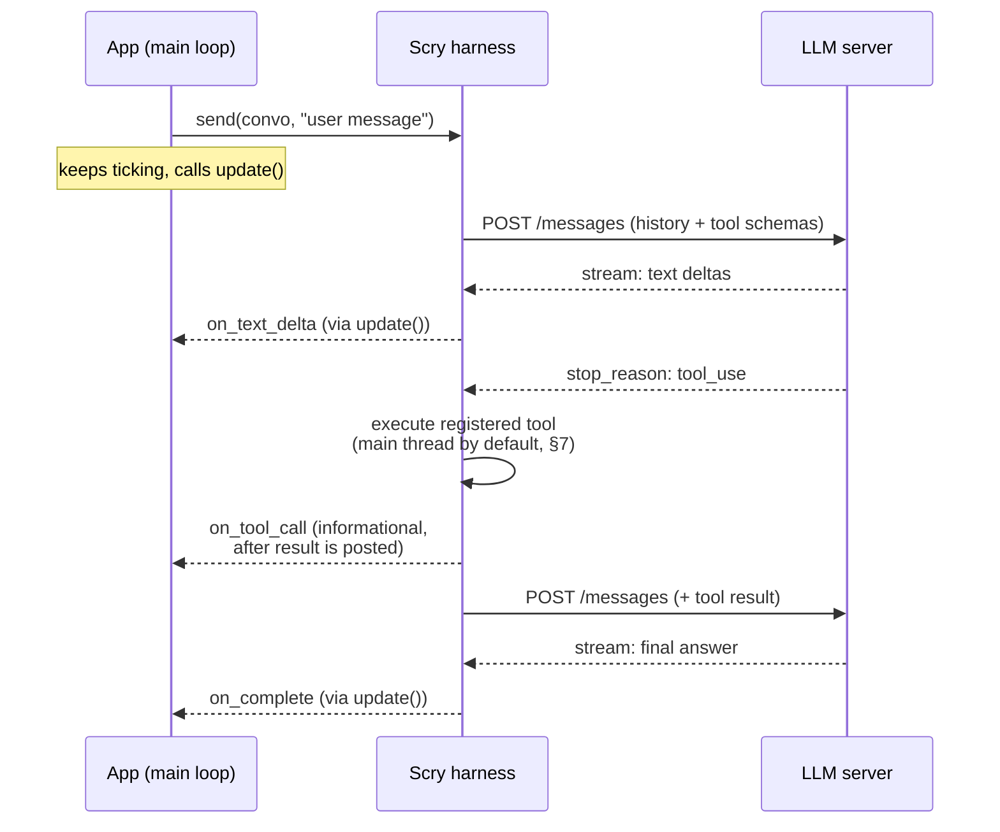
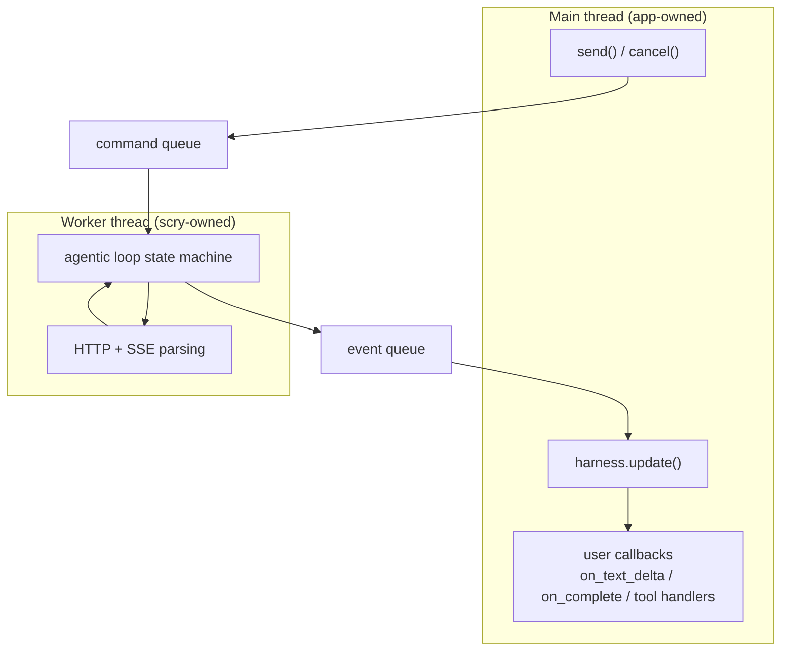

# Scry

> *Scrying: the practice of consulting an oracle by gazing into a mirror.*

A C++ LLM harness for applications with their own main loops. Scry's stable
C++23 surface turns explicit schemas and callables into LLM tools and hides the
full agentic loop — HTTP, streaming, tool dispatch, retries — behind a small,
poll-friendly API. M3 will add isolated **C++26 reflection** to derive the same
registrations from ordinary C++ types.

The name is the design: **reflection** (the mirror) + **consulting an oracle** (the LLM). Namespace `scry::`, suggested repo name `scry` (fallbacks: `scry-cpp`, `scrylib`).

---

## 1. Vision

Python has a dozen mature LLM harnesses. C++ has llama.cpp bindings for local inference and almost nothing for API-based integration — yet the applications that live in C++ (games, CAD, trading systems, embedded, desktop tools) are exactly the ones that can't easily shell out to Python.

Scry lets an existing C++ application add LLM capabilities — chat *and* tool use — by touching roughly five types, with zero changes to its threading or event architecture.

**Guiding principle:** tool use is the core design target, not an add-on. Chat is the degenerate case of an agentic loop with zero tools. The architecture is built around the loop from day one.

## 2. Goals and Non-Goals

**Goals**

- Drop-in integration for apps with their own main loop (game engines, GUI apps, simulation loops). No event loop assumed, none imposed.
- M3 tool registration with near-zero boilerplate via C++26 reflection (P2996):
  schema generation and argument marshalling derived from plain structs at
  compile time, lowering to the implemented C++23 registry.
- The harness owns the agentic loop entirely: model requests tool → harness executes it → result appended → resend → repeat until final answer.
- Provider abstraction at the message level, not the HTTP level: Anthropic is
  implemented; M4 adds an OpenAI-compatible adapter for vLLM, Ollama, and
  llama.cpp server as a config-only switch.
- Server/model configuration (base URL, auth, model, sampling params) as simple declarative config.
- Streaming, cancellation, and retries handled internally with clear thread guarantees.

**Non-Goals**

- Not an inference engine. Scry talks to servers; it does not load weights.
- Not a framework. Scry never owns `main()`, never spins an event loop the app must join, never demands ownership of app lifecycle.
- No prompt-template/chain DSL (LangChain-style). Apps compose in C++.
- MSVC support is deferred (no public P2996 support as of mid-2026 — see §9).

## 3. Target Environment

Primary: applications with a main loop that ticks at some frequency — game engines, Qt/ImGui/native GUI apps, simulators. Consequences that drive the whole design:

- **Never block by default.** Network turns take seconds; the main loop runs at 60 Hz or handles UI events. The async surface never waits on network I/O; the explicitly named `send_and_wait` convenience is reserved for CLI tools and tests.
- **Poll, don't push.** The app calls `scry::Harness::update()` once per tick. All callbacks fire inside `update()`, on the caller's thread. User code needs no locks.
- **Cancellation is normal.** Windows close, scenes change mid-request. Every in-flight turn has a `cancel()` safe to call at any time.

## 4. Core Concepts (the public surface)

The app touches five core concepts:

| Type | Responsibility |
|------|---------------|
| `scry::Config` | Plain value aggregate: base URL, API key, model, sampling params, provider dialect. Designated-initializer friendly. |
| `scry::Conversation` | Owns message history (system prompt, user/assistant turns, tool calls/results). Serializable for persistence. |
| `scry::ToolRegistry` | Named tools: description + schema + callable. Owned by a Harness and snapshotted when a turn is accepted. |
| `scry::Turn` | Handle to one in-flight agentic exchange. Carries callbacks (`on_text_delta`, `on_tool_call`, `on_complete`, `on_error`) and `cancel()`. |
| `scry::Harness` | Created from `Config`; owns provider/auth state, the tool registry, worker thread, and event queue. `send()` starts a turn; `update()` pumps completions into the app thread. |

Intended feel:

```cpp
// Config is a plain aggregate; Harness is the single configured runtime owner.
// Semantic failures are values. Allocation failure remains an ordinary C++ exception.
auto harness = scry::Harness::create(scry::Config{
    .base_url = "https://api.anthropic.com",
    .api_key  = env("API_KEY"),
    .model    = "claude-sonnet-5",
});
if (!harness) { /* invalid configuration, reported as a value */ }

auto conversation = scry::Conversation::create({
    .system_prompt = "Answer briefly and use tools when useful.",
});
if (!conversation) { /* invalid conversation configuration */ }

auto registered = harness->tools().add(
    scry::ToolDefinition{
        .name = "get_application_status",
        .description = "Report whether the host main loop is running",
        .input_schema = {
            .text = R"({"type":"object","properties":{},"additionalProperties":false})",
        },
    },
    [&](scry::Json arguments) -> scry::Result<scry::Json> {
        return app.status(arguments); // validate JSON; return valid JSON
    });
if (!registered) { /* invalid schema, duplicate name, or inactive registry */ }

auto turn = harness->send(*conversation, "Is the host application still running?");
if (!turn) { /* busy, invalid state, or admission/resource limit */ }
turn->on_complete([&](const scry::Completion& result) {
    ui.show(result.text);
});

// somewhere in the existing main loop:
while (app.running()) {
    harness->update();  // callbacks fire here, on this thread
    app.tick();
}
```

This explicit-schema overload is the implemented C++23 surface. The
[checked-in canonical example](examples/main_loop.cpp) registers a read-only
tool through it and drives the complete M2 loop. M3 adds reflected
`add<Args>()` schema generation and marshalling as compile-time sugar over the
same registry; it does not introduce a second dispatch system.

**Conversation persistence.** `Conversation::to_json()` returns a canonical,
versioned Scry-owned JSON document suitable for app-managed storage;
`Conversation::from_json()` validates and restores one. Version 1 preserves
the system prompt and every committed neutral text, tool-call, and tool-result
block. Busy state and uncommitted turns are deliberately excluded, so saving
an active Conversation captures its last committed boundary. Scry does no file
I/O and rejects malformed documents, unknown fields or versions, and invalid
role/content combinations with `invalid_config`.

## 5. Architecture Overview



Layering rule: the app only sees the public API; the provider adapter only sees neutral `Message`/`ToolCall` types; only the adapter knows wire formats.

## 6. Interaction Model: the Agentic Loop

The harness owns the loop. The app registers tools and receives a final answer; intermediate tool calls are visible through optional callbacks but require no app participation.



The loop iterates as many times as the model requests tools, bounded by a configurable `max_tool_rounds` to prevent runaways.

## 7. Threading Model

One worker thread per `Harness` does all blocking I/O. A lock-free (or mutex-guarded, initially) event queue carries results back. **Every user callback fires inside `update()`, on the thread that calls it.** That is the contract that makes user code lock-free.



**Tool execution policy.** Tools touch app state, so tool handlers run on the
main thread inside `update()` — the worker posts a tool-call event and waits.
M4 will add a per-tool worker-thread opt-in for handlers that are thread-safe
and slow (disk, DB); that future mode will use the same registration table and
agent loop.

**Frame budget.** `update()` accepts an optional time budget; excess events roll to the next tick. The budget is a soft deadline checked between callbacks. Scry never preempts user code, so one slow callback or tool handler can overrun it.

**Cancellation.** `Turn::cancel()` sets an atomic flag; the worker aborts the HTTP transfer at the next opportunity and posts a `Cancelled` event. Cancelling a still-queued turn removes it before any I/O is issued. `Turn` handles are safe to drop (detach semantics); dropping does not join, block, or cancel.

M2 tool handlers are non-preemptive. Cancellation observed before dispatch
skips the handler. Cancellation requested while a handler is running takes
effect when it returns: Scry suppresses that result and the remaining calls,
does not resend to the model, and terminates the turn as cancelled.

**Batch and payload atomicity.** All tool calls from one assistant response are
admitted to the worker-to-pump event queue as one batch. If the whole batch
cannot fit, none becomes dispatchable and no handler runs. During pump
dispatch, a fatal framework failure (for example, no remaining space for even
a bounded result) suppresses every later handler in that batch. The
Conversation byte limit is one cumulative exchange budget: assistant tool-call
messages, every tool result, and the final answer are reserved before
dispatch, resend, or commit. It is not a per-message limit.

**M2 scheduling baseline (ratified).** A Harness accepts up to `Config::limits.max_pending_turns`; accepted turns queue FIFO and exactly **one HTTP transfer is active at a time**. Admission beyond that bound fails immediately with `resource_limit`. A second `send()` on a Conversation that already has a turn queued or in flight fails immediately with `busy`. While the active turn awaits a main-thread tool result, it retains the serialized turn slot, so queued turns wait (deliberate simplification; trigger and end state in the ARCHITECTURE.md evolution register, which moves to curl-multi multiplexing when serialized scheduling measurably limits a real app).

**Registry ownership and snapshots.** A Harness owns exactly one `ToolRegistry`;
there is no Conversation-local or process-global registry. `send()` snapshots
immutable registrations into the accepted turn, so later or reentrant
registration remains safe and affects only subsequently accepted turns. The
public surface cannot move the Harness-owned registry out. Explicit schemas
are parsed when registered, must be JSON objects, and are stored canonically.

**Runtime configuration defaults.** Limits count payload bytes (not allocator
overhead); implementations may reject earlier when a provider's own limit is
lower. These defaults are conservative starting points and remain configurable:

| Setting | Default |
|---|---:|
| Pending turns per Harness | 64 |
| SSE event | 256 KiB |
| Response | 8 MiB |
| Tool arguments | 1 MiB |
| Tool result | 4 MiB |
| Queued event payload per turn | 2 MiB |
| Conversation payload | 16 MiB |
| Tool rounds | 8 |
| Default maximum output tokens | 1024 |
| Retry attempts / elapsed time | 3 / 30 s |
| Retry initial / maximum backoff | 250 ms / 10 s |
| Connect / transfer / shutdown timeout | 10 s / 120 s / 2 s |

TLS peer verification defaults on. The runtime uses Curl with asynchronous DNS,
applies Curl's connect timeout (which covers name resolution and connection)
and total transfer timeout, and caps each multi-poll wait by the shutdown
timeout. A runtime that cannot provide the required resolver/global
capabilities is rejected. Deterministic tests cover held transfers, cancellation,
and capability rejection; the timeout wiring is source-reviewed rather than
tested against a flaky DNS black hole.

## 8. Tool Registration: C++23 Now, Reflection in M3

The implemented M2 boundary accepts a `ToolDefinition` (name, description, and
JSON-object input schema) plus a move-only `Json → Result<Json>` handler.
Registration parses and canonicalizes the schema immediately. Each accepted
turn owns an immutable snapshot, sends its schemas with every model request,
dispatches calls on the `update()` thread, and automatically resends ordered
results. The handler is responsible for validating its explicit JSON arguments
and returning valid JSON; Scry converts unknown tools, handler errors,
exceptions, and malformed handler output into bounded model-visible tool
errors.

P2996 is the M3 ergonomics layer over that boundary:

- Args are described as a struct; `template<typename T> consteval` code will
  walk `std::meta::nonstatic_data_members_of(^^T)` to emit the JSON schema
  (member names become parameter names; members with default initializers
  become optional parameters).
- The same reflection will generate the JSON→struct deserializer used at
  dispatch time.
- Member descriptions will come from P3394 annotations when supported, else a
  customization point.
- JSON-serializable reflected return values will lower to the existing
  `scry::Json` result boundary.

**Explicit-schema registration (not a parallel system):** the registry's internal representation is necessarily runtime data — name, description, schema JSON, type-erased `json → json` callable — since that is what gets serialized to the server and dispatched on tool calls. The reflection API is `consteval` sugar that lowers onto this same table, so exposing the lower layer as a public overload costs one function signature, not a second code path to maintain. It earns its keep twice: today it covers toolchains without P2996; permanently it covers *dynamic* tools whose schemas exist only at runtime (plugin-loaded tools, MCP proxying, user scripting) — something compile-time reflection can never express. If universal P2996 adoption arrives, the overload remains as the dynamic-tool API rather than becoming debt.

**Side effects and idempotency.** Scry guarantees at-most-once dispatch for a
tool-call ID within one accepted turn. It cannot make external effects
transactional: cancellation may arrive after a non-preemptive handler has
changed app state, and a failed/cancelled turn intentionally commits no
Conversation history. A host that lets tools charge a card, write a file, send
a command, or otherwise mutate durable state must therefore include an
app-owned operation/idempotency key in that tool's schema. Before applying the
effect, the handler checks a durable key→result ledger and returns the recorded
result for duplicates; after an ambiguous failure, the app reconciles that
ledger before resubmitting the user request. Read-only handlers, such as the
canonical `get_application_status` example, need no such policy.

**Glaze** is the ratified internal JSON dependency (ARCHITECTURE.md §9). Its types never cross the public-header boundary.

## 9. Provider Abstraction

Neutral internal model: `Message { role, vector<ContentBlock> }` where `ContentBlock` is text, tool call, or tool result. Adapters translate to wire formats:

- **Anthropic Messages API** — content blocks, `tool_use`/`tool_result`.
- **OpenAI-compatible Chat Completions (M4)** — will cover OpenAI plus vLLM,
  Ollama, llama.cpp server, and LM Studio through one adapter.

Adapter differences (schema envelope, streaming event shapes, stop reasons)
are contained entirely in the adapter. After the M4 adapter lands, switching
between supported dialects or pointing at a local model is a `Harness` config
change.

**Toolchain reality (mid-2026):** P2996 is in C++26. [GCC 16 provides P2996R13](https://gcc.gnu.org/projects/cxx-status.html) behind `-std=c++26 -freflection` and is the planned supported M3 reflection toolchain. Bloomberg's [clang-p2996 fork](https://github.com/bloomberg/clang-p2996) remains useful for compatibility experiments, but its own maintainers classify it as highly experimental and prohibit production artifacts; it is therefore a non-gating feasibility leg, not a supported production compiler. [Glaze documents](https://stephenberry.github.io/glaze/p2996-reflection/) both toolchains and their required flags. Stable GCC/Clang build the severable C++23 core with reflection disabled. MSVC reflection support remains deferred.

## 10. Errors, Retries, Streaming

- **Retries:** exponential backoff with jitter for 429/5xx/transport errors, honoring `Retry-After`, under configurable attempt and elapsed-time caps. Retry eligibility is strict: a request is retried only if **no semantic output has been consumed** (failure before the first content event). After partial output the turn fails with a retryable-flagged error and the app decides — automatic mid-stream resumption is later hardening, not M1. Within one turn, retry machinery never dispatches the same tool-call ID twice. A failed or cancelled turn commits no tool rounds, so resubmitting the user message is **not** automatically safe for side-effecting tools; applications must supply their own idempotency keys or reconciliation policy.
- **Errors:** immediate API rejection (`create`, `send`, callback/tool registration) returns `std::expected<..., scry::Error>`. Once a turn is accepted, asynchronous failure has one channel: `on_error(scry::Error)`. Categories include invalid configuration/state, busy, authentication, rate limit, network, protocol, resource limit, tool failure, maximum tool rounds, and cancellation. Tool-handler exceptions are caught and returned to the model as tool errors (the model can often recover), not thrown into the app. Exceptions thrown by app callbacks are different: they propagate synchronously out of `update()` after the event is counted delivered.
- **Streaming:** SSE parsed on the worker; text deltas batched per `update()` tick rather than per-token, so a fast stream doesn't flood the queue. Callback arguments are borrowed for the duration of the invocation; apps copy any data they retain.

## 11. Open Questions

Resolved and removed from this list: concurrency baseline (§7, ratified), JSON library (Glaze — ARCHITECTURE.md §9), HTTP library (libcurl direct — ARCHITECTURE.md §7). Remaining, none of which block M2:

1. **Parameter descriptions** — P3394 annotations vs. customization point vs. convention. Decide during M3, once the pinned toolchain's annotation support is known.
2. **Structured output** — reflected structs also enable "answer as this type" (schema-constrained responses). Natural v2 feature; keep the door open in `Turn`.
3. **Coroutine sugar** — `co_await harness.send(...)` for apps with coroutine schedulers. Tracked in the evolution register; layered over the event queue later.

## 12. Roadmap

| Milestone | Scope |
|-----------|-------|
| **M0 — Skeleton (complete)** | Compile-only public header sketch + canonical example; target-based build/install/package layout; stable Linux + macOS core CI; GCC 16 reflection feasibility with Glaze; clang-p2996 as a non-gating experiment; libcurl SSE feasibility probe. No runtime loop. |
| **M1 — Chat (complete)** | Config + Conversation + Harness + Turn; worker actor + update() pump; minimal sans-I/O request/turn machine including retries; Anthropic adapter; blocking + streaming text. ToolRegistry validation/storage is inert infrastructure only. |
| **M2 — Tools (complete)** | Snapshot and serialize explicit-schema registrations; multi-round tool states in the sans-I/O machine; main-thread ordered dispatch and automatic resend; transactional tool history and versioned Conversation persistence. |
| **M3 — Reflection** | P2996 schema generation + marshalling; the `add<Args>()` API; docs demo. |
| **M4 — Breadth** | OpenAI-compatible adapter (vLLM/Ollama/llama.cpp), retries/backoff polish, cancellation hardening, worker-thread tools. |
| **M5 — Showcase** | Example integrations: ImGui chat panel; a small game where the LLM drives an NPC via tools. |

M1 and M2 precede M3 on purpose: reflection is the flashy layer, but it now
has a complete, tested C++23 agentic runtime to lower onto.
