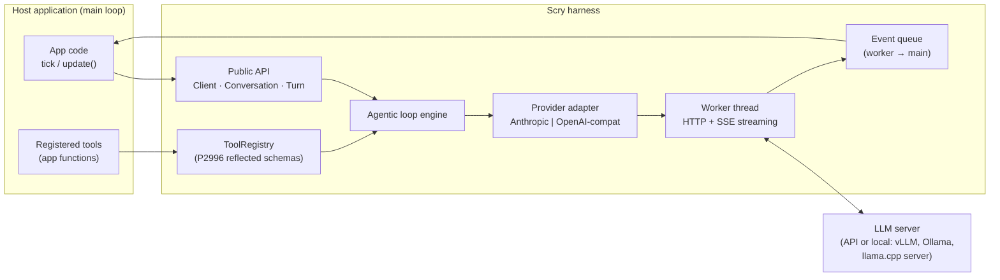
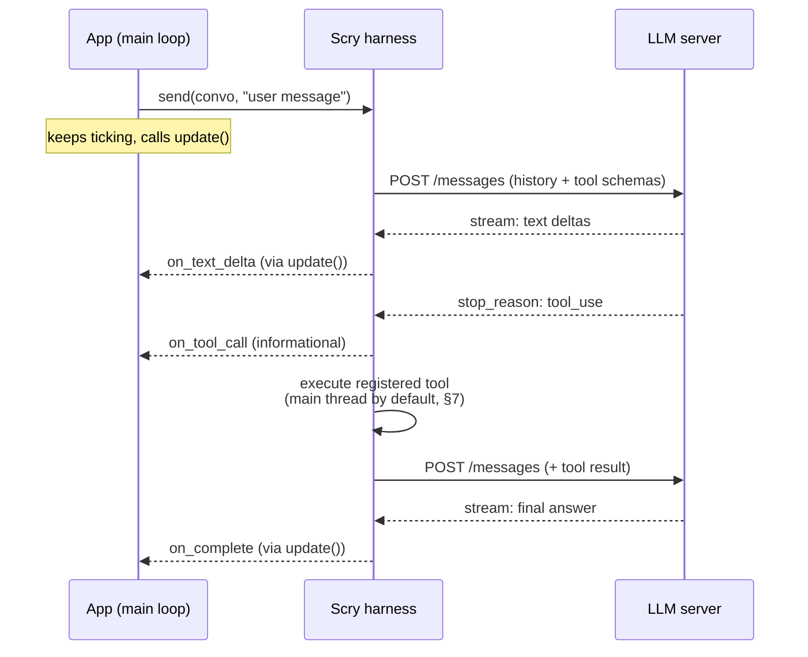
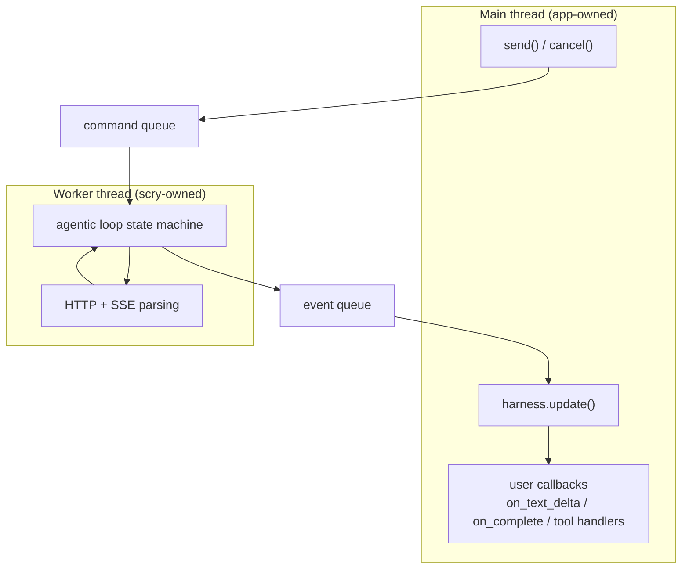

# Scry

> *Scrying: the practice of consulting an oracle by gazing into a mirror.*

A C++ LLM harness for applications with their own main loops. Scry uses **C++26 reflection** to turn ordinary C++ functions into LLM-callable tools, and hides the full agentic loop — HTTP, streaming, tool dispatch, retries — behind a small, poll-friendly API.

The name is the design: **reflection** (the mirror) + **consulting an oracle** (the LLM). Namespace `scry::`, suggested repo name `scry` (fallbacks: `scry-cpp`, `scrylib`).

---

## 1. Vision

Python has a dozen mature LLM harnesses. C++ has llama.cpp bindings for local inference and almost nothing for API-based integration — yet the applications that live in C++ (games, CAD, trading systems, embedded, desktop tools) are exactly the ones that can't easily shell out to Python.

Scry lets an existing C++ application add LLM capabilities — chat *and* tool use — by touching roughly five types, with zero changes to its threading or event architecture.

**Guiding principle:** tool use is the core design target, not an add-on. Chat is the degenerate case of an agentic loop with zero tools. The architecture is built around the loop from day one.

## 2. Goals and Non-Goals

**Goals**

- Drop-in integration for apps with their own main loop (game engines, GUI apps, simulation loops). No event loop assumed, none imposed.
- Tool registration with near-zero boilerplate via C++26 reflection (P2996): schema generation and argument marshalling derived from plain structs at compile time.
- The harness owns the agentic loop entirely: model requests tool → harness executes it → result appended → resend → repeat until final answer.
- Provider abstraction at the message level, not the HTTP level: Anthropic and OpenAI-compatible endpoints (which covers vLLM, Ollama, llama.cpp server) are a config change, not a code change.
- Server/model configuration (base URL, auth, model, sampling params) as simple declarative config.
- Streaming, cancellation, and retries handled internally with clear thread guarantees.

**Non-Goals**

- Not an inference engine. Scry talks to servers; it does not load weights.
- Not a framework. Scry never owns `main()`, never spins an event loop the app must join, never demands ownership of app lifecycle.
- No prompt-template/chain DSL (LangChain-style). Apps compose in C++.
- MSVC support is deferred (no public P2996 support as of mid-2026 — see §9).

## 3. Target Environment

Primary: applications with a main loop that ticks at some frequency — game engines, Qt/ImGui/native GUI apps, simulators. Consequences that drive the whole design:

- **Never block.** Network turns take seconds; the main loop runs at 60 Hz or handles UI events. All network work happens on a harness-owned worker thread.
- **Poll, don't push.** The app calls `scry::Harness::update()` once per tick. All callbacks fire inside `update()`, on the caller's thread. User code needs no locks.
- **Cancellation is normal.** Windows close, scenes change mid-request. Every in-flight turn has a `cancel()` safe to call at any time.

## 4. Core Concepts (the public surface)

The app touches ~5 types:

| Type | Responsibility |
|------|---------------|
| `scry::Config` | Plain value aggregate: base URL, API key, model, sampling params, provider dialect. Designated-initializer friendly. |
| `scry::Client` | PImpl handle over connection/auth state, constructed from a `Config`. Reusable across Harnesses. |
| `scry::Conversation` | Owns message history (system prompt, user/assistant turns, tool calls/results). Serializable for persistence. |
| `scry::ToolRegistry` | Named tools: description + reflected schema + callable. Attached to a Conversation or Client. |
| `scry::Turn` | Handle to one in-flight agentic exchange. Carries callbacks (`on_text_delta`, `on_tool_call`, `on_complete`, `on_error`) and `cancel()`. |
| `scry::Harness` | Owns the worker thread and event queue. `send()` starts a turn; `update()` pumps completions into the app thread. |

Intended feel:

```cpp
// Config is a plain aggregate; Client and Harness are PImpl handles built from it.
// Fallible construction returns std::expected — no exceptions at the boundary.
auto harness = scry::Harness::create(scry::Config{
    .base_url = "https://api.anthropic.com",
    .api_key  = env("API_KEY"),
    .model    = "claude-sonnet-5",
});
if (!harness) { /* harness.error(): config/auth problem, reported as a value */ }

struct ForecastArgs {
    std::string city;   ///< City name
    int days = 3;       ///< Days ahead (optional — has default)
};

harness->tools().add<ForecastArgs>(
    "get_forecast", "Weather forecast for a city",
    [&](const ForecastArgs& a) { return app.forecast(a.city, a.days); });

auto turn = harness->send(convo, "Will it rain in Detroit this week?");
turn.on_complete([&](std::string_view answer) { ui.show(answer); });

// somewhere in the existing main loop:
while (app.running()) {
    harness->update();  // callbacks fire here, on this thread
    app.tick();
}
```

## 5. Architecture Overview



Layering rule: the app only sees the public API; the provider adapter only sees neutral `Message`/`ToolCall` types; only the adapter knows wire formats.

## 6. Interaction Model: the Agentic Loop

The harness owns the loop. The app registers tools and receives a final answer; intermediate tool calls are visible through optional callbacks but require no app participation.



The loop iterates as many times as the model requests tools, bounded by a configurable `max_tool_rounds` to prevent runaways.

## 7. Threading Model

One worker thread per `Harness` does all blocking I/O. A lock-free (or mutex-guarded, initially) event queue carries results back. **Every user callback fires inside `update()`, on the thread that calls it.** That is the contract that makes user code lock-free.



**Tool execution policy.** Tools touch app state, so by default tool handlers also run on the main thread inside `update()` — the worker thread posts a `ToolCallPending` event and waits. Opt-in escape hatch (lands M4): `add<Args>(..., scry::run_on_worker)` for handlers that are thread-safe and slow (disk, DB), so they don't stall the frame.

**Frame budget.** `update()` accepts an optional time budget; excess events roll to the next tick. A 60 Hz app never spends more than its budget on Scry.

**Cancellation.** `Turn::cancel()` sets an atomic flag; the worker aborts the HTTP transfer at the next opportunity and posts a `Cancelled` event. Cancelling a still-queued turn removes it before any I/O is issued. `Turn` handles are safe to drop (detach semantics) or can be joined.

**M1 scheduling baseline (ratified — no longer an open question).** A Harness accepts any number of turns; they queue FIFO and exactly **one HTTP transfer is active at a time**. A second `send()` on a Conversation that already has a turn queued or in flight fails immediately with a distinct error. While the active turn awaits a main-thread tool result, it retains the transfer slot — queued turns wait (deliberate simplification; trigger and end state in the ARCHITECTURE.md evolution register, which moves to curl-multi multiplexing when serialized scheduling measurably limits a real app).

## 8. Tool Registration via C++26 Reflection

The make-or-break API. The LLM needs a JSON schema per tool; the harness needs to unmarshal the model's JSON arguments into a typed call. P2996 gives both from one plain struct — no macros, no hand-written schemas, no template gymnastics in user code.

- Args are described as a struct; `template<typename T> consteval` code walks `std::meta::nonstatic_data_members_of(^^T)` to emit the JSON schema (member names become parameter names; members with default initializers become optional parameters).
- The same reflection generates the JSON→struct deserializer used at dispatch time.
- Doc comments / annotations on members become parameter descriptions (mechanism TBD — annotations via P3394 if available, else a `describe()` customization point).
- Return values: anything serializable to JSON (reflected structs, strings, numbers) becomes the tool result.

**Explicit-schema registration (not a parallel system):** the registry's internal representation is necessarily runtime data — name, description, schema JSON, type-erased `json → json` callable — since that is what gets serialized to the server and dispatched on tool calls. The reflection API is `consteval` sugar that lowers onto this same table, so exposing the lower layer as a public overload costs one function signature, not a second code path to maintain. It earns its keep twice: today it covers toolchains without P2996; permanently it covers *dynamic* tools whose schemas exist only at runtime (plugin-loaded tools, MCP proxying, user scripting) — something compile-time reflection can never express. If universal P2996 adoption arrives, the overload remains as the dynamic-tool API rather than becoming debt.

Prior art to study: **Glaze** (compile-time JSON with P2996 support) — potentially even a dependency for the JSON layer.

## 9. Provider Abstraction

Neutral internal model: `Message { role, vector<ContentBlock> }` where `ContentBlock` is text, tool call, or tool result. Adapters translate to wire formats:

- **Anthropic Messages API** — content blocks, `tool_use`/`tool_result`.
- **OpenAI-compatible Chat Completions** — covers OpenAI plus vLLM, Ollama, llama.cpp server, LM Studio; one adapter, many backends.

Adapter differences (schema envelope, streaming event shapes, stop reasons) are contained entirely in the adapter. Switching providers or pointing at a local model is a `Client` config change.

**Toolchain reality (mid-2026):** P2996 is in C++26; GCC trunk has support; Bloomberg's clang-p2996 fork is the most complete implementation; MSVC has no public support. Development targets GCC trunk / clang-p2996. This is deliberately acceptable — the project doubles as a demonstration of C++26 reflection.

## 10. Errors, Retries, Streaming

- **Retries:** exponential backoff with jitter for 429/5xx/transport errors, honoring `Retry-After`, under configurable attempt and elapsed-time caps. Retry eligibility is strict: a request is retried only if **no semantic output has been consumed** (failure before the first content event). After partial output the turn fails with a retryable-flagged error and the app decides — automatic mid-stream resumption is later hardening, not M1. A dispatched tool call is **never re-dispatched** by retry machinery: tool execution is at-most-once per tool-call ID, and completed tool rounds live in history, so re-sending a request never re-runs a side effect.
- **Errors** surface as a single `on_error(scry::Error)` callback with category (auth, rate limit, network, protocol, tool, resource, busy, cancelled — the ERR-001 enum) — tool handler exceptions are caught and returned to the model as tool errors (the model can often recover), not thrown into the app.
- **Streaming:** SSE parsed on the worker; text deltas batched per `update()` tick rather than per-token, so a fast stream doesn't flood the queue.

## 11. Open Questions

Resolved and removed from this list: concurrency baseline (§7, ratified), JSON library (Glaze — ARCHITECTURE.md §9), HTTP library (libcurl direct — ARCHITECTURE.md §7). Remaining, none of which block M0/M1:

1. **Parameter descriptions** — P3394 annotations vs. customization point vs. convention. Decide during M3, once the pinned toolchain's annotation support is known.
2. **Structured output** — reflected structs also enable "answer as this type" (schema-constrained responses). Natural v2 feature; keep the door open in `Turn`.
3. **Coroutine sugar** — `co_await harness.send(...)` for apps with coroutine schedulers. Tracked in the evolution register; layered over the event queue later.

## 12. Roadmap

| Milestone | Scope |
|-----------|-------|
| **M0 — Skeleton** | Compile-only public header sketch + canonical example; build/CI matrix (reflection-OFF on Linux + macOS; reflection-ON on Linux — PORT-005 as amended, ADR 0004); bounded feasibility spikes: P2996 schema generation on GCC trunk + clang-p2996 with Glaze, and a libcurl SSE streaming probe. No agentic loop. |
| **M1 — Chat** | Client + Conversation + Harness + worker thread + update() pump; Anthropic adapter; blocking + streaming text. No tools. |
| **M2 — Tools** | ToolRegistry with explicit-schema registration; agentic loop engine; main-thread tool execution. |
| **M3 — Reflection** | P2996 schema generation + marshalling; the `add<Args>()` API; docs demo. |
| **M4 — Breadth** | OpenAI-compatible adapter (vLLM/Ollama/llama.cpp), retries/backoff polish, cancellation hardening, worker-thread tools. |
| **M5 — Showcase** | Example integrations: ImGui chat panel; a small game where the LLM drives an NPC via tools. |

M1 before M3 on purpose: the reflection layer is the flashy part, but it needs a working loop underneath it to demonstrate anything.
