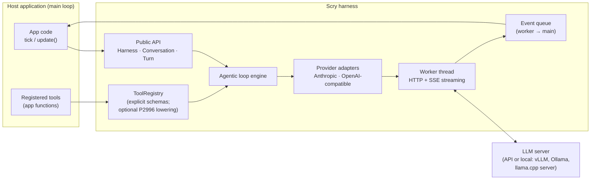
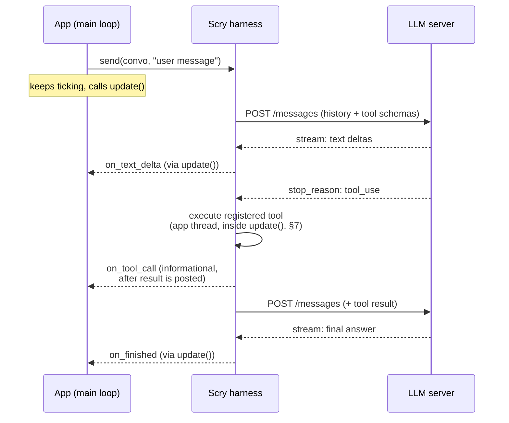
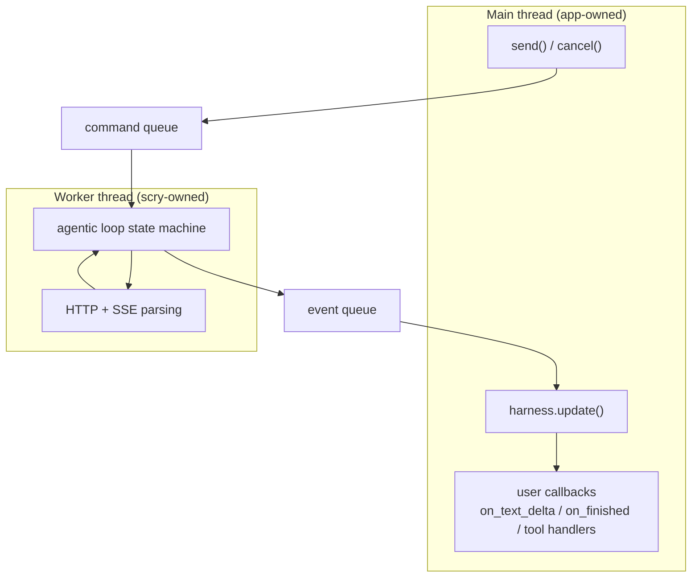

# Scry

> *Scrying: the practice of consulting an oracle by gazing into a mirror.*

A C++ LLM harness for applications with their own main loops. Scry's stable
C++23 surface turns explicit schemas and callables into LLM tools and hides the
full agentic loop — HTTP, streaming, tool dispatch, retries — behind a small,
poll-friendly API. An optional, experimental **C++26 reflection** component
derives the same registrations from ordinary C++ types under
[ADR 0007](docs/adr/0007-m3-reflection-contract.md).

The name is the design: **reflection** (the mirror) + **consulting an oracle** (the LLM). Namespace `scry::`; the canonical repository is [github.com/crybo-rybo/scry](https://github.com/crybo-rybo/scry).

---

## 1. Vision

Python has a dozen mature LLM harnesses. C++ has llama.cpp bindings for local inference and almost nothing for API-based integration — yet the applications that live in C++ (games, CAD, trading systems, embedded, desktop tools) are exactly the ones that can't easily shell out to Python.

Scry lets an existing C++ application add LLM capabilities — chat *and* tool use — by touching roughly five types, with zero changes to its threading or event architecture.

**Guiding principle:** tool use is the core design target, not an add-on. Chat is the degenerate case of an agentic loop with zero tools. The architecture is built around the loop from day one.

## 2. Goals and Non-Goals

**Goals**

- Drop-in integration for apps with their own main loop (game engines, GUI apps, simulation loops). No event loop assumed, none imposed.
- Tool registration with near-zero boilerplate via C++26 reflection (P2996):
  schema generation and argument marshalling derived from plain structs at
  compile time, lowering to the same C++23 registry. Optional and experimental.
- The harness owns the agentic loop entirely: model requests tool → harness executes it → result appended → resend → repeat until final answer.
- Provider abstraction at the message level, not the HTTP level: Anthropic and
  the ADR 0008 OpenAI-compatible common subset for vLLM, Ollama, llama.cpp
  server, and LM Studio sit behind a config-only switch.
- Server/model configuration (base URL, auth, model, sampling params, optional
  reasoning disablement) as simple declarative config.
- Streaming, cancellation, and retries handled internally with clear thread guarantees.
- Examples that prove the public C++23 surface embeds in a real immediate-mode
  GUI and a small stateful game loop without expanding Scry's API or lifecycle.

**Non-Goals**

- Not an inference engine. Scry talks to servers; it does not load weights.
- Not a framework. Scry never owns `main()`, never spins an event loop the app must join, never demands ownership of app lifecycle.
- Not a GUI or game engine. Showcase views and world objects remain
  example-local; applications keep their window, rendering, input, state, and
  update-loop ownership.
- No prompt-template/chain DSL (LangChain-style). Apps compose in C++.
- MSVC support is deferred (no public P2996 support as of mid-2026 — see §9).

## 3. Target Environment

Primary: applications with a main loop that ticks at some frequency — game engines, Qt/ImGui/native GUI apps, simulators. Consequences that drive the whole design:

- **Never block by default.** Network turns take seconds; the main loop runs at 60 Hz or handles UI events. The async surface never waits on network I/O; the explicitly named `send_and_wait` convenience is reserved for CLI tools and tests.
- **Poll, don't push.** The app calls `scry::Harness::update()` once per tick. All callbacks fire inside `update()`, on the caller's thread. User code needs no locks.
- **Cancellation is normal.** Windows close, scenes change mid-request. Every in-flight turn has a `cancel()` safe to call at any time.

## 4. Core Concepts (the public surface)

The app touches five core concepts:

| Type | Responsibility |
|------|---------------|
| `scry::Config` | Plain value aggregate: base URL, API key, model, sampling params, reasoning mode, provider dialect. Designated-initializer friendly. |
| `scry::Conversation` | Owns message history (system prompt, user/assistant turns, tool calls/results). Serializable for persistence. |
| `scry::ToolRegistry` | Named tools: description + schema + callable. Owned by a Harness and snapshotted when a turn is accepted. |
| `scry::Turn` | Move-only handle to one in-flight agentic exchange. Exposes `id()` and `cancel()`; the callbacks for the turn are supplied to `send()`. |
| `scry::Harness` | Created from `Config`; owns provider/auth state, the tool registry, worker thread, and event queue. `send()` starts a turn; `update()` pumps completions into the app thread. |

Intended feel:

```cpp
// Config is a plain aggregate; Harness is the single configured runtime owner.
// Semantic failures are values. Allocation failure remains an ordinary C++ exception.
auto harness = scry::Harness::create(scry::Config{
    .base_url = "https://api.anthropic.com",
    .api_key  = env("API_KEY"),
    .model    = "claude-sonnet-5",
});
if (!harness) { /* invalid configuration, reported as a value */ }

auto conversation = scry::Conversation::create({
    .system_prompt = "Answer briefly and use tools when useful.",
});
if (!conversation) { /* invalid conversation configuration */ }

auto registered = harness->tools().add(
    scry::ToolDefinition{
        .name = "get_application_status",
        .description = "Report whether the host main loop is running",
        .input_schema = {
            .text = R"({"type":"object","properties":{},"additionalProperties":false})",
        },
    },
    [&](scry::Json arguments) -> scry::Result<scry::Json> {
        return app.status(arguments); // validate JSON; return valid JSON
    });
if (!registered) { /* invalid schema, duplicate name, or inactive registry */ }

// Callbacks are part of the send: the turn owns them before it is accepted.
auto turn = harness->send(*conversation, "Is the host application still running?",
    scry::TurnCallbacks{
        .on_text_delta = [&](std::string_view chunk) { ui.append(chunk); },
        .on_finished = [&](scry::Result<scry::Completion> outcome) {
            if (outcome) { ui.show(outcome->text); }
            else { ui.show_error(outcome.error()); }  // includes cancellation
        },
    });
if (!turn) { /* busy, invalid state, or admission/resource limit */ }

// somewhere in the existing main loop:
while (app.running()) {
    harness->update();  // callbacks fire here, on this thread
    app.tick();
}
```

This explicit-schema overload is the implemented C++23 surface. The
[checked-in canonical example](examples/main_loop.cpp) registers a read-only
tool through it and drives the complete loop. The optional reflection component
adds `scry::reflection::add<Args>()` schema generation and marshalling as
compile-time sugar over the same registry; it does not introduce a second
dispatch system.

**Conversation persistence.** `Conversation::to_json()` returns a canonical,
versioned Scry-owned JSON document suitable for app-managed storage;
`Conversation::from_json()` validates and restores one. It preserves
the system prompt and every committed neutral text, tool-call, and tool-result
block. Busy state and uncommitted turns are deliberately excluded, so saving
an active Conversation captures its last committed boundary. Scry does no file
I/O and rejects malformed documents, unknown fields or versions, and invalid
role/content combinations with `invalid_config`.

**The document format is unstable before 1.0.** It carries a version field, but
0.x releases may change the shape without a migration path: a document written
by one 0.x release is not guaranteed to load in another. Use it for session
continuity against a pinned Scry version, not as an archival format.

## 5. Architecture Overview


```mermaid
graph LR
    subgraph App["Host application (main loop)"]
        MAIN["App code<br/>tick / update()"]
        TOOLS["Registered tools<br/>(app functions)"]
    end

    subgraph Scry["Scry harness"]
        API["Public API<br/>Harness · Conversation · Turn"]
        REG["ToolRegistry<br/>(explicit schemas;<br/>optional P2996 lowering)"]
        LOOP["Agentic loop engine"]
        Q["Event queue<br/>(worker → main)"]
        PROV["Provider adapters<br/>Anthropic · OpenAI-compatible"]
        NET["Worker thread<br/>HTTP + SSE streaming"]
    end

    LLM["LLM server<br/>(API or local: vLLM, Ollama,<br/>llama.cpp server)"]

    MAIN --> API --> LOOP
    TOOLS --> REG --> LOOP
    LOOP --> PROV --> NET <--> LLM
    NET --> Q --> MAIN
```

Layering rule: the app only sees the public API; the provider adapter only sees neutral `Message`/`ToolCall` types; only the adapter knows wire formats.

## 6. Interaction Model: the Agentic Loop

The harness owns the loop. The app registers tools and receives a final answer; intermediate tool calls are visible through optional callbacks but require no app participation.


```mermaid
sequenceDiagram
    participant App as App (main loop)
    participant H as Scry harness
    participant LLM as LLM server

    App->>H: send(convo, "user message")
    Note over App: keeps ticking, calls update()
    H->>LLM: POST /messages (history + tool schemas)
    LLM-->>H: stream: text deltas
    H-->>App: on_text_delta (via update())
    LLM-->>H: stop_reason: tool_use
    H->>H: execute registered tool<br/>(app thread, inside update(), §7)
    H-->>App: on_tool_call (informational,<br/>after result is posted)
    H->>LLM: POST /messages (+ tool result)
    LLM-->>H: stream: final answer
    H-->>App: on_finished (via update())
```

The loop iterates as many times as the model requests tools, bounded by a configurable `max_tool_rounds` to prevent runaways.

## 7. Threading Model

One worker thread per `Harness` does all blocking I/O. A lock-free (or mutex-guarded, initially) event queue carries results back. **Every user callback fires inside `update()`, on the thread that calls it.** That is the contract that makes user code lock-free.


```mermaid
graph TB
    subgraph MT["Main thread (app-owned)"]
        U["harness.update()"]
        CB["user callbacks<br/>on_text_delta / on_finished / tool handlers"]
        S["send() / cancel()"]
    end
    subgraph WT["Worker thread (scry-owned)"]
        HTTP["HTTP + SSE parsing"]
        AL["agentic loop state machine"]
    end
    EQ["event queue"]
    CQ["command queue"]

    S --> CQ --> AL
    AL --> HTTP
    HTTP --> AL
    AL --> EQ --> U --> CB
```

**Tool execution policy.** There is one policy: every handler runs on the app
thread, inside `update()`, in provider order. That is the safe mode for
handlers touching host-owned game, GUI, or simulation state, and it is the only
mode — a handler is ordinary app code running on the app's own thread, so there
is no second agent loop, no pool, and no application callable crossing the
worker boundary. The complete provider batch is admitted atomically; `update()`
then walks it, invoking each handler, running the optional `on_tool_call`
observer, and applying the canonical result before admitting the next call.

The cost is explicit: a slow handler spends the host's frame budget, because
Scry never preempts user code. The intended answer is an asynchronous/deferred
tool-result API (§11), not a hidden thread executing application callbacks
behind the host's back.

**Callbacks are part of the send.** `Harness::send()` takes a `TurnCallbacks`
aggregate — `on_text_delta`, `on_tool_call`, and the terminal `on_finished` —
and moves it into the turn before acceptance. Every member is optional;
omitting one changes no loop behavior. The immutable callback set is installed
before the worker command becomes visible, so no event can precede that set;
an event with no matching callback is released immediately. The `Turn` handle
needs no registration surface at all: it carries `id()` and `cancel()`.

**One terminal outcome.** The turn becomes terminal exactly once whether or not
it has a terminal observer. When non-empty, `on_finished` is invoked exactly
once and receives a `Result<Completion>` by value — the completion on success,
or the `Error` on failure. Cancellation is not a separate event type: it arrives
on that same channel as an `Error` with category `cancelled`.

**Frame budget.** `update()` accepts an optional time budget; excess events roll to the next tick. The budget is a soft deadline checked between callbacks. Scry never preempts user code, so one slow callback or tool handler can overrun it.

**Cancellation.** `Turn::cancel()` sets an atomic flag; the worker aborts the HTTP transfer at the next opportunity, and the turn terminates through `on_finished` with a `cancelled` error. Cancelling a still-queued turn removes it before any I/O is issued. `Turn` handles are safe to drop (detach semantics); dropping does not join, block, or cancel — the callbacks supplied at send still run.

Tool handlers are non-preemptive. Cancellation observed before dispatch skips
the handler. Cancellation requested while one runs takes effect when it
returns: Scry suppresses that result and the remaining calls, does not resend
to the model, and terminates the turn as cancelled. Scry can bound its own
transport shutdown but cannot safely terminate arbitrary C++ user code — which
is exactly why handlers run on the caller's thread, where the host already
governs how long its own code may take.

**Batch and payload atomicity.** All tool calls from one assistant response are
admitted to the worker-to-pump event queue as one batch. If the whole batch
cannot fit, none becomes dispatchable and no handler runs. During pump
dispatch, a fatal framework failure (for example, no remaining space for even
a bounded result) suppresses every later handler in that batch. The
Conversation byte limit is one cumulative exchange budget: assistant tool-call
messages, every tool result, and the final answer are reserved before
dispatch, resend, or commit. It is not a per-message limit.

**Scheduling baseline.** A Harness accepts up to `Config::limits.max_pending_turns`; accepted turns queue FIFO and exactly **one HTTP transfer is active at a time**. Admission beyond that bound fails immediately with `resource_limit`. A second `send()` on a Conversation that already has a turn queued or in flight fails immediately with `busy`. While the active turn awaits a tool result, it retains the serialized turn slot, so queued turns wait (deliberate simplification; trigger and end state in the ARCHITECTURE.md evolution register, which moves to curl-multi multiplexing when serialized scheduling measurably limits a real app).

**Registry ownership and snapshots.** A Harness owns exactly one `ToolRegistry`;
there is no Conversation-local or process-global registry. `send()` snapshots
immutable registrations into the accepted turn, so later or reentrant
registration remains safe and affects only subsequently accepted turns. The
public surface cannot move the Harness-owned registry out. Definitions are
snapshotted and their neutral schemas are copied to the worker; handlers stay
pump-owned and never cross the thread boundary. Explicit schemas are parsed
when registered, must be JSON objects, and are stored canonically.

**Runtime configuration defaults.** Limits count payload bytes (not allocator
overhead); implementations may reject earlier when a provider's own limit is
lower. These defaults are conservative starting points and remain configurable:

| Setting | Default |
|---|---:|
| Pending turns per Harness | 64 |
| SSE event | 256 KiB |
| Response | 8 MiB |
| Tool arguments | 1 MiB |
| Tool result | 4 MiB |
| Queued event payload per turn | 2 MiB |
| Conversation payload | 16 MiB |
| Tool rounds | 8 |
| Default maximum output tokens | 1024 |
| Retry attempts / elapsed time | 3 / 30 s |
| Retry initial / maximum backoff | 250 ms / 10 s |
| Connect / transfer / shutdown timeout | 10 s / 120 s / 2 s |

TLS peer verification defaults on. The runtime uses Curl with asynchronous DNS,
applies Curl's connect timeout (which covers name resolution and connection)
and total transfer timeout, and caps each multi-poll wait by the shutdown
timeout. A runtime that cannot provide the required resolver/global
capabilities is rejected. Deterministic tests cover held transfers, cancellation,
and capability rejection; the timeout wiring is source-reviewed rather than
tested against a flaky DNS black hole.

## 8. Tool Registration: Explicit Schemas, Optional Reflection

The stable boundary accepts a `ToolDefinition` (name, description, and
JSON-object input schema) plus a move-only `Json → Result<Json>` handler.
Registration parses and canonicalizes the schema immediately. Each accepted
turn owns an immutable snapshot, sends its schemas with every model request,
dispatches calls on the `update()` thread, and automatically resends ordered
results. The handler is responsible for validating its explicit JSON arguments
and returning valid JSON; Scry converts unknown tools, handler errors,
exceptions, and malformed handler output into bounded model-visible tool
errors.

P2996 is an optional, experimental ergonomics layer over that boundary. [ADR
0007](docs/adr/0007-m3-reflection-contract.md) fixes its contract. Its public
shape is a free function in the optional component, keeping experimental
declarations out of the stable `ToolRegistry` class:

```cpp
struct ForecastArgs {
    [[=scry::reflection::description{"City to query"}]]
    std::string city;
    std::optional<int> days = std::nullopt;
};

struct Forecast {
    std::string summary;
    double temperature_c;
};

auto status = scry::reflection::add<ForecastArgs>(
    harness->tools(),
    {
        .name = "forecast",
        .description = "Return the forecast for one city",
    },
    [](ForecastArgs args) -> scry::Result<Forecast> {
        return lookup_forecast(std::move(args));
    });
```

`input_schema_v<Args>` is a compile-time, minified canonical JSON schema.
Objects and property names are sorted lexicographically, nested aggregates are
closed inline objects, and enum values preserve declaration order. The
value family is deliberately finite: booleans; non-character integral types;
finite `float`/`double`; owning strings; scoped enums; optionals; vectors
except every `vector<bool, Allocator>` specialization; fixed arrays; and
recursively supported plain aggregates. Scoped enum values must be unique, and
only one optional layer is supported: enum aliases and nested optionals are
rejected because their JSON representation cannot preserve the C++ distinction.
Integers carry their C++ range, fixed arrays carry their exact length, and
unsupported shapes fail at the registration call. Glaze supporting another
C++ type does not silently add it to Scry's contract.

**Presence and null are separate.** A default member initializer alone permits
omission; `std::optional` alone permits JSON `null`. Consequently
`std::optional<T> value;` is required-but-nullable, while
`T value = initializer;` is omittable-but-non-null. If an initialized member is
omitted, normal C++ construction preserves its initializer. Generated schemas
never publish a JSON Schema `default`.

The generated decoder rejects a non-object root, unknown fields, missing
required fields, wrong JSON kinds, disallowed null, numeric sign/range or
non-finite errors, unknown enum names, and fixed-array length mismatches at
every nesting level. These are bounded model-visible tool errors, not fatal
turn failures. The canonical parsed JSON value is the dispatch boundary:
duplicate lexical keys have already been collapsed by the single canonical
parse and are not separately observable to the reflected decoder.

Tool and parameter descriptions come from Scry's P3394 `description`
annotation and from nowhere else — there is no portable trait-based fallback or
override, so a description has exactly one source and lives next to the member
it describes. Duplicate description annotations on one entity are a
compile-time error.

Handlers receive a moved `Args` and may return a supported value directly or
inside `scry::Result`. Raw `Json`, `void`, `Status`, references, futures, and
awaitables deliberately stay outside the reflected overload; the implemented
explicit-schema API remains the escape hatch for dynamic or unsupported
boundaries.

**Explicit-schema registration (not a parallel system):** the registry's internal representation is necessarily runtime data — name, description, schema JSON, type-erased `json → json` callable — since that is what gets serialized to the server and dispatched on tool calls. The reflection API is `consteval` sugar that lowers onto this same table, so exposing the lower layer as a public overload costs one function signature, not a second code path to maintain. It earns its keep twice: today it covers toolchains without P2996; permanently it covers *dynamic* tools whose schemas exist only at runtime (plugin-loaded tools, MCP proxying, user scripting) — something compile-time reflection can never express. If universal P2996 adoption arrives, the overload remains as the dynamic-tool API rather than becoming debt.

**Side effects and idempotency.** Scry guarantees at-most-once dispatch for a
tool-call ID within one accepted turn. It cannot make external effects
transactional: cancellation may arrive after a non-preemptive handler has
changed app state, and a failed/cancelled turn intentionally commits no
Conversation history. A host that lets tools charge a card, write a file, send
a command, or otherwise mutate durable state must therefore include an
app-owned operation/idempotency key in that tool's schema. Before applying the
effect, the handler checks a durable key→result ledger and returns the recorded
result for duplicates; after an ambiguous failure, the app reconciles that
ledger before resubmitting the user request. Read-only handlers, such as the
canonical `get_application_status` example, need no such policy.

**Glaze** is the ratified internal JSON dependency (ARCHITECTURE.md §9). The
reflection header and installed target expose only Scry-owned and standard
types; compiled implementation reaches Glaze through a Scry-owned JSON bridge.

## 9. Provider Abstraction

Neutral internal model: `Message { role, vector<ContentBlock> }` where `ContentBlock` is text, tool call, or tool result. Adapters translate to wire formats:

- **Anthropic Messages API** — content blocks, `tool_use`/`tool_result`.
- **OpenAI-compatible Chat Completions** — OpenAI plus the
  common vLLM, Ollama, llama.cpp server, and LM Studio subset from ADR 0008.

Adapter differences (schema envelope, streaming event shapes, stop reasons)
remain entirely inside the adapter, and every adapter receives a `Config` that
`Harness::create` already validated. The OpenAI-compatible dialect deliberately
targets a *common subset*, not parity: it normalizes an origin, a `/v1` base,
or a full `/v1/chat/completions` endpoint without Azure inference; makes
authentication optional so local servers need no key; keeps the portable
request baseline free of provider extensions; and expands each neutral tool
result into its own ordered `role: "tool"` message. One explicit opt-in exists:
`ReasoningMode::disabled` sends `reasoning_effort: "none"` for endpoints that
support it, while the default omits the field. ADR 0008 fixes that contract and
PROV-010/011 state its binding form, including the strict streaming lifecycle:
bounded index-accumulated tool fragments, a required finish reason, and `[DONE]`
as the sole successful terminal marker, with anything else a protocol error.

The adapter seam is streaming-only: the runtime always requests
`stream: true` and decodes every response through the stream path, so there is
no parallel non-streaming decoder to keep in sync (see the evolution register
in ARCHITECTURE.md §11). Per-turn decode state is a dialect-specific variant,
so Anthropic and OpenAI-compatible Harnesses cannot contaminate one another.
Switching dialects is only a `Harness` config change.

**Toolchain and package reality (mid-2026):** P2996 is in C++26.
[GCC 16 provides P2996R13](https://gcc.gnu.org/projects/cxx-status.html) behind
`-std=c++26 -freflection` and is the supported reflection toolchain.
Reflection is opt-in at build time and is consumed as
`find_package(scry CONFIG REQUIRED COMPONENTS reflection)` plus
`scry::reflection`; the core `scry::scry` package remains C++23 and does not
install or export reflection support when built with the feature off.
Bloomberg's [clang-p2996 fork](https://github.com/bloomberg/clang-p2996)
remains useful for manual compatibility experiments, but it is not a supported
reflection configuration and produces no installable or release artifacts.
Stable GCC/Clang build the severable C++23 core with reflection disabled. MSVC
reflection support remains deferred.

## 10. Errors, Retries, Streaming

- **Retries:** exponential backoff with jitter for 429/5xx/transport errors, honoring `Retry-After`, under configurable attempt and elapsed-time caps. Retry eligibility is strict: a request is retried only if **no semantic output has been consumed** (failure before the first content event). After partial output the turn fails with a retryable-flagged error and the app decides — automatic mid-stream resumption is later hardening. Within one turn, retry machinery never dispatches the same tool-call ID twice. A failed or cancelled turn commits no tool rounds, so resubmitting the user message is **not** automatically safe for side-effecting tools; applications must supply their own idempotency keys or reconciliation policy.
- **Errors:** immediate API rejection (`create`, `send`, tool registration) returns `std::expected<..., scry::Error>`. Once a turn is accepted, every asynchronous outcome uses one channel: when supplied, `on_finished(scry::Result<scry::Completion>)` carries the completion or the `scry::Error`. Categories include invalid configuration/state, busy, authentication, rate limit, network, protocol, resource limit, tool failure, maximum tool rounds, and cancellation. Tool-handler exceptions are caught and returned to the model as tool errors (the model can often recover), not thrown into the app. Exceptions thrown by app callbacks are different: they propagate synchronously out of `update()` after the event is counted delivered.
- **Streaming:** SSE parsed on the worker; text deltas batched per `update()` tick rather than per-token, so a fast stream doesn't flood the queue. The text-delta view and tool-call reference are borrowed for the invocation; apps copy data they retain. `on_finished` receives its result by value.

## 11. Open Questions

Resolved and removed from this list: concurrency baseline (§7), JSON library
(Glaze — ARCHITECTURE.md §9), and HTTP library (libcurl direct —
ARCHITECTURE.md §7). Remaining:

1. **Asynchronous / deferred tool results** — a handler that accepts a call,
   returns immediately, and completes its result on a later `update()`. This is
   the intended answer for a genuinely slow tool now that handlers all run on
   the app thread (§7): it keeps app callbacks on the app's own thread instead
   of hiding a worker behind them, but it needs its own cancellation, ordering,
   and budget rules ratified before it ships.
2. **Structured output** — reflected structs also enable "answer as this type" (schema-constrained responses). Natural v2 feature; keep the door open in `Turn`.
3. **Coroutine sugar** — `co_await harness.send(...)` for apps with coroutine schedulers. Tracked in the evolution register; layered over the event queue later.

## 12. Scope

**Shipped in v0.0.1.** The C++23 runtime — Config, Conversation, ToolRegistry,
Turn, Harness — with the streaming agentic tool loop on a sans-I/O machine,
explicit-schema tools dispatched from `update()`, retries and cancellation,
transactional history with versioned (pre-1.0 unstable) persistence, and two
config-selected provider dialects: Anthropic Messages and the ADR 0008
OpenAI-compatible Chat Completions subset. Alongside it: the optional,
experimental GCC 16 `scry::reflection` component, and opt-in showcase examples
— a Dear ImGui chat panel and a deterministic grid world where the model drives
an NPC through explicit tools — that add no public, installed, or exported
surface ([ADR 0010](docs/adr/0010-m5-showcase-contract.md)).

**Not shipped, in rough order of demand.** The asynchronous/deferred
tool-result API and structured output from §11; curl-multi multiplexing of
concurrent turns; coroutine-awaitable turns; Windows support. Each has a
trigger and an intended end state in the ARCHITECTURE.md §11 evolution
register — nothing here is scheduled, and nothing here is promised before 1.0.
