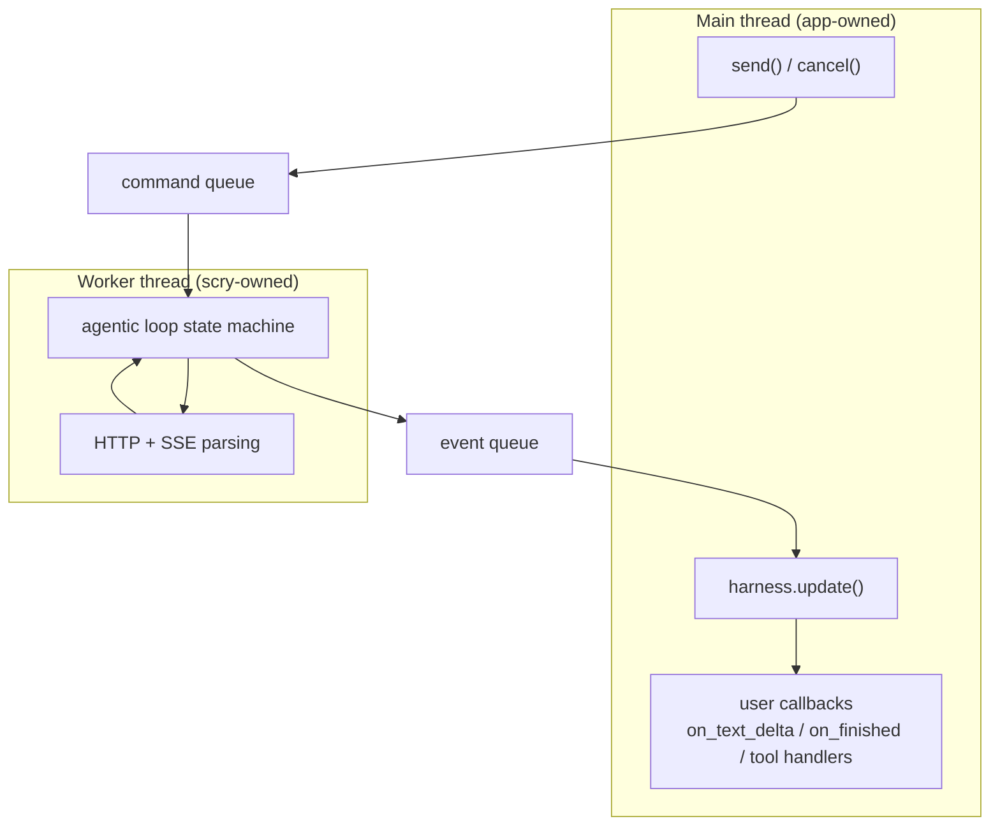
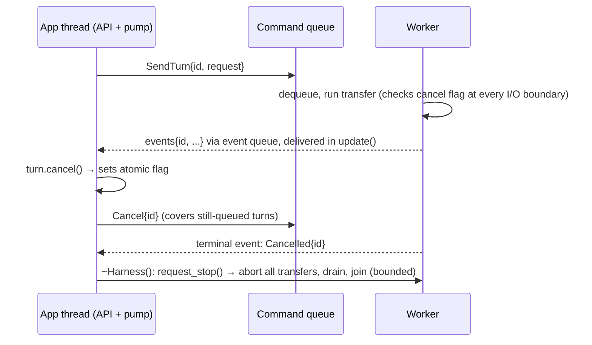

# Scry architecture

How Scry is built and why. The public headers under `include/scry/` are the API
source of truth and the generated Doxygen site is the reference; this document
explains the shape behind them. For toolchain setup and the development
workflow, see [contributing.md](contributing.md).

---

## 1. What Scry is, and is not

Python has a dozen mature LLM harnesses. C++ has llama.cpp bindings for local
inference and almost nothing for API-based integration — yet the applications
that live in C++ (games, CAD, trading systems, embedded, desktop tools) are
exactly the ones that cannot easily shell out to Python. Scry lets an existing
C++ application add chat *and* tool use by touching roughly five types, with no
change to its threading or event architecture.

Tool use is the core design target, not an add-on. Chat is the degenerate case
of an agentic loop with zero tools, so the architecture is built around the loop.

**Target environment: applications with a main loop** — game engines,
Qt/ImGui/native GUI apps, simulators. Three consequences drive the whole design.

- **Never block by default.** Network turns take seconds; the main loop runs at
  60 Hz. The asynchronous surface never waits on network I/O; the explicitly
  named `send_and_wait` is reserved for command line tools and tests.
- **Poll, don't push.** The host calls `Harness::update()` once per tick. All
  callbacks fire inside it, on the calling thread, so host code needs no locks.
- **Cancellation is normal.** Windows close and scenes change mid-request. Every
  in-flight turn can be cancelled at any time, and a host that wants the work to
  continue but the reporting to stop can disconnect it instead.

**Non-goals.** Scry is not an inference engine: it talks to servers, it does not
load weights. It is not a framework: it never owns `main()`, never spins an event
loop the host must join, never demands the host's lifecycle. It is not a GUI or
game engine, and there is no prompt-template or chain DSL — hosts compose in C++.

## 2. The five concepts

- **`Config`** — a designated-initializer-friendly aggregate: base URL, API key,
  model, sampling, reasoning mode, dialect, retry and timeout policy, resource
  limits, and network options (CA bundle, proxy, verbatim extra headers).
  `Harness::validate(config)` runs exactly the create-time checks without
  starting libcurl or a worker, so a settings dialog can report problems first.
- **`Conversation`** — owns committed history. Inspectable through `messages()`,
  `system_prompt()`, and `busy()`; serializable through `to_json()`/`from_json()`.
- **`ToolRegistry`** — named tools: description, schema, callable. Owned by a
  Harness and snapshotted when a turn is accepted.
- **`Turn`** — a move-only handle to one in-flight exchange: `id()`,
  `finished()`, `cancel()`, `disconnect()`. Callbacks belong to the turn and are
  supplied to `send()`.
- **`Harness`** — created from a `Config`; owns provider and auth state, the
  registry, the worker thread, and the event queue. `send()` starts a turn,
  `update()` pumps everything onto the host thread.

```cpp
// Config is a plain aggregate; Harness is the single configured runtime owner.
// Semantic failures are values. Allocation failure remains an ordinary exception.
auto harness = scry::Harness::create(scry::Config{
    .base_url = "https://api.anthropic.com",
    .api_key = env("API_KEY"),
    .model = "claude-sonnet-5",
});
if (!harness) { /* invalid configuration, reported as a value */ }

auto conversation = scry::Conversation::create({
    .system_prompt = "Answer briefly and use tools when useful.",
});

// Reflected registration: schema, strict argument decode, and result encode are
// all generated from the aggregate.
struct StatusArgs {
  [[= scry::reflection::description{"Include a human-readable label"}]]
  bool verbose{false};
};
auto registered = scry::reflection::add<StatusArgs>(
    harness->tools(),
    {.name = "get_application_status",
     .description = "Report whether the host main loop is running"},
    [&](StatusArgs args) { return app.status(args.verbose); });
if (!registered) { /* invalid metadata, duplicate name, or inactive registry */ }

// Callbacks are part of the send: the turn owns them before it is accepted.
auto turn = harness->send(*conversation, "Is the host application running?",
    scry::TurnCallbacks{
        .on_text_delta = [&](std::string_view chunk) { ui.append(chunk); },
        .on_tool_call = [&](const scry::ToolCall& call) {
            ui.show_tool(call.name, call.result.text, call.is_error);
        },
        .on_finished = [&](scry::Result<scry::Completion> outcome) {
            if (outcome) { ui.show(outcome->text); }
            else { ui.show_error(outcome.error()); }  // includes cancellation
        },
    });
if (!turn) { /* busy, invalid argument or state, or an admission limit */ }

while (app.running() && !turn->finished()) {  // the loop you already own
    harness->update();                        // callbacks fire here, this thread
    app.tick();
}
ui.render_history(conversation->messages());
```

`scry::Json` is the Scry-owned serialized JSON boundary type, read through
`scry::JsonView` and written by hand with `scry::escape_json_string()`, so a
C++23 host needs no third-party parser to work the tool boundary.
`Conversation::messages()` returns committed history as the public
`scry::Message` family — the same family the adapters encode — so a chat UI
renders state instead of mirroring it. `Harness::cancel(TurnId)` and
`Harness::disconnect(TurnId)` are the handle operations addressed by identifier,
for hosts that track turns by id.

## 3. Threading and ownership

One worker thread per `Harness` does all blocking I/O. The worker is an
**actor**: it exclusively owns all mutable networking and loop state, and the
only way anything crosses the thread boundary is message passing through two
queues. Commands cover send, cancel, tool result, and shutdown; events cover text
deltas, tool-call requests, completions, and errors. Nothing gets a side channel.



**Enumerated shared state.** Mutable cross-thread state is exactly three
internally synchronized objects: the command queue, the event queue, and one
atomic cancellation flag per turn. Accepted-turn commands additionally carry
shared *immutable* history and tool-schema blocks; the worker only reads them,
and the pump reseats a still-shared history block copy-on-write before mutating
it. Everything else is exclusively owned, and the worker addresses turns only by
immutable `TurnId`. This enumeration is the invariant TSan enforces: anything not
on the list found crossing threads is a bug by definition.

Messages are immutable values — a `std::variant` of small structs, moved rather
than copied — so `std::visit` is exhaustive and adding an event type breaks the
build until every consumer handles it. The queues are deliberately boring: mutex,
`std::deque`, condition variable, behind a minimal Scry-owned interface so a
lock-free queue can replace them if profiling ever demands it.

**Two cancellation mechanisms, deliberately separate.** The worker's
`std::jthread` stop token means Harness shutdown and nothing else; per-turn
cancellation is a distinct `std::atomic<bool>`, checked at every I/O boundary and
plumbed into the transport progress callback. Shutdown must abort every turn and
join; cancelling one turn must not disturb its neighbours.

**The pump is the contract.** Because *all* callbacks and *all* tool handlers
fire inside `update()`, host code is single-threaded by construction. This is the
most sacred invariant in the library; everything else may change. Its time budget
is a soft deadline checked *between* callbacks — Scry never preempts host code —
and it never bounds progress to nothing, so a tiny or expired budget slows the
pump instead of starving it. Streaming deltas are coalesced worker-side into at
most one aggregated text event per pump interval, so a fast stream cannot flood
the queue; coalescing is not the memory bound, the configurable byte ceilings
are.

**Callbacks are part of the send**, moved into the pump route before the worker
command is published, so no event can precede them and there is no late
registration or replay. `disconnect()` is the one way to detach the set
afterwards: the turn keeps running, still dispatches handlers, still commits or
rolls back history, but nothing further reaches the host. `cancel()` stops the
work and still reports it; `disconnect()` keeps the work and stops the reporting.
Either way the turn becomes terminal exactly once, and terminal processing
commits or rolls back the Conversation and clears its busy state whether or not
an observer exists. Cancellation is not a separate event type: it arrives on the
same `on_finished` channel as an `Error` with category `cancelled`. Harness
destruction is the explicit exception — it aborts work and discards undelivered
callbacks.

**Blocking-mode escape hatch.** `send_and_wait()` is the one public operation
that waits for network I/O, and it is a pump loop over the same asynchronous path
rather than a private wait. Three consequences follow and are documented on it:
it drives `update()` until the waited turn terminates, so callbacks and tool
handlers belonging to every other accepted turn run inside the call; the waited
turn exposes no `Turn` handle and so cannot be cancelled by the caller; and
calling it from inside a callback is rejected with `invalid_state`.

**Registry snapshots.** A Harness owns exactly one `ToolRegistry`; there is no
Conversation-local or process-global registry, and the public surface cannot move
it out. Registration appends to a working list. The first accepted turn after a
change freezes one registry-level immutable snapshot — registrations and neutral
schemas as shared collections — that later turns reuse until the next
registration; rejected sends neither freeze nor advance a generation. Handlers
stay pump-owned, and explicit schemas are parsed at registration, must be JSON
objects, and are stored canonically.

| State | Exclusive owner | Notes |
|---|---|---|
| Transport handles, curl state, wire buffers, SSE parser state | Worker | Never visible to another thread |
| Loop state machines (per turn) | Worker | Addressed by `TurnId` |
| Turn callbacks, buffered undelivered events, Turn routes | Pump side | Callbacks move in at `send()`; read only inside `update()`; handles observe routes weakly |
| Conversation contents | App thread via pump | Mutated only at terminal delivery. `send()` shares the committed-history block immutably with the worker command; the pump reseats it copy-on-write at commit if a request snapshot still shares it. `messages()` reads that block between `update()` calls, borrowed |
| Tool definitions | Pump side; immutable per accepted turn | Worker commands receive a shared snapshot of neutral schemas, never the live registry |
| Tool handlers | Pump side; immutable per accepted turn | Invoked only by `update()` |
| Command queue, event queue | Shared, internally synchronized | Sanctioned crossing points |
| Per-turn cancel flag (`atomic<bool>`) | Shared | Third sanctioned crossing point |
| `TurnId` | Immutable value | Freely copied everywhere |

A `Turn` is a handle, not the turn: a move-only PImpl value holding an immutable
`TurnId`, a shared reference to the cancellation flag, and a *weak* route to
pump-side state. The weak route keeps `cancel()` a harmless atomic operation when
a handle outlives its Harness, and copying a handle to in-flight work would
invite double-cancel ambiguity, hence move-only.



Because every tool handler runs on the app thread inside `update()`, no
application code is ever in flight on the worker at teardown, so the shutdown
bound covers the whole join with no carve-out. Handlers are likewise
non-preemptive: cancellation seen before dispatch skips the handler, and
cancellation requested while one runs takes effect when it returns — Scry
suppresses that result and the remaining calls, does not resend, and terminates
the turn as cancelled. Scry can bound its own transport shutdown but cannot
safely terminate arbitrary host code, which is exactly why handlers run on the
caller's thread, where the host already governs how long its own code may take.

```mermaid
stateDiagram-v2
    [*] --> Queued: send()
    Queued --> AwaitingModel: worker picks up (FIFO)
    Queued --> Cancelled: cancel() before start (no I/O ever issued)
    AwaitingModel --> Streaming: first content event
    AwaitingModel --> Completed
    AwaitingModel --> AwaitingTool: valid tool-use response
    AwaitingModel --> RetryWait: retryable failure before semantic output
    RetryWait --> AwaitingModel: retry wake
    RetryWait --> Failed: retry/elapsed cap reached
    RetryWait --> Cancelled: cancel()
    Streaming --> Completed
    Streaming --> AwaitingTool: valid tool-use response
    AwaitingTool --> AwaitingModel: all ordered results ready; resend
    AwaitingTool --> Failed: framework tool-execution failure
    AwaitingTool --> Cancelled: cancel()
    AwaitingModel --> Failed
    Streaming --> Failed
    AwaitingModel --> Cancelled
    Streaming --> Cancelled
    Completed --> [*]
    Failed --> [*]
    Cancelled --> [*]
```



## 4. The agentic loop

The loop engine is **sans-I/O**: a pure state machine that consumes events
(*provider replied with content or a tool call*, *tool result ready*, *stream
ended*, *transport failed*) and emits commands (*issue this request*, *run this
tool*, *deliver this to the app*), performing no I/O itself. The worker is a thin
driver that feeds it transport events and executes its commands. Three things
make this the hill to defend:

- **Testability without a network.** Multi-round tool use, retries, cancellation
  mid-tool-call, and malformed model output are tested by feeding event sequences
  and asserting command sequences — deterministic, sub-millisecond tests for the
  most complex logic in the system.
- **Replayability.** A recorded event log reproduces any bug exactly. Given how
  nondeterministic LLM behavior is, deterministic *harness* behavior is the only
  debuggable posture.
- **Explicit states.** Queued, awaiting-model, streaming, retry-wait,
  awaiting-tool, and terminal are a variant with the transition diagram above,
  not an implicit property of nested callbacks. An event illegal in the current
  state returns a diagnostic without mutating state or emitting commands.

**Retries** are machine state driven by time events injected by the driver: the
machine never sleeps, it requests "wake me at T". Backoff is exponential with
jitter derived from an independently generated per-Harness seed, the turn id, and
the attempt, so two processes do not retry in lockstep. Attempt and elapsed caps
reset for each model request, while the completion reports aggregate attempts and
usage across the whole tool loop. Eligibility is strict: a request is retried
only if no semantic output has been consumed. After partial output the turn fails
with a retryable-flagged error and the host decides; automatic mid-stream
resumption is later hardening.

**Tool rounds** iterate as many times as the model requests tools, bounded by
`Config::max_tool_rounds`. All tool calls from one assistant response are
admitted to the event queue as one batch: if the whole batch cannot fit, none
becomes dispatchable and no handler runs. During dispatch the pump walks the
batch in provider order, invoking each handler, reserving its canonical result
against the machine's remaining budget, posting the result, then running the
`on_tool_call` observer before admitting the next call. A fatal framework failure
latches the route and suppresses every later handler in that batch.

**The Conversation byte budget is one cumulative exchange budget, not a
per-message limit.** Assistant tool-call messages, every tool result, and the
final answer are reserved against it before dispatch, resend, or commit, so
crossing the bound fails the turn without partially committing history.

Limits count payload bytes, not allocator overhead, and implementations may
reject earlier when a provider's own limit is lower. These defaults are
conservative starting points and all remain configurable:

| Setting | Default |
|---|---:|
| Pending turns per Harness | 64 |
| SSE event | 256 KiB |
| Response | 8 MiB |
| Tool arguments | 1 MiB |
| Tool result | 4 MiB |
| Queued event payload per turn | 2 MiB |
| Conversation payload | 16 MiB |
| Tool rounds | 8 |
| Default maximum output tokens | 1024 |
| Retry attempts / elapsed time | 3 / 30 s |
| Retry initial / maximum backoff | 250 ms / 10 s |
| Connect / idle / shutdown timeout | 10 s / 120 s / 2 s |
| Total transfer timeout | unset |
| Proxy / CA bundle / extra headers | unset |

**Timeouts.** The connect bound covers asynchronous name resolution and
connection. The idle bound is the default liveness guarantee: it fails a response
that stays silent that long, including while waiting for the first byte, so a
slow local model is limited by silence rather than by total duration. The total
transfer bound is optional and unset, for hosts wanting a hard cap on one
transfer. Each multi-poll wait is capped by the shutdown timeout.

## 5. Tools

**The type-erased registry is the substrate.** A registered tool is a record:
name, description, canonical schema text, and a type-erased
`Json → Result<Json>` callable held in Scry's move-only `UniqueFunction`. That is
what gets serialized to the server and dispatched on a tool call, so it is
necessarily runtime data. Everything else lowers onto it.

**Reflection is the primary way to declare a tool.** `scry::reflection::add<Args>`
is a `consteval` code generator targeting that layer: from a plain aggregate it
builds `input_schema_v<Args>` in canonical fixed storage, instantiates a typed
decoder and invoker erased into an ordinary `ToolHandler`, and calls the existing
registry operation.

```cpp
struct ForecastArgs {
    [[= scry::reflection::description{"City to query"}]] std::string city;
    std::optional<int> days = std::nullopt;
};
struct Forecast { std::string summary; double temperature_c; };

auto status = scry::reflection::add<ForecastArgs>(
    harness->tools(),
    {.name = "forecast", .description = "Return the forecast for one city"},
    [](ForecastArgs args) -> scry::Result<Forecast> {
        return lookup_forecast(std::move(args));
    });
```

**The supported value family is closed on purpose** — the exact matrix is under
[Guarantees](#tools). It is finite so that a shape either works or fails at the
registration call with a Scry-owned diagnostic, rather than failing inside a
dependency's template internals: Glaze supporting another C++ type does not
silently add it to Scry's contract. Nested optionals and scoped enum aliases are
rejected because their JSON representation cannot preserve the C++ distinction.

**Presence and null are separate**, because C++ distinguishes them and JSON does
not. A default member initializer alone permits omission; `std::optional` alone
permits JSON `null`. So `std::optional<T> value;` is required-but-nullable, while
`T value = init;` is omittable-but-non-null, and an omitted initialized member
keeps its initializer through ordinary C++ construction.

**Schemas and descriptions each have one source.** The generated schema is a
minified canonical artifact in a closed provider-neutral JSON Schema 2020-12
subset, and it is the exact text handed to the registry — there is no runtime
schema cache or macro registry. Descriptions come from the P3394 `description`
annotation alone, so a description lives next to the member it describes with no
second source to keep in agreement.

**Strict decoding produces model-visible tool errors, not turn failures.** The
generated decoder rejects a non-object root, unknown or missing fields, wrong
kinds, disallowed null, numeric range and non-finite errors, unknown enum names,
and fixed-array length mismatches at every nesting level, and each becomes a
bounded error the model can see and correct. The canonical parsed value is the
dispatch boundary, so duplicate lexical keys were already collapsed by the single
canonical parse. The same closed encoder is exposed directly as
`scry::reflection::encode(value)`, so a host can hold typed values until a JSON
boundary actually needs them.

**The explicit-schema overload is the dynamic-tool path**, not a parallel system.
Exposing the lower layer costs one function signature rather than a second code
path, and it earns its keep permanently: it covers tools whose schemas exist only
at runtime — plugin-loaded tools, MCP proxying, user scripting — which
compile-time reflection can never express. Such a handler owns argument
validation at the JSON boundary and must return valid JSON; Scry converts unknown
tools, handler errors, exceptions, and malformed output into bounded
model-visible tool errors.

**Side effects and idempotency.** Scry guarantees at-most-once dispatch for a
tool-call id within one accepted turn, but it cannot make external effects
transactional: cancellation may arrive after a non-preemptive handler has changed
host state, and a failed or cancelled turn commits no history. A host whose tools
charge a card, write a file, or otherwise mutate durable state must put a
host-owned idempotency key in that tool's schema, check a durable key→result
ledger before applying the effect, return the recorded result for duplicates, and
reconcile after an ambiguous failure. Read-only handlers need no such policy.

## 6. Providers and transport

The neutral model is the API of the adapter seam:
`Message { role, vector<ContentBlock> }` where a `ContentBlock` is text, a tool
call, or a tool result. That family is public as `scry::Message` and re-exported
into `scry::detail`, so the model the adapters encode is exactly the model
`Conversation::messages()` hands the host; `ToolSchema` stays internal. Adapters
see only that model; nothing above them sees JSON or HTTP. Wire-format knowledge
is concentrated in one file per provider, and selection is an internal factory
keyed on the dialect enum — no plugin machinery until a third-party provider
actually needs it.

Adapters are stateless translators. Stream-parse state (the partial SSE event,
the content block index, OpenAI chunk ids and indexed tool fragments) lives in a
per-turn `ProviderDecodeState` whose alternative is dialect-specific, so two
configured Harnesses cannot contaminate one another's decode state. Every adapter
receives a `Config` that `Harness::create` already validated: adapters translate,
they do not re-check configuration. Usage counts, finish reasons, and provider
request ids are surfaced on the completed turn.

**Anthropic Messages** uses content blocks with `tool_use`/`tool_result`.

**OpenAI-compatible Chat Completions** targets a documented *common subset* for
OpenAI, vLLM, Ollama, llama.cpp server, and LM Studio. That word is load-bearing:
it is a tested compatibility subset, not parity. The portable baseline
deliberately omits Azure shapes, the Responses API, structured output,
reasoning-specific token fields, and provider extensions, and authentication is
optional so a local server needs no key. One explicit opt-in exists:
`ReasoningMode::disabled` sends `reasoning_effort: "none"`, while the default
omits the field entirely. The exact request and streaming rules are under
[Guarantees](#providers-and-transport); the streaming lifecycle in particular is
strict, because a lenient one hides server bugs instead of reporting them.

**The seam is streaming-only.** The runtime always requests `stream: true` and
decodes every response through the stream path, so there is no parallel
non-streaming decoder to keep in sync. SSE parsing is a pure incremental
function: bytes in, zero or more events out, remainder buffered. It performs no
I/O, all retained data is covered by the configured event bound, and it is
property-tested with randomly split byte chunks, because the classic bug in SSE
parsers is a delimiter landing across a chunk boundary.

**Transport** sits behind an injectable virtual seam that exists for one reason:
injecting a fake transport in tests, and the driver's event source. libcurl is
used directly rather than through a wrapper library, for SSE control, but every
curl object lives in a RAII wrapper with curl types visible only in the `.cpp`,
and curl's C callbacks trampoline into C++ through the standard `void* userdata`
pattern with all exceptions caught at the trampoline, because a C stack must
never unwind. Process-global libcurl initialization is owned once by a
function-static RAII object: one attempt, the result cached, immediate cleanup if
the capability check fails, otherwise exactly one cleanup at static teardown, so
Harness lifetime never churns it. The curl progress callback checks both signals
— the worker stop token for shutdown, the turn's atomic flag for per-turn
cancellation — and neither is repurposed for the other. Connection reuse is an
internal optimization invisible above the seam.

A non-2xx response body never reaches the stream decoder. The transport retains
at most 8 KiB of it solely to extract the provider's own error token, which
reaches `Error::provider_detail` under the dialect namespace
(`anthropic:not_found_error`); the retained bytes are then discarded with the
transfer, and the provider's message and the rest of the body are never surfaced.

`Config::ca_bundle_path` and `Config::proxy` reach libcurl as `CURLOPT_CAINFO`
and `CURLOPT_PROXY`, and empty values leave libcurl's defaults, including its
`http_proxy` environment handling. Extra headers are appended verbatim after the
dialect's own.

## 7. Errors

One `Error` value end to end — a designated-initializer-friendly aggregate whose
scalar header (category, retryability, HTTP status, attempt) sits before the
diagnostic and correlation values, so an `Error` carried through `expected` and
event queues does not drag two padding gaps with it. There are no per-layer error
hierarchies to translate between.

| Category | Meaning |
|---|---|
| `invalid_config` | Configuration or a serialized document failed validation |
| `invalid_state` | The operation is invalid for the object's current state |
| `invalid_argument` | A caller-supplied argument failed validation, including a duplicate tool name |
| `busy` | The Conversation already has a queued or active turn |
| `authentication` | The provider rejected the credential |
| `rate_limit` | The provider rejected the request for rate limiting |
| `network` | A network or transport operation failed |
| `protocol` | Provider output violated the selected wire protocol |
| `resource_limit` | A configured admission, payload, or memory bound was exceeded |
| `tool` | Tool dispatch, arguments, or results were invalid |
| `max_tool_rounds` | The turn requested more tool rounds than configured |
| `cancelled` | The turn was cancelled cooperatively |

There is exactly one asynchronous outcome channel, `on_finished`, and no
`errno`-style status polling — a second channel is how "which one told me?"
bugs start. The retry classifier over these categories is a pure function owned
by the machine and tested as a table. Errors and completed turns carry
correlation identifiers (turn id, attempt number, sanitized provider request id),
and redaction is a boundary rule rather than a convention: keys, auth headers,
and prompt and tool content never reach a diagnostic in the first place.

## 8. Persistence

Persistence is a public serialization boundary, not a storage subsystem.
`Conversation::to_json()` emits a canonical, versioned Scry-owned document
holding the system prompt and every committed neutral text, tool-call, and
tool-result block; `from_json()` strictly validates and restores one, rejecting
malformed documents, unknown fields or versions, and invalid role/content
combinations with `invalid_config`. Object keys are sorted before tool arguments
and results enter committed history, so canonical bytes represent JSON meaning
rather than lexical input order. Busy state, callbacks, turn ids, registry
snapshots, and every uncommitted round are deliberately excluded, so saving an
active Conversation captures its last committed boundary. Scry does no file I/O;
the host owns encryption, storage, retention, and migration.

**The document format is unstable before 1.0.** It carries a version field, but
0.x releases may change the shape or the canonical bytes without a migration
path: a document written by one 0.x release is not guaranteed to load in another.
Use it for session continuity against a pinned Scry version, not as an archival
format.

## 9. Dependencies and standard posture

Runtime dependencies are libcurl and Glaze, and nothing else. The bar for a third
is high: a written justification committed with the change, and a pin.

**Glaze is internal.** No Glaze header or type appears in the public include
path; the tool boundary uses the Scry-owned `Json` value and the compiled
implementation reaches Glaze through a Scry-owned bridge, so a downstream
consumer never discovers or links an exported Glaze target. Enforcement is
mechanical: every public header compiles standalone as its own object target and
is audited for third-party includes.

**One codec, one canonical form.** A single internal JSON codec serves every seam
— provider wire encoding and decoding, the tool boundary, persistence, the
reflection bridge — and emits exactly one canonical form with lexicographically
sorted object keys. There is no second encoder and no per-seam canonicalization
to keep in agreement, so "canonical JSON" means one thing throughout.

**`UniqueFunction`** is Scry's small move-only callable erasure, used at every
callable boundary because the supported macOS standard libraries do not yet
consistently ship `std::move_only_function`. The boundary stays move-only rather
than silently becoming copy-only on one platform.

**A C++26 API over a C++23 implementation.** The public headers are C++26 and
require GCC 16 or newer with `-freflection`, because P2996 reflection is how
tools are declared. The implementation under `src/` is deliberately kept to
portable C++23 with no reflection syntax: `^^`, `[: :]`, and `std::meta` appear
only in `include/scry/detail/reflection_codec.hpp`, `reflection_meta.hpp`, and
`reflection_schema.hpp`. That rule is what lets `SCRY_CLANG_TOOLING=ON` build the
library and the fuzz targets with a Clang-family compiler, which is how
clang-tidy and libFuzzer still run — the umbrella header includes reflection, so
that build compiles no examples and only the fuzz targets among the tests. It is
not a supported consumer build. The same rule makes adding a second reflection
compiler a build-matrix change rather than a port.

Other structural rules that settle arguments before they start: value semantics
at the boundary with explicit ownership inside; Rule of Zero, with resource
management pushed into dedicated RAII wrappers; PImpl on the four stateful
handles and plain values everywhere else, so ABI survives internal refactors; no
singleton carrying library state; concepts over inheritance in templates, with
virtual dispatch in exactly two internal places — the provider adapter and the
transport; and extension points that are callables and config, never subclassing.

## 10. Guarantees

These hold as long as the library does. Where a section above already states one
in full, this list does not repeat it.

### Public API

- The public API is five concepts and no public type is designed for inheritance.
- No third-party type or header appears in the public include path. The four
  stateful handles use PImpl; configuration, errors, options, enums, event
  payloads, callback aggregates, and the JSON boundary type are plain values.
- Scry-originated semantic and operational failures are values: `std::expected`
  before a turn is accepted, the turn's terminal callback afterwards, never a
  throw. Fallible construction uses factories returning `std::expected`.
  Allocation failure is excluded from that contract.
- Switching between Anthropic and an unauthenticated local OpenAI-compatible
  server is a `Config` change, never a code change.
- Multiple Harness instances in one process work independently; no singleton or
  mutable global carries Harness or provider state.
- Conversation commits are transactional: success commits the user message, every
  tool round, and the final answer atomically; failure and cancellation commit
  nothing.
- A Harness owns its `ToolRegistry`; `send()` snapshots registrations, and
  registry changes affect later turns only.
- Callback reference and view arguments are borrowed for the invocation only: the
  `std::string_view` from `on_text_delta` and the `const ToolCall&` from
  `on_tool_call` must be copied to be retained. `on_finished` receives its
  `Result<Completion>` by value.
- The neutral message model is public and the internal model is that same family
  re-exported. `messages()`, `system_prompt()`, and `busy()` expose committed
  state directly; the `messages()` reference is valid until the next `update()`
  that commits into that Conversation, or until the handle is moved or destroyed.
  A moved-from handle reports empty history, an empty prompt, and not busy.
- Thin queries over state the runtime already holds are public: `Turn::finished()`,
  `Turn::disconnect()`, `Harness::cancel(TurnId)`, `Harness::disconnect(TurnId)`,
  `ToolRegistry::contains()` and `names()`, and `Harness::validate(const Config&)`,
  which runs exactly the checks `create()` runs without initializing libcurl or
  starting a worker. `create()` may still fail afterwards for runtime reasons.
- `JsonView` is a public read-only view over `Json`: kind, scalar accessors, array
  index, object key lookup, and ordered key iteration in canonical order. Parsing
  produces one shared immutable document, so a child view outlives its parent; a
  default-constructed view reports `null` with empty accessors; parse failure is
  `invalid_argument`. `escape_json_string()` complements it.
- The `on_tool_call` payload carries the canonical result returned to the model
  and an `is_error` flag, true when the handler returned an error, threw, returned
  invalid JSON, or the model requested an unknown tool. It is skipped only when a
  framework failure fails the turn instead of producing a result.

### Threading and ownership

- No asynchronous public call blocks the calling thread on network I/O; all
  blocking work happens on the Harness-owned worker, and `send_and_wait` is the
  sole named exception.
- All user callbacks and all tool handlers execute only inside `update()`, on the
  thread that calls it. There is no worker-thread tool execution mode.
- Mutable state crossing the thread boundary is exactly the command queue, the
  event queue, and one atomic cancellation flag per turn. Accepted-turn commands
  may additionally share immutable history and schema blocks, which the worker
  never mutates and the pump reseats copy-on-write before mutation.
- `update()` honors an optional time budget checked between events and callbacks;
  undelivered events roll to the next call and none are lost. Every call ingests
  at least one queued event and, where a deliverable callback exists and
  `max_callbacks` permits, delivers at least one before the budget is consulted.
- Streaming deltas are coalesced to at most one aggregated text event per pump
  interval, so token rate cannot flood the queue.
- `Turn::cancel()` is safe from the app thread at any time, including after
  completion; cancellation is cooperative and aborts in-flight transfers
  promptly. Cancelling a still-queued turn removes it before any I/O is issued.
- Dropping a `Turn` handle detaches: the turn continues, the Conversation still
  commits on success, and the callbacks supplied to `send()` remain deliverable.
  It never blocks or cancels implicitly.
- `Turn` handles are move-only and carry only identity, terminal-state query,
  cancellation, and disconnection; there is no callback-registration surface.
- `TurnCallbacks` is attached infallibly and atomically as part of accepting
  `send()`, before the worker command becomes visible, so no event can precede the
  callback set and there is no late registration or replay. An event with no
  matching callback is released immediately, while terminal processing still
  commits or rolls back the Conversation and clears its busy state.
- `Turn::disconnect()` and `Harness::disconnect(TurnId)` clear every callback for
  a turn at once. The turn keeps running, still dispatches handlers, still commits
  or rolls back, and still clears busy state; nothing further reaches the host and
  queued events for the turn are released on the next `update()`.
- Nothing throws across the thread boundary; worker-side failures become error
  events.
- A Harness accepts up to `Config::limits.max_pending_turns`; accepted turns queue
  FIFO with exactly one HTTP transfer active, and admission beyond the bound fails
  immediately with `resource_limit`. A `send()` on a Conversation that already has
  a turn queued or in flight fails immediately with `busy`, leaving the
  Conversation untouched.
- Harness destruction cancels all turns, aborts Scry-owned transfers, joins the
  worker within the configured transport and shutdown bounds, and discards
  undelivered events. No callback or tool handler fires after destruction begins,
  and every blocking curl phase is covered by those bounds.
- Callbacks may reentrantly call `send`, `cancel`, and tool registration; such
  changes affect subsequently accepted turns only. Reentrant `update()` is
  forbidden: it performs no work, delivers no callbacks, and reports the rejection
  through `UpdateStats::budget_exhausted`.
- An exception escaping a user callback propagates out of `update()`; the Harness
  remains valid and the event counts as delivered.

### The agentic loop

- The harness owns the full loop — model, tool, result, resend, until the final
  answer — and the app never resubmits intermediate results.
- Loop rounds are bounded by `Config::max_tool_rounds`; exceeding it terminates
  the turn with `ErrorCategory::max_tool_rounds`.
- Loop states are explicit, and an event illegal for the current state is
  diagnosed without mutating state or emitting commands.
- Retryability is decided by a pure classifier over error categories: rate limits,
  5xx, and transport failures are retryable; authentication and protocol failures
  are not.
- Within one turn, tool execution is at-most-once per tool-call id: retry
  machinery never re-dispatches an id that turn already dispatched. A multi-call
  response is admitted atomically, and a fatal framework or cumulative-budget
  failure suppresses every later handler in that batch before its side effects.
  Failed and cancelled turns commit no tool rounds, so resending a side-effecting
  tool needs a host-supplied idempotency or reconciliation policy.

### Tools

- Explicit-schema registration — a schema object plus a type-erased
  `Json → Result<Json>` callable — is public API and the substrate all
  registration lowers onto. Registrations are snapshotted per accepted turn,
  serialized to the provider, and dispatched from the pump.
- Reflected registration derives a lexically canonical input schema and argument
  and return marshalling from plain aggregates. `input_schema_v<Args>` is a
  `constexpr` artifact, `add<Args>` invokes the handler with `std::move(args)` and
  preserves move-only captures, and both lower onto the same registry rather than
  creating a second dispatch path.
- Reflected member names become parameter names. Presence and nullability are
  independent: only a default member initializer permits omission and removes a
  member from `required`; only `std::optional<T>` permits JSON `null`. Omission
  preserves the C++ initializer, and no JSON Schema `default` is emitted.
- Tool-handler exceptions are caught at dispatch and returned to the model as
  tool-error results; they never propagate to the app.
- Tool and parameter descriptions come from the P3394 `description` annotation and
  no other source; duplicate annotations on one entity fail at compile time.
- A reflected handler may return a supported value or `Result` of one, including a
  reflected aggregate. `void`, `Status`, raw `Json`, references, futures, and
  awaitables use the explicit-schema path.
- The registry is additive-only: a duplicate tool name is rejected as a value,
  never silently replaced, and there is no removal or replacement API.
- The supported reflected value family is closed, and other C++ shapes are not
  inferred from Glaze support.
- Generated schemas use Scry's closed provider-neutral JSON Schema 2020-12 subset,
  minified, with sorted keys and declaration-ordered enums. This does not restrict
  explicit schemas.
- Reflected decoding is strict and recursive, and its failures become bounded
  model-visible tool errors; configured payload-limit failures remain fatal
  `resource_limit` errors. The canonical parsed value is authoritative, so
  duplicate lexical keys are not separately observable at dispatch.
- `scry::reflection::encode(const T&)` accepts every supported value without tool
  registration and returns canonical `Json` through the same encoder and error
  mapping used for reflected handler results. Its bytes carry no cross-version
  archival guarantee.

### Providers and transport

- A neutral message model isolates provider wire-format mapping inside adapters;
  the generic JSON codec stays a provider-neutral bottom-layer facility.
- The OpenAI-compatible adapter implements the documented common subset for
  OpenAI, vLLM, Ollama, llama.cpp server, and LM Studio. It is a tested
  compatibility subset, not parity with every server extension or chat template.
- Streaming is supported on every adapter, and the SSE parser is a pure
  incremental function tolerant of arbitrary chunk splits.
- The neutral model carries multiple tool calls per assistant message with stable
  call ids and accumulates partially streamed JSON tool arguments before dispatch.
- Unknown or unmappable *optional* stream events are skipped; unmappable
  *required* content fails the turn with a protocol error rather than being
  silently discarded. There is no public logging surface.
- OpenAI-compatible requests normalize an origin, a `/v1` base, or a full
  endpoint; omit authorization for an empty key and use bearer auth for a safe
  nonempty one; encode system, text, and function tools; and expand every neutral
  tool result into a separate ordered `role: "tool"` message. Sampling is
  validated per dialect, and the encoder emits sorted keys but promises no exact
  wire bytes before 1.0.
- OpenAI-compatible streaming accepts arbitrary chunk splits, accumulates bounded
  tool-call fragments by numeric index, requires contiguous complete function
  calls at finish, permits a trailing usage-only chunk, and emits exactly one
  completion only when `[DONE]` follows a finish reason. Missing, duplicate, or
  early terminal markers and content after finish are protocol errors.
- Malformed or hostile server output never crashes or corrupts the host. Broken
  SSE, invalid JSON, and malformed or overflowing `Content-Length` headers become
  `protocol` errors; a declared or received response above the configured bound
  becomes `resource_limit`.
- Transient failures retry with exponential backoff and jitter, honoring
  `Retry-After`, under configurable attempt and elapsed caps, with jitter
  independently seeded per Harness and no mutable process-global state. A request
  is retried only if no semantic output has been consumed; after partial output
  the turn fails with a retryable-flagged error and the host decides.
- TLS certificate verification is on by default; disabling it is an explicit,
  named config option, and a CA bundle path is the supported way to reach an
  internally signed endpoint without disabling it.
- Resource bounds are configurable with documented defaults: pending turns, SSE
  event bytes, response bytes, tool argument and result bytes, per-turn queued
  event bytes, and Conversation bytes. Exceeding an admission limit rejects
  `send()`; exceeding an accepted turn's limit fails it with `resource_limit`. A
  stalled pump therefore bounds memory, not just event rate.
- Every transfer is bounded by a connect timeout, an idle timeout that fails it
  when no bytes arrive for `timeouts.idle`, and an optional total timeout. Both
  bounds fail the attempt with a retryable `network` error.
- A proxy URL and verbatim extra headers are plain `Config` fields validated at
  `create()` and `validate()`. Extra header names and values pass the same
  header-injection validation as Scry's own, and a name colliding with a
  Scry-managed header is rejected with `invalid_config`. The CA bundle path and
  proxy must contain no NUL, CR, or LF, and the proxy no space or tab either.

### Errors

- One error type end to end: a category enum plus message, sanitized provider
  detail, HTTP status, retryability and `Retry-After` metadata, and correlation
  fields.
- Immediate validation, admission, and registration failures return
  `std::expected`. After acceptance exactly one asynchronous outcome channel
  exists: `on_finished`, carrying the completion or the `Error`, cancellation
  included. There is no separate cancellation callback and no status-polling API.
- While its Harness lives, every accepted turn reaches exactly one terminal state
  — never zero, never two — and terminal processing commits or rolls back the
  Conversation even when no terminal observer exists. A non-empty `on_finished`
  receives exactly one delivery. Harness destruction is the explicit exception.
- API keys and auth headers never appear in error messages or diagnostics, and
  prompt and tool content are never recorded.
- An error produced by a provider HTTP response carries that status in
  `Error::http_status`. When the body is a JSON object with an `error.type` or
  `error.code` string, the sanitized token reaches `provider_detail` under the
  dialect namespace; the body, the provider message, and every other field are
  never surfaced.

### Portability

- The public API is C++26 and requires GCC 16 or newer with `-freflection` and a
  positive compile-time probe of the P2996 and P3394 surface Scry uses. The
  implementation stays portable C++23 so a Clang-family compiler can still build
  the library and the fuzz targets for tooling.
- Runtime dependencies are limited to libcurl and Glaze; any addition requires a
  written justification committed with the change.
- Glaze headers and types do not appear in public headers; the tool-boundary JSON
  type and the JSON-view bridge are Scry-owned.
- Linux and macOS are supported. Windows is deferred.
- libcurl 7.84 or newer is required; `CURL_VERSION_THREADSAFE` and asynchronous
  DNS are verified after the process's single initialization attempt, and the
  first result is cached.
- Pre-1.0 there are no API or ABI stability promises, and the persistence document
  format carries the same instability. From 1.0: semantic versioning and
  inline-namespace ABI versioning.

## 11. Deliberate simplifications

Every "boring first" choice is recorded with the condition that would trigger
evolution and the intended destination, so simplicity stays a decision rather
than an accident.

| Now | Would change if | Then |
|---|---|---|
| Mutex, deque, and condition-variable queues | Profiling shows queue contention or pump latency in a real app | Lock-free MPSC commands and SPSC events behind the same interface, which was designed for the swap |
| One worker per Harness, one turn in flight per Conversation, queued turns waiting while the active turn awaits a tool result | A real app needs concurrent turns at scale, or serialized scheduling measurably limits it | curl-multi multiplexing of N turns on one worker, with tool-await releasing the slot; the actor plus sans-I/O split leaves the machine layer untouched |
| Blocking `send_and_wait` built on pump-until-complete | Coroutine-scheduler apps appear as users | A `co_await`-able turn awaitable layered on the event queue; the core stays callback and pump based |
| Provider factory keyed on an internal enum, no plugin API | A third-party provider appears that cannot be upstreamed | A public adapter concept and registration hook, and only then |
| OpenAI-compatible common Chat Completions subset only | A supported deployment requires Azure, the Responses API, structured output, or another extension | Ratify a separate adapter and contract; never grow compatibility by wire-format guessing |
| Closed reflected value matrix; P3394 annotations the only description source | A concrete tool needs an unsupported type or constraint, or a description that cannot be an annotation | Add one schema, decode, encode, and diagnostic contract at a time; ratify a second description source only with an explicit precedence rule |
| No connection pooling beyond curl defaults | Measured connect or TLS overhead in streaming-heavy use | curl share and multi connection reuse, invisible above the transport seam |
| Scry-owned `UniqueFunction` at callable boundaries | Every supported standard library ships a conforming `std::move_only_function` and a pre-1.0 API change is acceptable | Replace the owned erasure with the standard facility after ABI and allocation checks |
| Additive-only `ToolRegistry` with immutable accepted-turn snapshots | A concrete hot-reload or dynamic-plugin use case needs mutation | Explicit replace and remove operations with documented snapshot and handler-lifetime semantics |
| Linux and macOS only | Concrete Windows user demand | A Windows toolchain, once a compiler there implements P2996 |
| GCC 16 only, because it is the one compiler shipping P2996 | Clang ships P2996 and P3394 in a distributable release | Add the Clang leg to the build matrix; the C++23 implementation rule keeps that a matrix change, not a port |
| All tool handlers run synchronously on the app thread inside `update()` | A real tool is slow enough that running it there costs the host its frame budget | An asynchronous/deferred tool-result API with its own cancellation, ordering, and budget rules ratified up front |
| Streaming-only provider seam: adapters always request `stream: true` | A supported deployment genuinely cannot serve SSE, or a consumer needs non-streaming completions | Reintroduce a `parse_response` seam together with a runtime mode that exercises it, plus golden and fuzz coverage — never as untested parallel code |

## 12. Future directions

Directions under consideration, not commitments. Nothing here is scheduled and
nothing is promised before 1.0.

**Deferred tool results.** A handler that accepts a call, returns immediately,
and completes its result on a later `update()`. This is the intended answer for a
genuinely slow tool now that every handler runs on the app thread: it keeps host
callbacks on the host's own thread instead of hiding a worker behind them. It
needs its own cancellation, ordering, and budget rules ratified before it ships.

**Structured output.** Reflected structs already describe a type well enough to
ask the model to answer *as* that type through a schema-constrained response.
That is a natural post-1.0 feature. The `Turn` surface keeps the door open.

**Coroutine sugar.** `co_await harness.send(...)` for hosts that already own a
coroutine scheduler. It would layer over the event queue rather than replace it,
so the callback and pump core stays exactly as it is. It waits on a real user
with a coroutine host.

**curl-multi multiplexing.** Today one HTTP transfer is active per Harness and
queued turns wait, including while the active turn awaits a tool result. Driving
several transfers through curl-multi would lift that, and the actor plus sans-I/O
split means the machine layer would not change. The trigger is a real app
measurably limited by serialized scheduling.

**Windows.** Deferred until there is concrete demand and a Windows compiler
implementing P2996. The C++23 implementation rule means most of the work would be
toolchain and CI rather than source changes.
