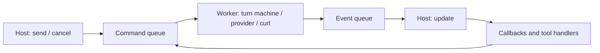

# Scry architecture

Scry is a static C++ library for applications that own their main loop. It sends
requests to an LLM server, streams text, executes tools, resends their results,
and commits conversation history when a turn succeeds. The host calls
`Harness::update()` to run tools and deliver callbacks on its own thread.

The public headers under `include/scry/` define the API. See [README.md](../README.md)
for a complete program and [contributing.md](contributing.md) for build and test
instructions.

## Public API

| Type | Responsibility |
|---|---|
| `Config` | Provider endpoint, credentials, model, sampling, retries, timeouts, and resource limits |
| `Conversation` | System prompt and committed message history |
| `ToolRegistry` | Standalone additive registry of tool definitions and handlers; a Harness takes ownership at `create()` |
| `Turn` | Handle to an accepted exchange: identity, completion query, cancellation, and callback disconnection |
| `Harness` | Configured runtime, worker thread, registry, and callback pump |

`Harness::validate(config)` runs the configuration checks used by `create()`
without initializing libcurl or starting a worker. Successful validation does
not guarantee that runtime initialization succeeds. Fallible operations return
`Result<T>` (`std::expected<T, Error>`) or `Status` (`Result<void>`).

`send()` validates admission and returns without waiting for network I/O. It
rejects empty user text with `invalid_argument`, an inactive handle with
`invalid_state`, a busy Conversation with `busy`, and an exceeded admission or
Conversation payload limit with `resource_limit`. Each Conversation has at most
one queued or active turn. Different Conversations can queue turns on the same
Harness.

Scry does not load model weights or own the application's main loop. Its public
extension points are configuration and tool callables; provider and transport
interfaces are internal.

## Threading and lifetime

Use a Harness, its registry, its Turns, and their Conversations from one host
thread. The public handles do not synchronize concurrent application access. A
registry that no Harness owns yet is a plain move-only value on the thread that
built it; `Harness::create()` adopts it and leaves the source inactive. All
callbacks and tool handlers run inside `update()` on its calling thread; they
can access host state owned by that thread directly.

One worker per Harness owns the network transfers, provider decoding, and turn
machine. It processes accepted turns in FIFO order, with one active turn at a
time. Later turns wait while the active turn retries or waits for tool results.
Separate Harness instances have separate workers and runtime state.



The command and event queues use mutexes. Per-turn cancellation uses an atomic
flag; Harness shutdown uses the worker's stop token. Accepted requests share
immutable history and schema snapshots. History is copied before modification
when a snapshot still holds it. Callbacks, tool handlers, and mutable
Conversation state remain on the host side.

`update()` ingests worker events, processes terminal state, and delivers pending
callbacks and tool calls. Its time budget is soft: it is checked between events
and callbacks, and cannot interrupt a handler. When work is available, it ingests
at least one event before checking time and delivers at least one pending
callback or tool call if `max_callbacks` permits. Tool dispatch counts as one
unit against that limit, including its optional `on_tool_call` observer.
`max_callbacks = 0` prevents dispatch and callback delivery but still allows
terminal events to commit history and clear busy state. Route cleanup runs on
every update; only the release of discarded events is deferred when the budget
runs out.

Adjacent worker text events are coalesced, and the pump combines pending text
for each turn. Queue byte accounting includes events retained by the pump until
delivery or discard. Coalescing reduces callback traffic; configured payload
limits provide the byte bound.

Callbacks may call `send()`, `cancel()`, `disconnect()`, and tool registration.
A reentrant `update()` does no work and returns `budget_exhausted = true`.
Exceptions from observer callbacks propagate out of `update()` after that event
counts as delivered; the Harness remains valid. Tool-handler exceptions are
caught and converted into tool-error results.

`send_and_wait()` runs `send()` and pumps `update()` until the requested turn
finishes. It also runs callbacks and handlers for other accepted turns. It does
not expose the waited Turn handle, and calling it from a callback or handler
returns `invalid_state`. When `update()` throws while it is pumping, the
exception propagates out of `send_and_wait()` and the waited turn is
disconnected; that turn keeps running and still commits its history.

| Operation | Effect |
|---|---|
| Drop a `Turn` | Work and callbacks continue; destruction does not wait |
| `Turn::cancel()` or `Harness::cancel(id)` | Request cooperative cancellation; the terminal callback remains attached |
| `Turn::disconnect()` or `Harness::disconnect(id)` | Clear callbacks; tools and history processing continue |
| Destroy a `Harness` | Request worker shutdown, join it, clear busy state, and discard undelivered callbacks |

Cancellation before a queued turn starts prevents its network request. A running
tool cannot be interrupted. If cancellation is observed after it returns, its
result and remaining calls are suppressed. Cancellation does not reverse a
terminal outcome already produced by the worker.

Disconnecting inside a callback takes effect for subsequent delivery; the
executing callback remains alive until it returns or throws. A tool handler that
disconnects also suppresses the `on_tool_call` observer for its own call.
Disconnecting does not cancel tools, and the host must keep pumping for the turn
to finish.

`Turn::finished()` becomes true after terminal callback delivery, or after
terminal processing when no terminal callback is attached. Once a turn is
finished the runtime releases its callbacks and tool snapshot even while a
handle is retained; the handle then reports identity and status only. Moved-from
handles and handles whose Harness is gone also report true. Dropping a Conversation
handle does not cancel an accepted turn: the runtime retains its state.

Harness destruction waits for the worker. The transport checks shutdown between
curl operations and limits each curl poll wait using `timeouts.shutdown`; this
setting is not a timed join or a hard wall-clock deadline for the destructor.

## Turn processing and retries

The turn machine in `src/machine/` performs no I/O and reads no clock. It consumes
explicit events and emits commands for the worker to execute. Its states are
queued, awaiting model, streaming, retry wait, awaiting tool, and terminal.
Invalid transitions return diagnostics without changing state or issuing work.
Tests inject time and event sequences directly.

A successful model response either completes the turn or starts a tool round.
Calls from one response are admitted to the event queue as a batch: if the whole
batch cannot fit, no handler in it runs. The pump dispatches calls in provider
order, posts each result to the worker, and invokes the optional `on_tool_call`
observer. The worker resends once all results are ready. A fatal dispatch or
payload-budget failure suppresses later handlers in the batch.

Tool-call IDs must be unique within a turn. Scry rejects reused IDs rather than
executing them again. `Config::max_tool_rounds` bounds the loop, and
`Config::tool_round_limit` decides what a response that asks for one round too
many does. Under `ToolRoundLimitPolicy::fail`, the default, the turn fails with
`max_tool_rounds` and commits nothing. Under `ToolRoundLimitPolicy::complete`, the
turn stops instead of failing: the rounds that ran and the final response's text
are committed, that response's tool-call blocks are dropped into
`Completion::unexecuted_tool_calls`, and the finish reason is
`tool_round_limit`. A response left with no text after the drop commits no
assistant message at all, so the transcript ends with the previous round's tool
results.

Automatic retries apply to retryable network and rate-limit failures, including
HTTP 5xx responses, only before semantic output is consumed. Text or tool-call
content disables retry even when no text callback has run. After partial output,
a failure ends the turn; its `retryable` flag still indicates whether a new
request may succeed. Authentication and protocol failures are not retried.

Backoff is exponential with jitter seeded independently per Harness. A valid
`Retry-After` can increase the delay, but `max_backoff` caps the final delay.
Attempt and elapsed retry limits reset for each model request in the tool loop.
The elapsed limit controls retry eligibility and wake times; it does not abort
an active transfer. `Completion::attempt_count` totals attempts across the turn,
and `usage` accumulates usage from completed model responses.

## Tools and JSON

A registry is a standalone value: a host builds one, `Harness::create(config,
std::move(tools))` adopts it, and `Harness::tools()` keeps it open for later
registrations. A registry is additive: duplicate names are rejected and there is
no replacement or removal operation. Each accepted turn retains the
registrations visible at `send()`. Immutable registration and schema snapshots
are reused until another tool is added; handlers stay on the host thread.

Every tool handler, reflected or explicit, comes in two shapes: one that receives
only its arguments, and one that also receives a `ToolCallContext` naming the call
it is servicing — the `TurnId`, the provider-assigned `call_id`, the registered
`tool_name`, the one-based `round`, and the zero-based `index` within that round's
batch. These are the same values the later `on_tool_call` observation carries, so
a handler can correlate its own work with the turn without counting calls itself.
The context is borrowed: both string views point into the call block being
dispatched and are valid only until the handler returns. A handler that keeps
either beyond its return must copy the text. Registrations store one handler
shape internally, so the two paths export an identical tool contract and differ
in nothing the model can see.

Before a handler runs, a call passes two admission gates in a fixed order. First
`Config::max_tool_calls_per_turn`, which bounds the calls one turn may dispatch
across every round; `max_tool_rounds` cannot do that on its own, because one
response may request many calls. Then `TurnCallbacks::on_tool_request`, the
host's own policy, which receives a `ToolRequest` naming the call and its
canonical arguments and answers with nothing to admit it or a `ToolRejection` to
refuse it.

Every call that reaches the route counts against the limit, including one naming
a tool nobody registered: the model spent the turn's budget by asking. An unknown
tool is refused by dispatch with its own message and never reaches the hook,
because there is no handler for the host to admit. A refused call runs no handler
and so can have no side effect. The model is given `{"error": message}` flagged
as a tool error: the fixed text `tool call limit for this turn reached; respond
without calling tools` for the limit, the host's `model_message` for a hook
refusal. That result reaches `on_tool_call` with `is_error` and is posted to the
worker like any other, so the turn continues and commits normally. A hook that
throws is treated exactly like a handler that throws: the call is refused with the
same fixed text and the turn carries on. The hook runs under the same invocation
guard as every other callback, so a `disconnect()` from inside it is deferred
until the call returns and suppresses that call's `on_tool_call` observation.

A hook that cancels the turn is obeyed before the handler runs, whether it admits
the call or refuses it. The cancel flag is read again the moment the hook returns:
when it is set, no handler runs, no result is posted, and no `on_tool_call` fires,
and the turn ends through the worker's ordinary cancellation path. That is the one
thing the rollback could not repair on the host's behalf, because a handler's
effects on host state outlive the transcript the turn discards. The counts are
unchanged by it: the call still spent the per-turn limit, but a call cancellation
suppressed is not a refusal and is not counted as one.

A refused call and a call dropped at the round limit share the same guarantee: the
handler never ran, so nothing it would have changed happened. Under
`ToolRoundLimitPolicy::complete`, host state and history agree because the dropped
calls never ran; the host learns what the model asked for from
`Completion::unexecuted_tool_calls` and can put it in the next send.

Cancelling from inside a handler is a different thing and rarely what a host
wants: it discards the pending transcript, so the results the executed tools
produced are thrown away and the whole turn rolls back, while the side effects
those handlers already had on host state remain and are the host's to reconcile.
A host that wants the turn to finish but no further tools to run sets its own
flag, from the handler or from `on_tool_call`, and refuses every later request
from `on_tool_request`. The model is told why, the turn completes, and history
commits.

`ToolRegistry::to_json()` exports a version-1 JSON manifest with a `tools` array
in registration order. Every entry contains the registered `name`, `description`,
and `input_schema` object, including reflected parameter annotations. This is
the provider-neutral tool contract; provider adapters apply their own wire
envelopes. The export includes both registration paths, invokes no handlers, and
makes no provider request. It reads the current registry rather than an active
turn's frozen snapshot, and returns owned text that later registrations do not
change. The host owns writing that text to a file or running the export as a
build step; only tools registered on that execution path are included. Export
needs no Harness: a registry built on its own exports the same document without
provider configuration, libcurl, or a worker. The manifest version is independent
of the library version: incompatible changes to its structure or field meanings
increment it; additive fields keep the version, and consumers should ignore
unknown fields.

### Reflected tools

`scry::reflection::add<Args>()` registers a typed callable at runtime using a
compile-time schema, `input_schema_v<Args>`, and generated argument decoding and
result encoding. It lowers to the same registry as explicit-schema tools and
preserves move-only handler captures.

```cpp
struct ForecastArgs {
  [[= scry::reflection::description{"City to query"}]] std::string city;
  std::optional<int> days = std::nullopt;
};
struct Forecast { std::string summary; double temperature_c; };

auto status = scry::reflection::add<ForecastArgs>(
    tools,
    {.name = "forecast", .description = "Return the forecast for one city"},
    [](ForecastArgs args) -> scry::Result<Forecast> {
      return lookup_forecast(std::move(args));
    });

// The same registration, with the call's identity as an optional leading parameter.
auto traced = scry::reflection::add<ForecastArgs>(
    tools,
    {.name = "traced_forecast", .description = "Return the forecast for one city"},
    [](const scry::ToolCallContext& context, ForecastArgs args) -> Forecast {
      log(context.turn_id, context.round, context.call_id);
      return lookup_forecast(std::move(args));
    });
```

The tool name and description come from `ToolMetadata`. Parameter descriptions
come from P3394 `scry::reflection::description` annotations on members. Duplicate
Scry description annotations on one member fail at compile time.
`scry::reflection::description_of<View>()` builds the same annotation from a
`std::string_view` with static storage duration, so a host can keep its parameter
text in one catalog instead of in literals spread across aggregates.

`scry::reflection::schema_v<Value>` is the same generator over any `SupportedValue`,
including handler result types; Scry sends only `input_schema_v<Args>` to a provider,
so a result schema is for a host's own contract export.

Argument objects and nested objects must be complete, default-constructible,
move-constructible, move-assignable plain aggregates. They must have no bases,
union layout, reference members, bit fields, unnamed or non-public members, or
`const`/`volatile` members. An aggregate cannot be reachable from its own members.

Supported member and result values are:

- `bool`; non-character signed and unsigned integers up to 64 bits; finite
  `float` and `double`; `std::string`.
- Nonempty scoped enums with unique underlying values, represented by exact
  enumerator names.
- `std::optional<T>` with a supported non-optional element.
- `std::vector<T, Allocator>` except `vector<bool, Allocator>`; `std::array<T, N>`;
  and recursively supported aggregates. Containers must support default
  construction, move construction, and move assignment.

Only a default member initializer permits omission. Only `std::optional<T>`
permits JSON `null`. Thus `std::optional<int> value;` is required and nullable,
while `int value = 1;` is omittable and non-null. Omission preserves the C++
initializer.

Generated schemas use closed inline objects, numeric range bounds, exact array
lengths, and a provider-neutral JSON Schema subset. Their keywords are
`additionalProperties`, `anyOf`, `description`, `enum`, `items`, `maxItems`,
`minItems`, `minimum`, `maximum`, `properties`, `required`, and `type`.
Object keys and required names are sorted; enum values keep declaration order.
Schemas omit `$schema`, references, definitions, `title`, and `default`.

Decoding recursively rejects unknown or missing fields, incorrect JSON kinds,
disallowed null, out-of-range or non-finite numbers, unknown enum names, and
incorrect fixed-array lengths. A floating-point JSON value such as `1.0` does
not decode into an integer member. Canonical parsing collapses duplicate object
keys before dispatch, so handlers do not see the original lexical duplicates.

A decode failure fills `Error::model_message` with the host `message` minus its
`reflected JSON at ` prefix: the JSON path of the offending value and what the
schema required there, plus the declared enumerator names when an enum value is
unrecognized. Argument text that is not JSON at all reports `tool arguments are
not valid JSON`. Every word of it is derived from the schema the model was
already given, so the model can correct itself without learning anything new. A
result-encoding failure fills no `model_message`: it describes the handler's own
result type, whose schema the model never sees, so the model receives the fixed
diagnostic.

Handlers are invoked with moved arguments and return a supported value or
`Result` of one. A handler may declare a leading `const ToolCallContext&`
parameter; `ToolHandlerFor` accepts either arity and checks the result type of
whichever form is viable, preferring the contextual one. The context must lead:
a handler that trails it is not a reflected handler and fails to compile. Raw
`Json`, `void`, `Status`, references, futures, and awaitables are not reflected
result types. The returned object is encoded without an
additional copy or move, including aggregates whose user-declared destructor
suppresses an implicit move constructor. `reflection::encode(value)` uses the
same value encoder without requiring registration.

### Explicit-schema tools

`ToolRegistry::add(ToolDefinition, ToolHandler)` accepts a JSON schema object and
a move-only `Json -> Result<Json>` callable;
`ToolRegistry::add(ToolDefinition, ContextualToolHandler)` accepts a move-only
`(const ToolCallContext&, Json) -> Result<Json>` callable instead. The overloads
are separated by the handler's arity, so a lambda of either shape selects one of
them without a cast. Registration validates and canonicalizes the schema as a
JSON object; Scry does not implement general JSON Schema validation. An empty
handler of either shape is rejected at registration. The handler receives
canonical object arguments and owns validation against its schema. It must
synchronously return valid JSON or an error. Asynchronous or deferred tool
results are not supported.

Unknown tools, reflected decode failures, handler errors, exceptions, and invalid
result JSON produce bounded model-visible error results. A handler error's
`model_message` is forwarded inside `{"error": ...}` subject to the result byte
cap; its `message` and any exception text are not. `scry::tool_error(model_message,
host_message)` builds such an error; an empty `model_message` keeps Scry's fixed
diagnostic, and one too large for the cap falls back to it. Reflected decode
failures and unknown-tool errors carry schema-derived `model_message` text: an
unknown tool names the requested tool and the registered tool names, which the
request's tool list already carried. Scry applies no redaction to
`model_message`, so a host that puts a secret in one has published it. An
oversized result, or an error result that cannot fit its bound, fails the turn
with `resource_limit`.
`on_tool_call` observes the canonical result and its `is_error` flag after the
result is posted to the worker; it does not confirm that the server received it.
Cancellation or a fatal framework failure can suppress this observer.

`Json` owns serialized text. `JsonView::parse()` creates a shared immutable parsed
document with scalar accessors, `find()`, `at()`, and ordered `key_at()` lookup;
child views can outlive their parent. Invalid input returns `invalid_argument`.
`escape_json_string()` produces a quoted JSON string for hand-built results.
The internal JSON codec uses Glaze and canonicalizes object keys in lexical order.
No Glaze type or header is exposed to consumers.

Tool side effects are not transactional. A failed or cancelled turn leaves
Conversation history unchanged even if a handler already changed host state.
Hosts own rollback, idempotency, and reconciliation for such effects.

## Providers and transport

The public `Message` model contains user and assistant roles with text, tool-call,
and tool-result blocks. Provider adapters translate this model into HTTP requests
and decode streaming replies. Provider code lives under `src/provider/`, split
into request encoding, stream decoding, and content helpers. Per-attempt decode
state is separate from the adapter.

Request encoding writes typed wire structs straight to JSON text rather than
building a document tree. Each embedded payload — tool-call arguments, tool
results, and tool input schemas — is spliced in as the canonical text the turn
machine, tool dispatch, and registration already produced, so a retry or a tool
round re-encodes only the request's own frame and never re-parses history.

| Setting | Anthropic Messages | OpenAI-compatible Chat Completions |
|---|---|---|
| Endpoint | `/v1/messages` | `/v1/chat/completions` |
| Authentication | Required `x-api-key` | Optional bearer token |
| `temperature` | 0–1 | 0–2 |
| `top_p` | Greater than 0, at most 1 | 0–1 |
| `max_tokens` | Required, positive | Optional; positive when set |
| Disabled reasoning | Rejected during validation | Sends `reasoning_effort: "none"` |

For Anthropic, use an origin or the full `/v1/messages` endpoint. The OpenAI
adapter accepts an origin, a `/v1` base, or the full `/v1/chat/completions` endpoint.
Both adapters always request `stream: true`. Default reasoning mode omits reasoning
controls.
An OpenAI-compatible server must implement the subset Scry sends, including the
optional reasoning field when enabled. Azure-specific endpoints, the Responses
API, structured output, and other server extensions are not implemented.

The Anthropic adapter merges consecutive same-role messages into one message whose
content array concatenates their blocks, because the Messages API takes one message
per role turn and a history that stopped at the tool-round limit can end with the
user message carrying that round's results.

OpenAI requests encode system text and function tools, and emit a separate ordered
`role: "tool"` message for each result, so a `user` message may follow tool results
directly and no merge is needed. Streaming accumulates bounded tool-call
fragments by index and requires complete contiguous calls at finish. A finish
reason followed by `[DONE]` completes the stream; a trailing usage-only chunk is
allowed before `[DONE]`. Missing, duplicate, or early terminal markers and
semantic content after finish are protocol errors. Anthropic streams decode
Messages content blocks, usage, stop reasons, and tool-use arguments.

The incremental SSE parser handles arbitrary byte splits. Unknown optional events
can be ignored; malformed required content fails with `protocol`. There is no
non-streaming response path or public logging API.

The transport uses libcurl through an internal injectable interface. Each Harness
retains a curl multi handle and its connection cache across retries, tool rounds,
and turns, while running one transfer at a time. Curl objects use RAII, and C
callbacks catch exceptions. Process-wide curl initialization is attempted once;
its result is cached. Startup requires libcurl 7.84 or newer with thread-safe
global initialization and asynchronous DNS.

TLS peer and hostname verification are enabled by default. `ca_bundle_path`
selects a CA bundle; `proxy` selects a proxy. Empty values preserve curl's trust
store and proxy defaults, including proxy environment variables. Extra header
names and values are validated, and collisions with Scry-managed headers are
rejected. `Harness::validate()` checks configuration values, not server reachability
or credential acceptance.

Non-2xx bodies are excluded from the SSE decoder. At most 8 KiB is retained to
extract a sanitized `error.type` or `error.code` token into `provider_detail`,
prefixed by the dialect name. The provider's message and raw body are not
surfaced. HTTP errors carry their status and sanitized request identifier when
available. Scry uses fixed diagnostics and filters configured API-key matches
from worker error and request-ID fields.

## Resource limits and timeouts

Defaults are defined in `include/scry/config.hpp`:

| Setting | Default |
|---|---:|
| Pending turns per Harness | 64 |
| SSE event bytes | 256 KiB |
| Response bytes per transfer | 8 MiB |
| Tool argument bytes per call | 1 MiB |
| Tool result bytes per call | 4 MiB |
| Queued event payload per turn | 2 MiB |
| Conversation payload | 16 MiB |
| Tool rounds | 8 |
| Tool calls per turn | Unset |
| Maximum output tokens | 1024 |
| Retry attempts / elapsed window per model request | 3 / 30 s |
| Initial / maximum retry backoff | 250 ms / 10 s |
| Retry jitter ratio | 0.2 |
| Connect / idle / shutdown | 10 s / 120 s / 2 s |
| Total transfer timeout | Unset |

Resource limits must be positive; the queued-event limit must be at least 1024
bytes. `max_tool_calls_per_turn` is optional: unset means unlimited and zero is
rejected as `invalid_config`. Admission failures reject `send()` immediately; an accepted turn that
exceeds its limit fails with `resource_limit`.

Conversation accounting includes the system prompt, text, tool identifiers and
names, tool-result error flags, and serialized arguments/results across history and
pending exchange. It excludes JSON envelope syntax and allocator overhead; it is
not the size of `to_json()`. The pump and machine reserve exchange payloads before
resend and commit. A completion payload is charged to the Conversation budget
when the machine reserves it, never to the queued-event limit, so a completion
that fits the Conversation limit is always deliverable; the queued-event limit
bounds the text deltas, tool-call batches, and error diagnostics awaiting
delivery. `from_json()` has no
Harness configuration and does not apply these byte limits; they apply when the
restored Conversation is sent through a Harness.

`connect` limits connection establishment, including name resolution. `idle`
uses curl's low-speed check at one byte per second with the duration rounded up
to whole seconds. It detects prolonged silence, including before the first byte,
but uses a rolling average and can report a stall later than the configured
interval. It is not an exact timer between chunks. Optional `transfer` sets a
hard duration limit on one HTTP transfer. Timeout failures are retryable network
errors subject to the turn's retry eligibility. `shutdown` caps curl poll waits.

## Completion, errors, and history

Before acceptance, errors return directly. After acceptance, `on_finished` is the
single terminal result channel for completion, failure, or cancellation. The host
must keep calling `update()`; a callback is delivered once unless disconnected
or discarded by Harness destruction. Allocation failures are outside the
semantic failure-as-value contract.

| Error category | Meaning |
|---|---|
| `invalid_config` | Invalid configuration or serialized document |
| `invalid_state` | Operation invalid for the current object state |
| `invalid_argument` | Invalid caller argument, including a duplicate tool name |
| `busy` | Conversation already has an accepted turn |
| `authentication` | Provider authentication failure |
| `rate_limit` | Provider rate limit |
| `network` | Network or transport failure, including HTTP 5xx |
| `protocol` | Invalid provider output |
| `resource_limit` | Admission or payload bound exceeded |
| `tool` | Invalid tool arguments, dispatch, or encoding |
| `max_tool_rounds` | Tool-round limit exceeded |
| `cancelled` | Cooperative cancellation |

Successful terminal processing in `update()` commits the user message, tool
rounds, and final assistant response together, before terminal callback delivery.
They arrive as one transcript: the machine keeps a single message list, resends
it each round, and hands that same list to the pump.
Failure or cancellation commits nothing. `Completion::finish_reason` is
`completed`, `length`, `unknown`, or `tool_round_limit`: `tool_use` is internal to
the loop, because a response that requests tools either starts another round,
fails with `max_tool_rounds`, or, under `ToolRoundLimitPolicy::complete`, ends the
turn as `tool_round_limit`. Inspect `Completion::finish_reason` when the
application requires an untruncated answer.

`Completion::unexecuted_tool_calls` holds the tool calls that final response asked
for and the loop never dispatched, in provider order. It is non-empty only for
`tool_round_limit`. The calls are reserved against the Conversation byte limit
during the turn, exactly as the tool round they replace would have been, and are
never charged to the queued-event limit; they are handed to the host and are not
committed to history. Those calls are absent from committed history and their
handlers never ran, so they count in neither `tool_call_count` nor
`rejected_tool_call_count`: the model asked and was not answered.

`Completion::tool_round_count` and `Completion::tool_call_count` report what the
loop ran before that final response; the call count includes unknown tools and
calls whose handler failed. `Completion::rejected_tool_call_count` is the subset
of those calls that never reached a handler because the per-turn call limit or
`on_tool_request` refused them; a refusal is an answer to the model, not a turn
failure, so it appears in both counts. Each observed `ToolCall` carries its own `round` and
its `index` within that round's batch, in provider order. Text deltas can include
intermediate tool rounds and `Completion::text` contains only the final assistant
response, but deltas of round N+1 are delivered only after every `on_tool_call` of
round N, so a host can attribute deltas to rounds by counting `on_tool_call`
observations.

Every committed message holds at least one block and no empty text block. The
machine drops empty text blocks from a model response before it commits or
dispatches anything, so a response of one empty text block plus real text
commits only the text, and a response announcing a tool call alongside an empty
text block commits only the call. A response left with neither text nor tool
calls fails the turn with `protocol` and commits nothing. Committed history is
therefore always encodable by `to_json()` and never carries the empty content
that providers reject on resend.

`Conversation::messages()` exposes committed history, excluding the system
prompt. Its reference is borrowed until a committing `update()`, or until the
handle is moved or destroyed. Callback views and references are borrowed only
for the invocation; `on_finished` receives its result by value.

`to_json()` writes the system prompt and committed message blocks as a canonical
versioned document. `from_json()` rejects malformed JSON, unknown fields or
versions, and invalid block shapes or roles with `invalid_config`. Saving while
busy captures the last committed boundary; active work, callbacks, turn IDs, and
tools are excluded. Scry performs no persistence file I/O. The host owns storage
and any input-size limit before loading.

## Build and package

The consumer target is `scry::scry`, a static library requiring GCC 16 or newer
with C++26 reflection and annotation support. CMake probes the P2996/P3394
features used by the headers. Linux and macOS are the supported platforms.
API, ABI, and persistence-format stability are not promised before 1.0.

The implementation under `src/` avoids reflection and builds as C++23 in
`SCRY_CLANG_TOOLING` mode. That mode requires Clang and supports clang-tidy and
libFuzzer; it excludes examples and ordinary tests. Fuzz targets are registered
separately from the ordinary test build. It is a tooling build, not
a supported consumer configuration.

`scry::testing` is an optional second static library, installed as the package
component `testing` and built unless `SCRY_BUILD_TESTING_SUPPORT` is off. It
publishes `scry::testing::ScriptedTransport`, a queue of scripted responses, and
`create_harness`, which builds a Harness over it with a seeded retry jitter. It
substitutes for the HTTP transfer alone: a scripted turn drives the real worker,
the real provider request encoder and stream decoder, real retry scheduling,
real tool dispatch, and the real pump, so its guarantees are the ones described
above. A scripted response carries a status, and a non-2xx one is classified by
the same transport policy a live response is, so a scripted 429 or 500 reaches
the runtime as the retryable error a real one would. It does not exercise libcurl, TLS, or any timeout curl enforces; those
stay covered by the loopback transport and integration suites. Its headers
depend only on `<scry/*>`, and its retry waits are real time bounded by the
`Config`'s retry policy.

libcurl is a linked dependency. Glaze is a private header-only build dependency,
resolved from an installed package or a pinned FetchContent checkout. The
installed package exports no Glaze target; it discovers curl and Threads.
Catch2 is used by tests, and Dear ImGui is confined to the standalone showcase.
Public headers use Scry-owned types and move-only `UniqueFunction` callables;
stateful handles use PImpl. Build, test, and packaging gates are described in
[contributing.md](contributing.md).
