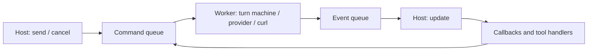

# Scry architecture

Scry is a static C++ library for applications that own their main loop. It sends
requests to an LLM server, streams text, and executes tools. It sends the tool
results back to the server, and it commits the conversation history when a turn
succeeds. The host calls `Harness::update()` to run tools and to deliver
callbacks on the host thread.

The public headers under `include/scry/` define the API. For a complete program,
see [README.md](../README.md). For build and test instructions, see
[contributing.md](contributing.md).

## Public API

| Type | Responsibility |
|---|---|
| `Config` | Provider endpoint, credentials, model, sampling, retries, timeouts, and resource limits |
| `Conversation` | System prompt and committed message history |
| `ToolRegistry` | Standalone additive registry of tool definitions and handlers. A Harness takes ownership of it at `create()` |
| `Turn` | Handle to an accepted exchange: identity, completion query, cancellation, and callback disconnection |
| `Harness` | Configured runtime, worker thread, registry, and callback pump |

`Harness::validate(config)` runs the configuration checks that `create()` uses.
It does not initialize libcurl, and it does not start a worker. A successful
validation does not guarantee that the runtime initialization succeeds.
Operations that can fail return `Result<T>` (`std::expected<T, Error>`) or
`Status` (`Result<void>`).

`send()` validates admission and returns without a wait for network I/O. It
rejects these inputs:

- Empty user text, with `invalid_argument`.
- An inactive handle, with `invalid_state`.
- A busy Conversation, with `busy`.
- A request that exceeds an admission limit or the Conversation payload limit,
  with `resource_limit`.

Each Conversation has a maximum of one queued or active turn. Different
Conversations can queue turns on the same Harness.

Scry does not load model weights, and it does not own the main loop of the
application. Its public extension points are configuration and tool callables.
The provider and transport interfaces are internal.

## Threading and lifetime

Use a Harness, its registry, its Turns, and their Conversations from one host
thread. The public handles do not synchronize concurrent access by the
application. A registry that no Harness owns yet is a plain move-only value on
the thread that built it. `Harness::create()` adopts the registry and makes the
source inactive.

All callbacks and tool handlers run inside `update()` on the thread that calls
`update()`. Thus they can directly access host state that this thread owns.

One worker per Harness owns the network transfers, the provider decoding, and
the turn machine. The worker processes accepted turns in FIFO order, with one
active turn at a time. Later turns wait while the active turn retries or waits
for tool results. Each Harness instance has its own worker and its own runtime
state.


```mermaid
flowchart LR
    App["Host: send / cancel"] --> Commands["Command queue"]
    Commands --> Worker["Worker: turn machine / provider / curl"]
    Worker --> Events["Event queue"]
    Events --> Pump["Host: update"]
    Pump --> Callbacks["Callbacks and tool handlers"]
    Callbacks --> Commands
```

The command queue and the event queue use mutexes. Per-turn cancellation uses an
atomic flag. Harness shutdown uses the stop token of the worker. Accepted
requests share immutable snapshots of the history and of the schemas. If a
snapshot still holds the history, Scry copies the history before it changes it.
Callbacks, tool handlers, and the mutable Conversation state stay on the host
side.

`update()` ingests worker events, processes terminal state, and delivers pending
callbacks and tool calls. Its time budget is soft. `update()` checks the budget
between events and callbacks, and it cannot interrupt a handler. When work is
available, it ingests at least one event before it checks the time. It also
delivers at least one pending callback or tool call if `max_callbacks` allows
it. One tool dispatch counts as one unit against that limit, and this unit
includes the optional `on_tool_call` observer.

`max_callbacks = 0` prevents dispatch and callback delivery. But terminal events
can still commit history and clear the busy state. Route cleanup runs on every
update. When the budget runs out, `update()` defers only the release of
discarded events.

The event queue coalesces adjacent text events from the worker, and the pump
combines the pending text for each turn. The byte count of the queue includes
the events that the pump keeps until it delivers or discards them. Coalescence
decreases the callback traffic. The configured payload limits supply the byte
bound.

Callbacks can call `send()`, `cancel()`, and `disconnect()`, and they can
register tools. A reentrant `update()` does no work and returns
`budget_exhausted = true`. If an observer callback throws an exception, the
exception propagates out of `update()` after that event counts as delivered. The
Harness stays valid. Scry catches tool-handler exceptions and converts them into
tool-error results.

`send_and_wait()` runs `send()` and then pumps `update()` until the requested
turn finishes. It also runs callbacks and handlers for other accepted turns. It
does not expose the Turn handle of the turn that it waits for. If a callback or
a handler calls `send_and_wait()`, it returns `invalid_state`. If `update()`
throws while `send_and_wait()` pumps it, the exception propagates out of
`send_and_wait()`, and `send_and_wait()` disconnects the waited turn. That turn
continues to run and still commits its history.

| Operation | Effect |
|---|---|
| Drop a `Turn` | Work and callbacks continue. Destruction does not wait |
| `Turn::cancel()` or `Harness::cancel(id)` | Request cooperative cancellation. The terminal callback stays attached |
| `Turn::disconnect()` or `Harness::disconnect(id)` | Clear callbacks. Tool processing and history processing continue |
| Destroy a `Harness` | Request worker shutdown, join the worker, clear the busy state, and discard undelivered callbacks |

If a cancellation occurs before a queued turn starts, the turn sends no network
request. Scry cannot interrupt a tool that runs. If Scry sees the cancellation
after the tool returns, Scry suppresses the result of that tool and the other
calls that remain. Cancellation does not reverse a terminal outcome that the
worker already produced.

A disconnect inside a callback applies to the subsequent deliveries. The
callback that executes stays alive until it returns or throws. If a tool handler
disconnects, Scry also suppresses the `on_tool_call` observer for the call of
that handler. A disconnect does not cancel tools. The host must continue to pump
until the turn finishes.

`Turn::finished()` becomes true after the delivery of the terminal callback. If
no terminal callback is attached, it becomes true after terminal processing.
When a turn is finished, the runtime releases its callbacks and its tool
snapshot, even if the host still keeps a handle. The handle then reports only
identity and status. Moved-from handles and handles whose Harness no longer
exists also report true. A drop of a Conversation handle does not cancel an
accepted turn, because the runtime keeps the state of the Conversation.

Harness destruction waits for the worker. The transport checks for shutdown
between curl operations. It uses `timeouts.shutdown` to limit each curl poll
wait. This setting is not a timed join, and it is not a hard wall-clock deadline
for the destructor.

## Turn processing and retries

The turn machine in `src/machine/` does no I/O and does not read a clock. It
consumes explicit events and emits commands that the worker executes. Its states
are queued, awaiting model, streaming, retry wait, awaiting tool, and terminal.
If a transition is not valid, the machine returns diagnostics. It does not
change state, and it does not issue work. Tests inject time and event sequences
directly.

A successful model response completes the turn or starts a tool round. Scry
admits the calls from one response to the event queue as one batch. If the full
batch cannot fit, no handler in that batch runs. The pump dispatches the calls
in provider order. For each call, it posts the result to the worker and invokes
the optional `on_tool_call` observer. The worker sends the request again when
all the results are ready.

A fatal failure of dispatch or of the payload budget suppresses the later
handlers in the batch.

Tool-call IDs must be unique in a turn. Scry rejects reused IDs and does not
execute them again. `Config::max_tool_rounds` sets the limit of the loop.
`Config::tool_round_limit` sets what occurs when a response asks for one round
more than that limit. Under `ToolRoundLimitPolicy::fail`, which is the default,
the turn fails with `max_tool_rounds` and commits nothing. Under
`ToolRoundLimitPolicy::complete`, the turn stops but does not fail:

- Scry commits the rounds that ran and the text of the final response.
- Scry removes the tool-call blocks of that response and puts them in
  `Completion::unexecuted_tool_calls`.
- The finish reason is `tool_round_limit`.

If the response has no text after this removal, Scry commits no assistant
message. Thus the transcript ends with the tool results of the previous round.

Scry automatically retries network failures and rate-limit failures that are
retryable, including HTTP 5xx responses. It does this only before it consumes
semantic output. Text or tool-call content disables the retry, even if no text
callback ran. After partial output, a failure ends the turn. The `retryable`
flag of the failure still shows if a new request can succeed. Scry does not
retry authentication failures or protocol failures.

Backoff is exponential with jitter, and each Harness seeds its jitter
independently. A valid `Retry-After` can increase the delay, but `max_backoff`
limits the final delay. The retry limits for attempts and for elapsed time reset
for each model request in the tool loop. The elapsed-time limit controls retry
eligibility and wake times, but it does not stop an active transfer.
`Completion::attempt_count` is the total of the attempts across the turn, and
`usage` accumulates the usage from completed model responses.

## Tools and JSON

A registry is a standalone value. A host builds a registry, and
`Harness::create(config, std::move(tools))` adopts it. `Harness::tools()` keeps
the registry open for later registrations.

A registry is additive. Scry rejects duplicate names, and there is no operation
that replaces or removes a tool. Each accepted turn keeps the registrations that
were visible at `send()`. Scry uses the same immutable snapshots of the
registrations and the schemas again until the host adds another tool. Handlers
stay on the host thread.

Each tool handler, reflected or explicit, has two possible shapes. One shape
receives only its arguments. The other shape also receives a `ToolCallContext`
that identifies the call that the handler services. The context has these
fields:

- The `TurnId`.
- The `call_id` that the provider assigned.
- The registered `tool_name`.
- The one-based `round`.
- The zero-based `index` in the batch of that round.

These values are the same values that the later `on_tool_call` observation
carries. Thus a handler can correlate its work with the turn, and it does not
have to count calls. The context is borrowed. Its two string views point into
the call block that Scry dispatches, and they are valid only until the handler
returns. If a handler keeps one of them after it returns, the handler must copy
the text. Internally, a registration stores one handler shape. Thus the two
paths export an identical tool contract, and the model sees no difference.

Before a handler runs, a call goes through two admission gates in a fixed order:

1. `Config::max_tool_calls_per_turn`. This limit applies to the calls that one
   turn can dispatch across all rounds. `max_tool_rounds` alone cannot do this,
   because one response can request many calls.
2. `TurnCallbacks::on_tool_request`, which is the policy of the host. It
   receives a `ToolRequest` that identifies the call and its canonical
   arguments. It returns nothing to admit the call, or a `ToolRejection` to
   refuse it.

Each call that gets to the route counts against the limit. This includes a call
to a tool that nobody registered, because the model used the budget of the turn
when it asked. Dispatch refuses an unknown tool with its own message. An unknown
tool never gets to the hook, because there is no handler for the host to admit.
A refused call runs no handler, so it cannot have a side effect.

The model gets `{"error": message}`, flagged as a tool error. The message is one
of these:

- For the limit, the fixed text `tool call limit for this turn reached; respond
  without calling tools`.
- For a hook refusal, the `model_message` of the host.

That result gets to `on_tool_call` with `is_error`. Scry posts it to the worker
like any other result, so the turn continues and commits normally. If the hook
throws, Scry handles it exactly like a handler that throws. Scry refuses the
call with the same fixed text as for a handler that throws, and the turn
continues. The hook runs under the same
invocation guard as all other callbacks. Thus a `disconnect()` from inside the
hook is deferred until the call returns, and it suppresses the `on_tool_call`
observation of that call.

If a hook cancels the turn, Scry obeys the cancellation before the handler runs.
This is true if the hook admits the call and if it refuses the call. Scry reads
the cancel flag again immediately when the hook returns. If the flag is set, no
handler runs, Scry posts no result, and no `on_tool_call` fires. The turn then
ends through the ordinary cancellation path of the worker. A handler that runs
at this point is the one thing that the rollback cannot repair for the host. The
reason is that the effects of a handler on host state stay after the turn
discards its transcript.

This check does not change the counts. The call still used one unit of the
per-turn limit. But a call that cancellation suppressed is not a refusal, and
Scry does not count it as one.

Tool side effects are not transactional. If a turn fails or is cancelled, the
Conversation history does not change, even if a handler already changed host
state. The host owns rollback, idempotency, and reconciliation for such effects.
For this reason, a cancel from inside a handler is rarely what a host wants. The
cancel discards the pending transcript, so Scry discards the results of the
executed tools and the full turn rolls back. But the side effects that those
handlers already had on host state stay.

If a host wants the turn to finish but wants no more tools to run, it sets its
own flag. It can set this flag from the handler or from `on_tool_call`. Then it
refuses every later request from `on_tool_request`. The model gets the reason,
the turn completes, and the history commits.

`ToolRegistry::to_json()` exports a version-1 JSON manifest. The manifest has a
`tools` array in registration order. Each entry has the registered `name`,
`description`, and `input_schema` object, and the schema includes reflected
parameter annotations. This manifest is the provider-neutral tool contract.
Provider adapters apply their own wire envelopes.

The export includes the tools from both registration paths. It invokes no
handlers and makes no provider request. It reads the current registry, not the
frozen snapshot of an active turn. It returns owned text that later
registrations do not change. If the text must go to a file, the host writes it.
If the export must run as a build step, the host runs it.

The export includes only the tools that the host registers on that execution
path. The export does not need a Harness. A registry that the host builds alone
exports the same document without provider configuration, libcurl, or a worker.
The manifest version is independent of the library version. Incompatible
changes to its structure or to the meaning of its fields increment the version.
Additive fields keep the version. We recommend that consumers ignore unknown
fields.

### Reflected tools

`scry::reflection::add<Args>()` registers a typed callable at runtime. It uses a
compile-time schema, `input_schema_v<Args>`. It also uses generated code that
decodes the arguments and encodes the result. It lowers to the same registry as
explicit-schema tools, and it keeps move-only handler captures.

```cpp
struct ForecastArgs {
  [[= scry::reflection::description{"City to query"}]] std::string city;
  std::optional<int> days = std::nullopt;
};
struct Forecast { std::string summary; double temperature_c; };

auto status = scry::reflection::add<ForecastArgs>(
    tools,
    {.name = "forecast", .description = "Return the forecast for one city"},
    [](ForecastArgs args) -> scry::Result<Forecast> {
      return lookup_forecast(std::move(args));
    });

// The same registration, with the call's identity as an optional leading parameter.
auto traced = scry::reflection::add<ForecastArgs>(
    tools,
    {.name = "traced_forecast", .description = "Return the forecast for one city"},
    [](const scry::ToolCallContext& context, ForecastArgs args) -> Forecast {
      log(context.turn_id, context.round, context.call_id);
      return lookup_forecast(std::move(args));
    });
```

`ToolMetadata` supplies the tool name and the description. Parameter
descriptions come from P3394 `scry::reflection::description` annotations on
members. If one member has more than one Scry description annotation, the
compilation fails. `scry::reflection::description_of<View>()` builds the same
annotation from a `std::string_view` with static storage duration. Thus a host
can keep its parameter text in one catalog, and not in literals across many
aggregates.

`scry::reflection::schema_v<Value>` is the same generator for any
`SupportedValue`, including handler result types. Scry sends only
`input_schema_v<Args>` to a provider. Thus a result schema is only for the
contract export of the host.

Argument objects and nested objects must be plain aggregates that are complete,
default-constructible, move-constructible, and move-assignable. They must not
have bases, union layout, reference members, bit fields, unnamed or non-public
members, or `const`/`volatile` members. An aggregate must not be reachable from
its own members.

These member values and result values are supported:

- `bool`; non-character signed and unsigned integers up to 64 bits; finite
  `float` and `double`; `std::string`.
- Nonempty scoped enums with unique underlying values. The JSON value is the
  exact enumerator name.
- `std::optional<T>` with a supported non-optional element.
- `std::vector<T, Allocator>` except `vector<bool, Allocator>`; `std::array<T, N>`;
  and recursively supported aggregates. Containers must support default
  construction, move construction, and move assignment.

Only a default member initializer allows omission. Only `std::optional<T>`
allows JSON `null`. Thus `std::optional<int> value;` is required and nullable,
and `int value = 1;` is omittable and non-null. If a field is omitted, the
member keeps the value of its C++ initializer.

The schemas that Scry generates use closed inline objects, numeric range bounds,
exact array lengths, and a provider-neutral subset of JSON Schema. They use
these keywords: `additionalProperties`, `anyOf`, `description`, `enum`, `items`,
`maxItems`, `minItems`, `minimum`, `maximum`, `properties`, `required`, and
`type`. Object keys and required names are in sorted order. Enum values keep the
declaration order. Schemas do not include `$schema`, references, definitions,
`title`, or `default`.

The decoder recursively rejects these errors:

- Unknown or missing fields.
- Incorrect JSON kinds.
- A `null` where `null` is not allowed.
- Numbers that are out of range or not finite.
- Unknown enum names.
- Incorrect fixed-array lengths.

A floating-point JSON value such as `1.0` does not decode into an integer
member. The canonical parse merges duplicate object keys into one key before
dispatch. Thus handlers do not see the original lexical duplicates.

If the decode fails, Scry fills `Error::model_message` with the host `message`
without its `reflected JSON at ` prefix. This text gives the JSON path of the
incorrect value and what the schema required at that path. If an enum value is
not known, the text also gives the declared enumerator names. If the argument
text is not JSON at all, the text is `tool arguments are not valid JSON`. Each
word of this text comes from the schema that the model already has. Thus the
model can correct itself, and it learns nothing new.

A failure of the result encoding fills no `model_message`. Such a failure
describes the result type of the handler, and the model never sees the schema of
that type. Thus the model receives the fixed diagnostic.

Scry invokes handlers with moved arguments. A handler returns a supported value
or a `Result` of one. A handler can declare a leading `const ToolCallContext&`
parameter. `ToolHandlerFor` accepts either arity. It checks the result type of
the viable form, and if both forms are viable, it prefers the contextual form.
The context must be the first parameter. If a handler has the context as the
last parameter, it is not a reflected handler, and it does not compile.

Raw `Json`, `void`, `Status`, references, futures, and awaitables are not
reflected result types. Scry encodes the returned object without an additional
copy or move. This is also true for aggregates whose user-declared destructor
suppresses an implicit move constructor. `reflection::encode(value)` uses the
same value encoder, and it does not require registration.

### Explicit-schema tools

`ToolRegistry::add(ToolDefinition, ToolHandler)` accepts a JSON schema object
and a move-only `Json -> Result<Json>` callable.
`ToolRegistry::add(ToolDefinition, ContextualToolHandler)` accepts a move-only
`(const ToolCallContext&, Json) -> Result<Json>` callable. The arity of the
handler selects the overload. Thus a lambda of either shape selects one of the
overloads without a cast. Registration validates the schema as a JSON object and
makes it canonical. Scry does not implement general JSON Schema validation.

Registration rejects an empty handler of either shape. The handler receives
canonical object arguments, and it owns the validation against its schema. Scry
checks only that the arguments parse and form an object. Scry does not check
that they match the schema that the model received. If a handler rejects the
arguments with `scry::tool_error()`, the model gets the reason. The turn
continues, so the model can correct the call.

`on_tool_request` can do the same check before any handler runs. A handler must
synchronously return valid JSON or an error. Scry does not support asynchronous
or deferred tool results.

Unknown tools, reflected decode failures, handler errors, exceptions, and
invalid result JSON produce bounded error results that the model can see. Scry
forwards the `model_message` of a handler error inside `{"error": ...}`, subject
to the byte cap for results. Scry does not forward its `message` or any
exception text. `scry::tool_error(model_message, host_message)` builds such an
error. If `model_message` is empty, Scry keeps its fixed diagnostic,
`tool handler returned an error`. If any error text, a `model_message`
included, is too large for the cap, Scry replaces it with the generic
`tool execution failed`.

Reflected decode failures and unknown-tool errors carry `model_message` text
that comes from the schema. For an unknown tool, this text gives the requested
tool name and the registered tool names. The tool list of the request already
carried these names. Scry does not redact `model_message`. Thus, if a host puts
a secret in a `model_message`, the host publishes that secret. If a result is
too large, or if an error result cannot fit its bound, the turn fails with
`resource_limit`.

`on_tool_call` observes the canonical result and its `is_error` flag after Scry
posts the result to the worker. It does not confirm that the server received the
result. Cancellation or a fatal framework failure can suppress this observer.

`Json` owns serialized text. `JsonView::parse()` creates a shared immutable
parsed document. This document has scalar accessors, `find()`, `at()`, and
ordered `key_at()` lookup. Child views can outlive their parent. Invalid input
returns `invalid_argument`. `escape_json_string()` makes a quoted JSON string
for results that the host builds by hand.

The internal JSON codec uses Glaze and puts object keys in canonical lexical
order. Scry does not expose a Glaze type or header to consumers.

## Providers and transport

The public `Message` model has user and assistant roles with text blocks,
tool-call blocks, and tool-result blocks. Provider adapters translate this model
into HTTP requests and decode the streamed replies. The provider code is under
`src/provider/`. It has three parts: request encoding, stream decoding, and
content helpers. The decode state for each attempt is separate from the adapter.

Request encoding writes typed wire structs directly to JSON text. It does not
build a document tree. The embedded payloads are tool-call arguments, tool
results, and tool input schemas. One validation scan, which does no allocation,
checks each embedded payload. Then the encoder splices the payload in as
canonical text. The turn machine, tool dispatch, and registration already made
this canonical text.

Thus a retry or a tool round encodes again only the frame of the request. It
never builds the history again as a document tree. The encoder still rejects
malformed embedded text with `invalid_config`.

| Setting | Anthropic Messages | OpenAI-compatible Chat Completions |
|---|---|---|
| Endpoint | `/v1/messages` | `/v1/chat/completions` |
| Authentication | Required `x-api-key` | Optional bearer token |
| `temperature` | 0–1 | 0–2 |
| `top_p` | Greater than 0, at most 1 | 0–1 |
| `max_tokens` | Required, positive | Optional; positive when set |
| `seed` | Rejected during validation | Optional; sent when set |
| Disabled reasoning | Rejected during validation | Sends `reasoning_effort: "none"` |

Scry passes `SamplingConfig::seed` through, but it does not enforce it. Scry
sends the same value with every request, including retries and tool rounds, and
it does nothing more. The server decides if the same seed, model, prompt, and
sampling values repeat an output. The server treats this as best-effort. No seed
carries across models, servers, or server versions.

The Messages API has no seed. Thus the Anthropic dialect rejects a seed and does
not drop it. If the dialect dropped the seed, a host can think that its runs
used a seed.

For Anthropic, use an origin or the full `/v1/messages` endpoint. The OpenAI
adapter accepts an origin, a `/v1` base, or the full `/v1/chat/completions`
endpoint. Both adapters always request `stream: true`. The default reasoning
mode omits the reasoning controls.

An OpenAI-compatible server must implement the subset that Scry sends. This
subset includes the optional reasoning field when it is enabled. Scry does not
implement Azure-specific endpoints, the Responses API, structured output, or
other server extensions.

The Anthropic adapter merges consecutive messages with the same role into one
message. The content array of this message concatenates their blocks. The
adapter does this because the Messages API takes one message per role turn.
Also, a history that stopped at the tool-round limit can end with the user
message that carries the results of that round.

OpenAI requests encode system text and function tools. They emit a separate,
ordered `role: "tool"` message for each result. Thus a `user` message can follow
tool results directly, and no merge is necessary. The stream decoder accumulates
bounded tool-call fragments by index. At finish, it requires complete contiguous
calls. A finish reason followed by `[DONE]` completes the stream.

After the finish reason and before `[DONE]`, the stream can have a chunk that
has only usage. These
conditions are protocol errors: missing, duplicate, or early terminal markers,
and semantic content after finish. For Anthropic streams, Scry decodes Messages
content blocks, usage, stop reasons, and tool-use arguments.

The incremental SSE parser handles byte splits at any position. A CR, LF, or
CRLF ends a line immediately when it arrives. If a lone CR ends a blank line,
the parser dispatches the event and does not wait for the next byte. The parser
can ignore unknown optional events. Malformed required content fails with
`protocol`. Scry has no non-streaming response path and no public logging API.

The transport uses libcurl through an internal injectable interface. Each
Harness keeps a curl multi handle and its connection cache across retries, tool
rounds, and turns. It runs one transfer at a time. Curl objects use RAII, and C
callbacks catch exceptions. Scry attempts the process-wide curl initialization
once and caches its result. At startup, Scry requires libcurl 7.84 or newer with
thread-safe global initialization and asynchronous DNS.

TLS peer verification and hostname verification are enabled by default.
`ca_bundle_path` selects a CA bundle, and `proxy` selects a proxy. Empty values
keep the curl defaults for the trust store and the proxy, including proxy
environment variables. Scry validates extra header names and values, and it
rejects collisions with headers that Scry manages. `Harness::validate()` checks
configuration values. It does not check if the server is reachable or if the
server accepts the credentials.

The SSE decoder does not receive non-2xx bodies. Scry keeps a maximum of 8 KiB
of such a body. From this text, Scry extracts a sanitized `error.type` or
`error.code` token into `provider_detail`, with the dialect name as a prefix.
Scry does not show the message of the provider or the raw body. When they are
available, HTTP errors carry their status and the sanitized request identifier.
Scry uses fixed diagnostics, and it removes matches of the configured API key
from the worker error fields and the request-ID fields.

## Resource limits and timeouts

`include/scry/config.hpp` defines the defaults:

| Setting | Default |
|---|---:|
| Pending turns per Harness | 64 |
| SSE event bytes | 256 KiB |
| Response bytes per transfer | 8 MiB |
| Tool argument bytes per call | 1 MiB |
| Tool result bytes per call | 4 MiB |
| Queued event payload per turn | 2 MiB |
| Conversation payload | 16 MiB |
| Tool rounds | 8 |
| Tool calls per turn | Unset |
| Maximum output tokens | 1024 |
| Retry attempts / elapsed window per model request | 3 / 30 s |
| Initial / maximum retry backoff | 250 ms / 10 s |
| Retry jitter ratio | 0.2 |
| Connect / idle / shutdown | 10 s / 120 s / 2 s |
| Total transfer timeout | Unset |

Resource limits must be positive. The queued-event limit must be at least 1024
bytes. `max_tool_calls_per_turn` is optional. If it is unset, the number of
calls is unlimited. Scry rejects a value of zero with `invalid_config`. An
admission failure rejects `send()` immediately. If an accepted turn exceeds its
limit, the turn fails with `resource_limit`.

The Conversation accounting includes the system prompt, text, tool identifiers
and names, tool-result error flags, and serialized arguments and results. It
includes these items across the history and the pending exchange. It excludes
JSON envelope syntax and allocator overhead, so it is not the size of
`to_json()`. The pump and the machine reserve exchange payloads before resend
and commit.

When the machine reserves a completion payload, Scry charges it to the
Conversation budget, never to the queued-event limit. Thus a completion that
fits the Conversation limit is always deliverable. The queued-event limit
applies to the text deltas, tool-call batches, and error diagnostics that wait
for delivery. `from_json()` has no Harness configuration and does not apply
these byte limits. These limits apply when the host sends the restored
Conversation through a Harness.

`connect` limits the connection establishment, including name resolution.
`idle` uses the curl low-speed check at one byte per second, and Scry rounds the
duration up to whole seconds. `idle` finds long silence, including before the
first byte. But it uses a rolling average, and it can report a stall later than
the configured interval. It is not an exact timer between chunks.

The optional `transfer` setting sets a hard duration limit on one HTTP transfer.
Timeout failures are retryable network errors, subject to the retry eligibility
of the turn. `shutdown` limits curl poll waits.

## Completion, errors, and history

Before acceptance, errors return directly. After acceptance, `on_finished` is
the single channel for the terminal result: completion, failure, or cancellation.
The host must continue to call `update()`. Scry delivers a callback once, unless
the host disconnects it or Harness destruction discards it. Allocation failures
are outside the semantic failure-as-value contract.

| Error category | Meaning |
|---|---|
| `invalid_config` | Configuration or serialized document is not valid |
| `invalid_state` | Operation is not valid for the current object state |
| `invalid_argument` | Caller argument is not valid, including a duplicate tool name |
| `busy` | Conversation already has an accepted turn |
| `authentication` | Provider authentication failure |
| `rate_limit` | Provider rate limit |
| `network` | Network or transport failure, including HTTP 5xx |
| `protocol` | Provider output is not valid |
| `resource_limit` | Admission bound or payload bound exceeded |
| `tool` | Tool arguments, dispatch, or encoding are not valid |
| `max_tool_rounds` | Tool-round limit exceeded |
| `cancelled` | Cooperative cancellation |

If terminal processing in `update()` succeeds, it commits the user message, the
tool rounds, and the final assistant response together. This commit occurs
before the delivery of the terminal callback. These messages arrive as one
transcript. The machine keeps a single message list, sends it again in each
round, and gives that same list to the pump. Failure or cancellation commits
nothing.

`Completion::finish_reason` is `completed`, `length`, `unknown`, or
`tool_round_limit`. `tool_use` is internal to the loop. A response that requests
tools starts another round, or fails with `max_tool_rounds`, or, under
`ToolRoundLimitPolicy::complete`, ends the turn as `tool_round_limit`. If the
application requires an answer that is not truncated, examine
`Completion::finish_reason`.

`Completion::unexecuted_tool_calls` holds the tool calls that the final response
asked for and that the loop never dispatched. These calls are in provider order.
This list has items only for `tool_round_limit`. During the turn, Scry reserves
these calls against the Conversation byte limit, exactly as for the tool round
that they replace. Scry never charges them to the queued-event limit. Scry gives
them to the host and does not commit them to history.

These calls are not in committed history, and their handlers never ran. Thus
they are not in `tool_call_count` and not in `rejected_tool_call_count`: the
model asked and got no answer.

`Completion::tool_round_count` and `Completion::tool_call_count` report what the
loop ran before that final response. The call count includes unknown tools and
calls whose handler failed. `Completion::rejected_tool_call_count` is the subset
of those calls that never got to a handler, because the per-turn call limit or
`on_tool_request` refused them. A refusal is an answer to the model, not a turn
failure, so it is in both counts. Each observed `ToolCall` carries its own
`round` and its `index` in the batch of that round, in provider order.

Text deltas can include intermediate tool rounds. `Completion::text` contains
only the final assistant response. But Scry delivers the deltas of round N+1
only after every `on_tool_call` of round N. Thus a host can count the
`on_tool_call` observations to find the round of each delta.

Each committed message has at least one block and no empty text block. The
machine removes empty text blocks from a model response before it commits or
dispatches anything. Thus, if a response has one empty text block and real text,
only the text commits. If a response announces a tool call together with an
empty text block, only the call commits. If a response has no text and no tool
calls after this removal, the turn fails with `protocol` and commits nothing. As
a result, `to_json()` can always encode committed history, and committed history
never has the empty content that providers reject on resend.

`Conversation::messages()` exposes committed history, without the system prompt.
Its reference is borrowed until an `update()` that commits, or until the handle
is moved or destroyed. Callback views and references are borrowed only for the
invocation. `on_finished` receives its result by value.

`to_json()` writes the system prompt and the committed message blocks as a
canonical versioned document. `from_json()` rejects these inputs with
`invalid_config`: malformed JSON, unknown fields or versions, and invalid block
shapes or roles. A save while the Conversation is busy captures the last
committed boundary. The save excludes active work, callbacks, turn IDs, and
tools. Scry does no file I/O for persistence. The host owns storage and any
input-size limit before it loads a document.

## Build and package

The consumer target is `scry::scry`. It is a static library, and it requires GCC
16 or newer with C++26 reflection and annotation support. CMake probes the
P2996/P3394 features that the headers use. The supported platforms are Linux and
macOS. Before 1.0, Scry does not promise API, ABI, or persistence-format
stability.

The implementation under `src/` does not use reflection, and it builds as C++23
in `SCRY_CLANG_TOOLING` mode. That mode requires Clang and supports clang-tidy
and libFuzzer. It excludes examples and ordinary tests. Fuzz targets are
registered separately from the ordinary test build. This mode is a tooling
build, not a supported consumer configuration.

`scry::testing` is an optional second static library. It is installed as the
package component `testing`, and it is built unless
`SCRY_BUILD_TESTING_SUPPORT` is off. It publishes
`scry::testing::ScriptedTransport`, which is a queue of scripted responses. It
also publishes `create_harness`, which builds a Harness over that transport with
a seeded retry jitter.

The scripted transport replaces only the HTTP transfer. A scripted turn uses the
real worker, the real provider request encoder and stream decoder, and the real
retry schedule. It also uses the real tool dispatch and the real pump. Thus its
guarantees are the guarantees that this document gives above. A scripted
response has a status. The same transport policy as for a live response
classifies a non-2xx scripted response.

Thus a scripted 429 or 500 gets to the runtime as the same retryable error as a
real one. The scripted transport does not exercise libcurl, TLS, or any timeout
that curl enforces. The loopback transport suites and the integration suites
cover those items. The headers of `scry::testing` depend only on `<scry/*>`.
Its retry waits are real time, and the retry policy of the `Config` sets their
bound.

libcurl is a linked dependency. Glaze is a private header-only build dependency.
The build gets Glaze from an installed package or from a pinned FetchContent
checkout. The installed package exports no Glaze target, and it finds curl and
Threads. Tests use Catch2, and only the standalone showcase uses Dear ImGui.

Public headers use types that Scry owns and move-only `UniqueFunction`
callables. Stateful handles use PImpl. [contributing.md](contributing.md)
describes the build, test, and packaging gates.
