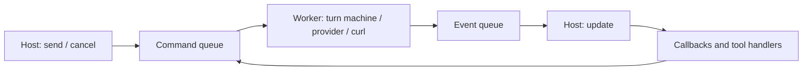

# Scry architecture

Scry is a static C++ library for applications that own their main loop. It sends
requests to an LLM server, streams text, executes tools, resends their results,
and commits conversation history when a turn succeeds. The host calls
`Harness::update()` to run tools and deliver callbacks on its own thread.

The public headers under `include/scry/` define the API. See [README.md](../README.md)
for a complete program and [contributing.md](contributing.md) for build and test
instructions.

## Public API

| Type | Responsibility |
|---|---|
| `Config` | Provider endpoint, credentials, model, sampling, retries, timeouts, and resource limits |
| `Conversation` | System prompt and committed message history |
| `ToolRegistry` | Standalone additive registry of reflected and dynamic tools; a Harness takes ownership at `create()` |
| `Turn` | Handle to an accepted exchange: identity, completion query, cancellation, and callback disconnection |
| `ResponseFormat` | Response tool and answer validator that make a turn end with a [structured answer](#typed-completions) |
| `Harness` | Configured runtime, worker thread, registry, and callback pump |

`Harness::validate(config)` runs the configuration checks used by `create()`
without initializing libcurl or starting a worker. Successful validation does
not guarantee that runtime initialization succeeds. Fallible operations return
`Result<T>` (`std::expected<T, Error>`) or `Status` (`Result<void>`).

`send()` validates admission and returns without waiting for network I/O. It
rejects empty user text with `invalid_argument`, an inactive handle with
`invalid_state`, a busy Conversation with `busy`, and an exceeded admission or
Conversation payload limit with `resource_limit`. Each Conversation has at most
one queued or active turn. Different Conversations can queue turns on the same
Harness.

Scry does not load model weights or own the application's main loop. Its public
extension points are configuration and tool callables; provider and transport
interfaces are internal.

## Threading and lifetime

Use a Harness, its registry, its Turns, and their Conversations from one host
thread. The public handles do not synchronize concurrent application access. A
registry that no Harness owns yet is a plain move-only value on the thread that
built it; `Harness::create()` adopts it and leaves the source inactive. All
callbacks, tool handlers, and answer validators run inside `update()` on its
calling thread; they can access host state owned by that thread directly.

One worker per Harness owns the network transfers, provider decoding, and turn
machine. It processes accepted turns in FIFO order, with one active turn at a
time. Later turns wait while the active turn retries or waits for tool results.
Separate Harness instances have separate workers and runtime state.


```mermaid
flowchart LR
    App["Host: send / cancel"] --> Commands["Command queue"]
    Commands --> Worker["Worker: turn machine / provider / curl"]
    Worker --> Events["Event queue"]
    Events --> Pump["Host: update"]
    Pump --> Callbacks["Callbacks and tool handlers"]
    Callbacks --> Commands
```

The command and event queues use mutexes. Per-turn cancellation uses an atomic
flag; Harness shutdown uses the worker's stop token. Accepted requests share
immutable history and schema snapshots. History is copied before modification
when a snapshot still holds it. Callbacks, tool handlers, and mutable
Conversation state remain on the host side.

`update()` ingests worker events, processes terminal state, and delivers pending
callbacks and tool calls. Its time budget is soft: it is checked between events
and callbacks, and cannot interrupt a handler. When work is available, it ingests
at least one event before checking time and delivers at least one pending
callback or tool call if `max_callbacks` permits. Tool dispatch counts as one
unit against that limit, including its optional `on_tool_call` observer.
`max_callbacks = 0` prevents dispatch and callback delivery but still allows
terminal events to commit history and clear busy state. Route cleanup runs on
every update; only the release of discarded events is deferred when the budget
runs out.

Adjacent worker text events are coalesced, and the pump combines pending text
for each turn. Queue byte accounting includes events retained by the pump until
delivery or discard. Coalescing reduces callback traffic; configured payload
limits provide the byte bound.

Callbacks may call `send()`, `cancel()`, `disconnect()`, and tool registration.
A reentrant `update()` does no work and returns `budget_exhausted = true`.
Exceptions from observer callbacks propagate out of `update()` after that event
counts as delivered; the Harness remains valid. Tool-handler exceptions are
caught and converted into tool-error results.

`send_and_wait()` runs `send()` and pumps `update()` until the requested turn
finishes; `ask<Answer>()` does the same for a typed turn. It also runs callbacks and handlers for other accepted turns. It does
not expose the waited Turn handle, and calling it from a callback or handler
returns `invalid_state`. When `update()` throws while it is pumping, the
exception propagates out of `send_and_wait()` and the waited turn is
disconnected; that turn keeps running and still commits its history.

| Operation | Effect |
|---|---|
| Drop a `Turn` | Work and callbacks continue; destruction does not wait |
| `Turn::cancel()` or `Harness::cancel(id)` | Request cooperative cancellation; the terminal callback remains attached |
| `Turn::disconnect()` or `Harness::disconnect(id)` | Clear callbacks; tools and history processing continue |
| Destroy a `Harness` | Request worker shutdown, join it, clear busy state, and discard undelivered callbacks |

Cancellation before a queued turn starts prevents its network request. A running
tool cannot be interrupted. If cancellation is observed after it returns, its
result and remaining calls are suppressed. Cancellation does not reverse a
terminal outcome already produced by the worker.

Disconnecting inside a callback takes effect for subsequent delivery; the
executing callback remains alive until it returns or throws. A tool handler that
disconnects also suppresses the `on_tool_call` observer for its own call.
Disconnecting does not cancel tools, and the host must keep pumping for the turn
to finish.

`Turn::finished()` becomes true after terminal callback delivery, or after
terminal processing when no terminal callback is attached. Once a turn is
finished the runtime releases its callbacks and tool snapshot even while a
handle is retained; the handle then reports identity and status only. Moved-from
handles and handles whose Harness is gone also report true. Dropping a Conversation
handle does not cancel an accepted turn: the runtime retains its state.

Harness destruction waits for the worker. The transport checks shutdown between
curl operations and limits each curl poll wait using `timeouts.shutdown`; this
setting is not a timed join or a hard wall-clock deadline for the destructor.

## Turn processing and retries

The turn machine in `src/machine/` performs no I/O and reads no clock. It consumes
explicit events and emits commands for the worker to execute. Its states are
queued, awaiting model, streaming, retry wait, awaiting tool, and terminal.
Invalid transitions return diagnostics without changing state or issuing work.
Tests inject time and event sequences directly.

A successful model response either completes the turn or starts a tool round.
In a [typed turn](#typed-completions) the model completes it by calling the
response tool instead, and the round holding that call ends the turn once the
host accepts the answer.
Calls from one response are admitted to the event queue as a batch: if the whole
batch cannot fit, no handler in it runs. The pump dispatches calls in provider
order, posts each result to the worker, and invokes the optional `on_tool_call`
observer. The worker resends once all results are ready. A fatal dispatch or
payload-budget failure suppresses later handlers in the batch.

Tool-call IDs must be unique within a turn. Scry rejects reused IDs rather than
executing them again. `Config::max_tool_rounds` bounds the loop, and
`Config::tool_round_limit` decides what a response that asks for one round too
many does. Under `ToolRoundLimitPolicy::fail`, the default, the turn fails with
`max_tool_rounds` and commits nothing. Under `ToolRoundLimitPolicy::complete`, the
turn stops instead of failing: the rounds that ran and the final response's text
are committed, that response's tool-call blocks are dropped into
`Completion::unexecuted_tool_calls`, and the finish reason is
`tool_round_limit`. A response left with no text after the drop commits no
assistant message at all, so the transcript ends with the previous round's tool
results.

Automatic retries apply to retryable network and rate-limit failures, including
HTTP 5xx responses, only before semantic output is consumed. Text or tool-call
content disables retry even when no text callback has run. After partial output,
a failure ends the turn; its `retryable` flag still indicates whether a new
request may succeed. Authentication and protocol failures are not retried.

Backoff is exponential with jitter seeded independently per Harness. A valid
`Retry-After` can increase the delay, but `max_backoff` caps the final delay.
Attempt and elapsed retry limits reset for each model request in the tool loop.
The elapsed limit controls retry eligibility and wake times; it does not abort
an active transfer. `Completion::attempt_count` totals attempts across the turn,
and `usage` accumulates usage from completed model responses.

## Tools and JSON

Tools are declared in C++ and registered by reflection. `ToolRegistry::add()`
takes a toolbox object, an annotated function or a namespace of them, or an
argument aggregate with a callable, and generates each tool's argument schema,
its strict argument decoder, and its result encoder from the declaration.
[Dynamic tools](#dynamic-tools), registered with `add_dynamic()`, are the escape
hatch for tools that exist only at runtime.

A registry is a standalone value: a host builds one, `Harness::create(config,
std::move(tools))` adopts it, and `Harness::tools()` keeps it open for later
registrations. A registry is additive: duplicate names are rejected and there is
no replacement or removal operation. Every registration call is atomic. A call
that registers several tools, such as a toolbox or a namespace, validates all
of them first: each name must be non-empty and distinct from the other names in
the call and from every tool already registered, each schema must be a JSON
object, and each handler must be non-empty. Only then does it insert them, so a
failed call leaves the registry exactly as it was, even when the failure is an
allocation. Each accepted turn retains the registrations visible at `send()`.
Immutable registration and schema snapshots are reused until another tool is
added; handlers stay on the host thread.

Every tool handler, reflected or dynamic, comes in two shapes: one that receives
only its arguments, and one that also receives a `ToolCallContext` naming the call
it is servicing — the `TurnId`, the provider-assigned `call_id`, the registered
`tool_name`, the one-based `round`, and the zero-based `index` within that round's
batch. These are the same values the later `on_tool_call` observation carries, so
a handler can correlate its own work with the turn without counting calls itself.
The context is borrowed: both string views point into the call block being
dispatched and are valid only until the handler returns. A handler that keeps
either beyond its return must copy the text. Registrations store one handler
shape internally, so every registration form exports the same kind of tool
contract and differs in nothing the model can see.

Before a handler runs, a call passes two admission gates in a fixed order. First
`Config::max_tool_calls_per_turn`, which bounds the calls one turn may dispatch
across every round; `max_tool_rounds` cannot do that on its own, because one
response may request many calls. Then `TurnCallbacks::on_tool_request`, the
host's own policy, which receives a `ToolRequest` naming the call and its
canonical arguments and answers with nothing to admit it or a `ToolRejection` to
refuse it.

Every call that reaches the route counts against the limit, including one naming
a tool nobody registered: the model spent the turn's budget by asking. An unknown
tool is refused by dispatch with its own message and never reaches the hook,
because there is no handler for the host to admit. A refused call runs no handler
and so can have no side effect. The model is given `{"error": message}` flagged
as a tool error: the fixed text `tool call limit for this turn reached; respond
without calling tools` for the limit, the host's `model_message` for a hook
refusal. A typed turn still requires a tool call and ends only on its response
tool, so there the limit's text instead tells the model to call that tool, by
its name, on its own with the final answer. That result reaches `on_tool_call` with `is_error` and is posted to the
worker like any other, so the turn continues and commits normally. A hook that
throws is treated exactly like a handler that throws: the call is refused with the
same fixed text and the turn carries on. The hook runs under the same invocation
guard as every other callback, so a `disconnect()` from inside it is deferred
until the call returns and suppresses that call's `on_tool_call` observation.

A hook that cancels the turn is obeyed before the handler runs, whether it admits
the call or refuses it. The cancel flag is read again the moment the hook returns:
when it is set, no handler runs, no result is posted, and no `on_tool_call` fires,
and the turn ends through the worker's ordinary cancellation path. That is the one
thing the rollback could not repair on the host's behalf, because a handler's
effects on host state outlive the transcript the turn discards. The counts are
unchanged by it: the call still spent the per-turn limit, but a call cancellation
suppressed is not a refusal and is not counted as one.

Tool side effects are not transactional. A failed or cancelled turn leaves
Conversation history unchanged even if a handler already changed host state.
Hosts own rollback, idempotency, and reconciliation for such effects. That is why
cancelling from inside a handler is rarely what a host wants: it discards the
pending transcript, so the results the executed tools produced are thrown away
and the whole turn rolls back, while the side effects those handlers already had
on host state remain.
A host that wants the turn to finish but no further tools to run sets its own
flag, from the handler or from `on_tool_call`, and refuses every later request
from `on_tool_request`. The model is told why, the turn completes, and history
commits.

`ToolRegistry::to_json()` exports a version-1 JSON manifest with a `tools` array
in registration order. Every entry contains the registered `name`, `description`,
and `input_schema` object, including reflected parameter annotations. This is
the provider-neutral tool contract; provider adapters apply their own wire
envelopes. The export includes reflected and dynamic tools alike, invokes no
handlers, and makes no provider request. It reads the current registry rather
than an active turn's frozen snapshot, and returns owned text that later
registrations do not change. The host owns writing that text to a file or
running the export as a build step; only tools registered on that execution path
are included. Export needs no Harness: a registry built on its own exports the
same document without provider configuration, libcurl, or a worker. The manifest
version is independent of the library version: incompatible changes to its
structure or field meanings increment it; additive fields keep the version, and
consumers should ignore unknown fields.

### Reflected tools

A reflected tool is declared in one of three ways, and each lowers to the same
registry entry: a name, a description, a schema generated by the
[reflected codec](#reflected-codec), and a handler that decodes the arguments
strictly, calls the C++ code, and encodes what it returns. The schema, the
decoder, and the encoder cannot disagree, because one compile-time model of the
argument and result types drives all three.

**A toolbox.** `ToolRegistry::add(std::shared_ptr<T>)` registers every member
function of `T` annotated with `scry::reflection::tool`, each bound to that one
object. `add(T&&)` moves the object into the registry first and then does the
same, so the registry owns the only copy.

```cpp
struct SayArgs {
  [[= scry::reflection::description{"One short line of dialogue"}]] std::string line;
  bool shout = false;
};

class Npc {
public:
  [[= scry::reflection::tool{"Report the NPC's position"}]] Position where() const;
  [[= scry::reflection::tool{"Move the NPC by whole tiles"}]]
  Position step(std::int32_t dx, std::int32_t dy);
  [[= scry::reflection::tool{"Make the NPC speak"}]] scry::Status say(SayArgs args);
};

auto npc = std::make_shared<Npc>();
auto shared = tools.add(npc);   // the host keeps a handle to the same object
auto owned = other.add(Npc{});  // or the registry owns it outright
```

**Annotated functions.** `add<^^forecast>()` registers one function annotated
with `scry::reflection::tool`. `add<^^npc_tools>()` registers every such function
declared directly in the namespace `npc_tools`, in declaration order; nested
namespaces are not searched, and a namespace's tools should be declared before
the call that registers them, since reflection sees the namespace as it stands
at that point. A static member function registers as a free function does. A non-static
member function needs an object, so it is registered through its class as a
toolbox.

```cpp
namespace almanac {
[[= scry::reflection::tool{"Days until the first expected frost"}]]
std::int32_t days_to_frost();
[[= scry::reflection::tool{"Planting advice for one crop"}]]
std::string advice(Crop crop);
} // namespace almanac

auto one = tools.add<^^almanac::advice>();
auto all = tools.add<^^almanac>();  // both, or neither
```

Registration reads the declarations that precede the call in the calling
translation unit, and two units can see different ones. A namespace is open, so
each unit sees the tools declared in it so far. A function's `tool` and `name`
annotations accumulate across its redeclarations, and its parameter names are
the ones its declarations so far give it, so two units that declare one function
differently see a different description, tool name, or synthesized argument
object. An out-of-class definition of a toolbox member can likewise add
annotations, including `tool` itself, that only the units containing it see.
Each unit registers what it sees. The tools found at the call site, each with its
name, description, and synthesized parameter names, are a defaulted template
argument of every `add()` overload that registers reflected declarations, and
the code generated for a tool reads those facts from that argument and from the
function's type, never again from its declarations. Units that see different
declarations therefore instantiate differently named specializations, which the
linker cannot merge into one.

**An argument aggregate and a callable.** `add<Args>(ToolMetadata, handler)`
registers any callable that takes `Args`, which suits a lambda capturing host
state. The name and description come from `ToolMetadata`.

```cpp
struct ForecastArgs {
  [[= scry::reflection::description{"City to query"}]] std::string city;
  std::optional<int> days = std::nullopt;
};
struct Forecast { std::string summary; double temperature_c; };

auto status = tools.add<ForecastArgs>(
    {.name = "forecast", .description = "Return the forecast for one city"},
    [](ForecastArgs args) -> scry::Result<Forecast> {
      return lookup_forecast(std::move(args));
    });

// The same registration, with the call's identity as an optional leading parameter.
auto traced = tools.add<ForecastArgs>(
    {.name = "traced_forecast", .description = "Return the forecast for one city"},
    [](const scry::ToolCallContext& context, ForecastArgs args) -> Forecast {
      log(context.turn_id, context.round, context.call_id);
      return lookup_forecast(std::move(args));
    });
```

An annotated function is named after its identifier, and a
`scry::reflection::name{"..."}` annotation on the function replaces it. Its
description is the `tool` annotation's text, which must not be empty; a
`description` annotation on a function is an error, since the `tool` text already
is the description. Tool names within one toolbox or namespace must be distinct,
which is checked at compile time, and against the registry, which is checked at
registration.

A toolbox's tools are the member functions its class declares itself; inherited
member functions are not considered. Each must be public, not deleted, and not
`&&`-qualified. A toolbox registered as `std::shared_ptr<const T>` admits only
`const` member functions. Function templates cannot be tools: GCC 16 cannot read
annotations on a template, so an annotated function template in a namespace or
class is not seen.

A tool member function may take a C++23 explicit object parameter, such as
`int read(this const Box& self)`. The registry calls it on the toolbox it holds,
as an lvalue that is `const` when the toolbox is, so that parameter is the
toolbox and never an argument; the call context and the arguments follow it. The
lvalue must initialize the parameter as it would any argument, and the `const`
and `&&` rules for implicit object members do not apply. A `const T&` parameter
always binds. A `T&` parameter binds a non-const toolbox and reaches the object
the host shares; on a const toolbox it is a compile error. A by-value `T`
parameter copies the toolbox for each call, so `T` must be copy-constructible
from a `const T` lvalue for a const toolbox, or from a `T` lvalue otherwise. An
rvalue reference is a compile error, as a `&&`-qualified member function is. A
parameter of another type, such as a reference to a base class, is accepted when
the toolbox lvalue converts to it, and is a compile error otherwise.
`this auto&& self` makes the function a template, which is not seen.

A tool function's parameters, after an optional explicit object parameter and an
optional `const ToolCallContext&`, take one of three forms:

- **None.** The tool takes no arguments. Its schema is the empty closed object,
  `{"additionalProperties":false,"properties":{},"required":[],"type":"object"}`,
  and decoding accepts `{}` alone.
- **One aggregate.** When exactly one parameter remains and its type, without
  references and cv-qualifiers, is a plain aggregate class, that class is the
  argument object, exactly as for `add<Args>()`: its member descriptions,
  defaults, and optional members all apply. `std::string`, `std::optional`,
  `std::vector`, `std::array`, and `std::variant` are not aggregate classes in
  this sense.
- **Anything else.** Scry synthesizes the argument object with
  `std::meta::define_aggregate`: one member per parameter, named after the
  parameter, of the parameter's type without references and cv-qualifiers. Every
  member is required, and none has a description. Default arguments are ignored.
  GCC 16 cannot read annotations on function parameters, so a tool whose
  parameters need descriptions, defaults, or optional members takes an argument
  aggregate instead. Every parameter must be named, in some declaration of the
  function, and of a `SupportedValue` type. A single parameter of aggregate type
  that should be one member of the argument object, rather than the object
  itself, needs a wrapper aggregate or a second parameter.

The decoded arguments are moved into the call, so each parameter takes a value,
a `const` reference, or an rvalue reference. A non-const lvalue reference, a
`volatile` parameter, or a `ToolCallContext` anywhere but first (after the
explicit object parameter, if there is one) is a compile error.

Handlers and tool functions return a supported value, a `Result` of one, `void`,
or `Status`. A value is encoded as the tool result. `void` and a successful
`Status` both send `{}`: a tool that acts for its side effects has nothing to
report beyond success, and an empty object says so without a placeholder result
type. A failed `Status` or `Result` is a handler error like any other. The
returned object is encoded without an additional copy or move, including
aggregates whose user-declared destructor suppresses an implicit move
constructor. Raw `Json`, references, futures, and awaitables are not reflected
result types. `reflection::encode(value)` uses the same value encoder without
requiring registration.

Handlers run synchronously on the host thread, inside `Harness::update()`, so a
toolbox's state needs no locking and can be the host's own. Each registration
from a toolbox holds a copy of its `std::shared_ptr`, so the toolbox lives as long
as the registry's registrations and any turn that snapshotted them still holds
one; the last of those is released on the host thread, when the registry is
destroyed (with its Harness) or when the last turn using it finishes. The
registry never borrows an object: an lvalue passed to `add(T&&)` is a compile
error. A host that must keep a toolbox somewhere the registry cannot own it can
pass a `std::shared_ptr` with a no-op deleter and take on the lifetime guarantee
itself.

Reflection reports a declaration the registry cannot accept at compile time,
with a `static_assert` that names the function, member, or namespace and the
reason. Each of these is one: a toolbox class that declares no tool member
function; a `tool` annotation on anything but a function, such as a variable or
a data member; a namespace that declares no tool function; a non-static member
function passed to `add<^^...>()`; an unnamed or unsupported parameter, or one
passed in a way the decoded arguments cannot bind; an explicit object parameter
the toolbox cannot initialize; an unsupported return type;
two tools of one toolbox or namespace with one name; more than one `tool` or
`name` annotation on one function; and an lvalue passed to `add(T&&)`. For
example, `scry::ToolRegistry::add<^^lamp_tools::label>(): lamp_tools::label has
parameter `initial`: char is a character type; use std::string for text or a
fixed-width integer for a number`. The concept `scry::reflection::Toolbox` is the
SFINAE-friendly form of the toolbox checks.

The rest of this section applies to every reflected form. Parameter
descriptions come from P3394 `scry::reflection::description` annotations on
members. Duplicate Scry description annotations on one member fail at compile
time. `scry::reflection::description_of<View>()` builds the same annotation from
a `std::string_view` with static storage duration, so a host can keep its
parameter text in one catalog instead of in literals spread across aggregates.

`scry::reflection::schema_v<Value>` is the same generator over any `SupportedValue`,
including handler result types; Scry sends only `input_schema_v<Args>` to a provider,
so a result schema is for a host's own contract export.

Argument objects and nested objects must be complete, default-constructible,
move-constructible, move-assignable plain aggregates. They must have no bases,
union layout, reference members, bit fields, unnamed or non-public members, or
`const`/`volatile` members. An aggregate cannot be reachable from its own members.

Supported member and result values are:

- `bool`; non-character signed and unsigned integers up to 64 bits; finite
  `float` and `double`; `std::string`.
- Nonempty scoped enums with unique underlying values, represented by exact
  enumerator names.
- `std::optional<T>` with a supported non-optional element.
- `std::vector<T, Allocator>` except `vector<bool, Allocator>`; `std::array<T, N>`;
  and recursively supported aggregates. Containers must support default
  construction, move construction, and move assignment.
- `std::variant<A, B, ...>` whose alternatives are supported aggregates, each
  with a distinct `scry::reflection::tag`. An untagged variant, or one with a
  non-aggregate alternative, is not supported.

Only a default member initializer, or `skip_null` on a `std::optional<T>` member,
permits omission. Only `std::optional<T>` permits JSON `null`. Thus
`std::optional<int> value;` is required and nullable, while `int value = 1;` is
omittable and non-null. Omission preserves the C++ initializer, except that an
omitted `skip_null` member decodes as disengaged.

Generated schemas use closed inline objects, numeric range bounds, exact array
lengths, and a provider-neutral JSON Schema subset. Their keywords are
`additionalProperties`, `anyOf`, `description`, `enum`, `items`, `maxItems`,
`minItems`, `minimum`, `maximum`, `properties`, `required`, and `type`.
Object keys and required names are sorted by final JSON key; enum values and
variant alternatives keep declaration order. A tagged variant is an `anyOf` of
its alternatives' object schemas, each with a required `type` property whose
`enum` holds that alternative's tag; an optional variant adds `{"type":"null"}`
to the same `anyOf`. Schemas omit `$schema`, references, definitions, `title`,
and `default`.

Decoding recursively rejects unknown or missing fields, incorrect JSON kinds,
disallowed null, out-of-range or non-finite numbers, unknown enum names, missing
or unknown variant tags, and incorrect fixed-array lengths. Only a number spelled
as digits alone is an integer, so neither `1.0` nor `1e2` decodes into an integer
member, and neither does `-0`, which is the double -0.0. Canonical parsing
collapses duplicate object keys before dispatch, the last occurrence winning, so
handlers do not see the original lexical duplicates.

A decode failure fills `Error::model_message` with the host `message` minus its
`reflected JSON at ` prefix: the JSON path of the offending value and what the
schema required there, plus the declared enumerator names when an enum value is
unrecognized, or the declared tags when a variant's `type` is missing or
unrecognized. Argument text that is not JSON at all reports `tool arguments are
not valid JSON`. Every word of it is derived from the schema the model was
already given, so the model can correct itself without learning anything new. A
result-encoding failure fills no `model_message`: it describes the handler's own
result type, whose schema the model never sees, so the model receives the fixed
diagnostic.

A type outside these rules fails to compile at `add`, `schema_v`, or
`input_schema_v` with a `static_assert` that names the member path and the
reason, for example `ForecastArgs does not satisfy
scry::reflection::ToolArguments: ForecastArgs::window.when:
std::chrono::duration<long int> is not a supported reflected value`. Those entry
points are unconstrained so that this text is what the compiler prints; the
concepts `SupportedValue`, `ToolArguments`, `ToolHandlerFor`, and `Toolbox` are
the SFINAE-friendly form of the same checks.

An `add<Args>()` handler is invoked with moved arguments. It may declare a
leading `const ToolCallContext&` parameter; `ToolHandlerFor` accepts either
arity and checks the result type of whichever form is viable, preferring the
contextual one. The context must lead: a handler that trails it is not a
reflected handler and fails to compile.

### Reflected codec

The reflection layer is Scry's serialization engine, and reflected tools are its
first consumer: their schemas, argument decoding, and result encoding are this
codec applied to the argument and result types. One compile-time model of a type (its shape, its fields in
canonical key order, and its annotations) drives schema generation, encoding,
and decoding, so the three cannot disagree about a key, an omission, or a tag.

Three concepts name what it accepts. `SupportedValue` is the closed family of the
previous section: every value has a schema, encodes, and decodes. `Encodable`
adds two encode-only leaves: `std::string_view`, written as a JSON string, for
wire text borrowed from elsewhere, and `scry::Json`, which is checked by the
validation scan request encoding uses and spliced verbatim. Because encoding
only reads, an `Encodable` aggregate need not be default-constructible or
movable and may have `const` members or reference members, through which it
borrows a value it writes. `Decodable` adds `scry::Json`, which
captures the canonical text of whatever value sits at its position, `null`
included, as `JsonView::to_json()` writes it; `std::optional<scry::Json>` reads
`null` as disengaged. Neither leaf has a schema, so neither may appear in tool
arguments, handler results, or `schema_v`.

`reflection::encode(value)` accepts any `Encodable` value and returns canonical
JSON. The writer emits object keys in canonical order, strings with the
canonical writer's escapes, and numbers in the
shortest spelling that reads back as the same value of their own type, so a
`float` 0.7 is written `0.7`; the result then passes once through the canonical
writer, which settles exponent spelling and canonicalizes spliced `Json` text.
It fails with `tool` and the value's path for a non-finite number, an undeclared
enumerator value, `Json` text that is not JSON, or a variant left valueless by an
exception. `reflection::decode<T>(json)` and `decode<T>(view)` accept any
`Decodable` `T` and apply the decoding rules of the previous section. They
report a failure as `invalid_argument`, with the same path-based `message` and
`model_message` a tool-argument failure carries, so a host can hand a typed
answer's failure back to the model; text that is not JSON reports `reflected
JSON text is not valid JSON`. The tool path keeps `ErrorCategory::tool`. A type
outside the family fails to compile with the member path and the reason, and
`Encodable` and `Decodable` are the SFINAE-friendly checks.

Annotations are declared in `<scry/annotations.hpp>`, which does not need a
reflection-enabled compiler to include: its types are plain structural types,
and only writing `[[= ...]]` requires C++26. A class annotation goes between the
class-key and the class name, `struct [[= scry::reflection::tag{"text"}]]
TextBlock { ... };`. Several annotations on one entity each take their own `=`,
in one bracket, `[[= a, = b]]`, or in separate ones.

| Annotation | Applies to | Effect |
|---|---|---|
| `description{"..."}` | Data member | The member schema's `description` |
| `name{"key"}` | Data member, or tool function | Replaces the member's JSON key in encoding, decoding, schemas, and failure paths; on a tool function, replaces the tool name |
| `tool{"..."}` | Function or member function | Declares a [reflected tool](#reflected-tools) and supplies its description |
| `tag{"value"}` | Class | The class's `type` value as a variant alternative; no effect elsewhere |
| `skip_null` | Class, or a `std::optional` member | A disengaged optional is omitted, and its absence decodes as disengaged |
| `emit_null` | `std::optional` member | Restores `null` output for one member of a `skip_null` class |
| `ignore_unknown` | Class | Decoding ignores members the class does not declare |

Objects are written in lexical byte order of their final keys. A variant
alternative's object carries `"type":"<tag>"` at its sorted position. Decoding
reads `type` first and dispatches on it, and the tag is not an unknown member of
the alternative. A tagged class outside a variant neither writes nor accepts
`type`. A `skip_null` member is left out of the schema's `required` list, and
its absence overrides its initializer, so every encoded value decodes to itself.
`ignore_unknown` relaxes only the class it annotates: its members' values and
any enclosing class stay strict, and its schema stays closed, because a schema
describes what a producer should send.

Each of these fails to compile with a diagnostic naming the class or member: two
members of one class with one final key; a variant alternative that is not an
aggregate, has no tag, shares its tag, or has a member whose final key is
`type`; `skip_null` or `emit_null` on a member that is not a `std::optional`, or
both on one member; more than one `name`, `description`, or `tag` on one entity;
`tag` or `ignore_unknown` on a data member, or `name` or `emit_null` on a
class; and `tool` on a data member or a class, which the tool registration
checks also report for any other entity that is not a function.

The public message model is reflected too. `TextBlock`, `ToolCallBlock`, and
`ToolResultBlock` carry the tags `text`, `tool_call`, and `tool_result`, so
`ContentBlock` is a tagged variant and a host can pass a `Message`, or a vector
of them, to `reflection::encode()` and `decode()`. The encoding is the
per-message shape of the `Conversation::to_json()` document. Every member of the
model has an initializer, so `decode()` reads an absent member as its initial
value, while `Conversation::from_json()` requires every member. Because the
blocks carry annotations, including `<scry/message.hpp>` needs a C++26
compiler, as the rest of the public API does.

### Dynamic tools

`ToolRegistry::add_dynamic(ToolDefinition, ToolHandler)` registers a tool from a
hand-written JSON schema object and a move-only `Json -> Result<Json>` callable;
`add_dynamic(ToolDefinition, ContextualToolHandler)` accepts a move-only
`(const ToolCallContext&, Json) -> Result<Json>` callable instead. They are the
escape hatch for tools that exist only at runtime, such as ones bridged from a
scripting language, another process, or a plugin manifest, where there is no
C++ declaration to reflect. A tool declared in C++ belongs on `add()`, where its
schema and argument checks are generated and cannot drift apart.

The overloads are separated by the handler's arity, so a lambda of either shape
selects one of them without a cast. Registration validates and canonicalizes the
schema as a JSON object; Scry does not implement general JSON Schema validation.
An empty handler of either shape is rejected at registration. The handler
receives canonical object arguments and owns validation against its schema:
Scry has checked that the arguments parse and form an object, not that they
match the schema the model was given. A handler that rejects them with
`scry::tool_error()` tells the model what was wrong, and the turn continues so
the model can correct the call; `on_tool_request` can apply the same check
before any handler runs. A handler must synchronously return valid JSON or an
error. Asynchronous or deferred tool results are not supported.

### Tool errors

Unknown tools, reflected decode failures, handler errors, exceptions, and invalid
result JSON produce bounded model-visible error results. A handler error's
`model_message` is forwarded inside `{"error": ...}` subject to the result byte
cap; its `message` and any exception text are not. `scry::tool_error(model_message,
host_message)` builds such an error; an empty `model_message` keeps Scry's fixed
diagnostic, `tool handler returned an error`. Any error text too large for the
cap, a `model_message` included, is replaced by the generic `tool execution
failed`. Reflected decode failures and unknown-tool errors carry schema-derived
`model_message` text: an unknown tool names the requested tool and the
registered tool names, which the request's tool list already carried. Scry
applies no redaction to `model_message`, so a host that puts a secret in one has
published it. An oversized result, or an error result that cannot fit its bound, fails the turn
with `resource_limit`.
`on_tool_call` observes the canonical result and its `is_error` flag after the
result is posted to the worker; it does not confirm that the server received it.
Cancellation or a fatal framework failure can suppress this observer.

`Json` owns serialized text. `JsonView::parse()` creates a shared immutable parsed
document with scalar accessors, `find()`, `at()`, and ordered `key_at()` lookup;
child views can outlive their parent. `to_json()` writes the canonical text of the
viewed value alone. Invalid input returns `invalid_argument`.
`escape_json_string()` produces a quoted JSON string for hand-built results,
escaped exactly as the canonical writer escapes: `\"`, `\\`, the short escapes
`\b \f \n \r \t`, and `\u00XX` with uppercase hexadecimal digits for any
other byte below 0x20; every other byte, `/` and non-ASCII included, passes
through unchanged.

JSON is parsed and written by Scry's own code, the kernel's JSON layer under
`src/kernel/json/`; no JSON library is linked or exposed. The rest of `src/`
reads parsed JSON through `JsonView` and maps its own data shapes with the
reflected codec. `src/kernel/json/document.hpp` states the contract in full:

- **Accepted text** is RFC 8259 JSON holding exactly one value, surrounded only
  by space, tab, line feed, and carriage return. Empty or whitespace-only input,
  a byte order mark, comments, trailing commas, a second value, and trailing
  bytes, a NUL included, are rejected. A validation pass that allocates nothing
  accepts exactly what the parser accepts.
- **Nesting** is limited to 256 arrays and objects open at once, counting an
  empty one; deeper input is rejected, which bounds recursion.
- **Strings** must be strictly valid UTF-8 in keys and values: no overlong
  forms, no encoded surrogates, nothing above U+10FFFF, no truncated sequence.
  Control characters must be escaped. A `\u` escape of a surrogate must be a
  high surrogate followed at once by an escaped low one; a lone or reversed
  surrogate is rejected. `\u0000` decodes to a NUL byte.
- **Numbers** spelled as an optional `-` and digits alone are integers when they
  fit: `unsigned_integer` for a non-negative value within 64 bits,
  `signed_integer` for a negative one. Everything else, a fraction or an
  exponent included (`1.0`, `1e2`), is a correctly rounded double, and so is
  `-0`, which is not negative and keeps its sign as -0.0. A number whose
  magnitude rounds to infinity, or a nonzero one that rounds to zero, is
  rejected.
- **Duplicate keys** collapse to the last occurrence, at every level.
- **Canonical text** has no insignificant whitespace, object keys in lexical
  byte order, the string escapes above, integers in plain digits, and doubles
  in the shortest spelling that reads back as the same double: positional for a
  decimal exponent from -4 through 15 (`0.0001`, `1`, `1500000000000000`),
  otherwise scientific with an uppercase `E`, no `+`, and no leading exponent
  zeros (`1E-5`, `1E20`). Zero is `0` and negative zero `-0`. Canonical text
  reads back as the same tree and writes back as itself.

Golden fixtures in `tests/fixtures/json/goldens.tar.xz` pin the acceptance boundary and the
canonical bytes.

## Typed completions

A turn can be asked to end with a structured answer instead of free text. The
answer is a C++ type, and reflection drives the rest: the schema the model is
given, the strict decoder that checks what it sends back, and the error text
that tells it what to fix.

```cpp
struct Verdict {
  [[= scry::reflection::description{"Is the claim supported?"}]] bool supported{};
  std::string reason{};
};

// Blocking, like send_and_wait(): Result<Answered<Verdict>>.
auto verdict = harness.ask<Verdict>(conversation, "Is the moon made of cheese?");
// verdict->value is the Verdict; verdict->completion is the turn's Completion.

// Poll-friendly: on_finished's Completion::structured holds the answer's
// canonical JSON, which reflection::decode<Verdict>() reads back.
auto turn = harness.send<Verdict>(conversation, "Is the moon made of cheese?",
                                  std::move(callbacks));
```

`Answer` must satisfy `ToolArguments`, because a provider's tool input is always
a JSON object; any other type fails to compile with the member path and the
reason, as `add<Args>()` does. `ask()` returns the `Completion` beside the value
because it carries what the value alone does not: prose the model gave with the
answer, usage, attempts, and round counts.

### Mechanism

A typed turn is the ordinary tool loop with one extra tool, the response tool,
described by a `ResponseFormat`: a `name` (`respond` by default), a
`description` (empty selects Scry's instruction to call it exactly once, on its
own, with the final answer), a JSON Schema object `schema`, and an optional
host-thread `validate` callable. `reflection::response_format<Answer>()` builds
one whose schema is `input_schema_v<Answer>` and whose validator is
`reflection::decode<Answer>()`; `send<Answer>()` and `ask<Answer>()` use it, and
a host that wants another name or description, or a hand-written schema, passes
a `ResponseFormat` to `send_structured(conversation, text, format, callbacks)` or
`send_and_wait_structured(conversation, text, format)`. The dynamic forms have
their own names so that `send()` and `send_and_wait()` keep exactly their plain
overloads: `send(conversation, text, {})` still means "no callbacks", and
`send<Answer>()` is never chosen without its explicit template argument.

Before acceptance, a structured send rejects with `invalid_argument` a format whose name
is empty or is a registered tool's, or whose schema is not a JSON object, so the
response tool can always be told apart from the host's tools. The request lists
the response tool after the registered tools and requires a tool call:
`"tool_choice":{"type":"any"}` for Anthropic and `"tool_choice":"required"` for
OpenAI-compatible servers. A request without a response format is byte for byte
what it was before typed turns existed. Nothing else changes: the model may call
registered tools for as many rounds as `max_tool_rounds` allows before it
answers.

### Validation loop

Each model response of a typed turn is classified by its tool calls:

- **No tool call.** The server ignored the required tool choice, or the output
  hit its token limit first. The turn fails with `protocol`, naming the
  response tool and which of the two happened, and commits nothing.
- **Exactly one call, to the response tool.** Its canonical arguments are a
  candidate answer. It travels to the host like a tool call and is validated
  inside `update()` on the host thread, counting as one delivery unit. On
  success the turn completes. On failure the model receives
  `{"error": model_message}` as the call's tool-error result, and the loop
  continues so the model can correct itself; the attempt costs a tool round.
  For a reflected type the `model_message` is the decode failure's
  schema-derived text, exactly as for a reflected tool argument, such as
  `$.supported is a required member`.
- **A response-tool call beside other calls, or more than one.** The real calls
  are dispatched as usual. Each response-tool call receives the tool error
  `call respond exactly once, on its own, after your other tool calls have
  returned`, and the loop continues.
- **Only real tool calls.** An ordinary tool round.

A validator is treated as a tool handler is. An error's `model_message` is what
the model reads; an error without one, and a validator that throws, give the
model the fixed text a failing handler gives it, and the turn continues. Without
a validator, any JSON object is accepted, since Scry does not implement general
JSON Schema validation. Validation runs under the same invocation guard as a
handler: cancelling from inside the validator is honoured before any verdict
reaches the worker, and disconnecting from inside it stops later delivery but
not the verdict, because the validator is part of the turn's work rather than
one of its callbacks.

A server that forces a tool call may report a plain `stop` beside the call it
forced, so a typed turn takes calls with a normal finish reason as a tool
response.

### Completion and history

An accepted answer completes the turn with `finish_reason` `completed`.
`Completion::structured` holds the answer's canonical JSON object, the arguments
the model passed, canonicalized; `Completion::text` holds only the prose the
final response carried beside the call, which may be empty.

The committed transcript is the user message, every round of real tool calls
with its results, and a final assistant message made of the final response's
text followed by one text block holding the answer's canonical JSON. The
response-tool call itself is not committed, and neither is any rejected
attempt: each response-tool call, its error result, and any message they leave
empty are taken out of the transcript, while real calls in the same rounds stay
with their results. Three constraints fix this shape. Every committed tool call
needs its result, or neither dialect accepts the history on the next request. A
result for the accepted call would end the transcript on a user message. And the
response tool is offered only to typed turns, so history that named it would
reach later requests, including a plain turn or a Harness that restored the
Conversation from JSON, that do not declare it, and a provider may refuse tool
blocks for a tool the request does not define. The model sees its attempts
within the turn; the committed history is what the next turn needs, which is
the question and the answer. Taking a rejected round out can leave two
assistant messages in a row, which the Anthropic adapter merges and the
OpenAI-compatible dialect accepts as they are. The OpenAI adapter joins a
message's text blocks without a separator, so the next request carries the
prose directly followed by the answer's JSON.

`Conversation::to_json()` saves the answer as the ordinary text block it is, and
a restored Conversation re-encodes for either dialect. The committed answer is
reserved against the Conversation byte limit like any reply; the copy in
`Completion::structured` is taken by the pump at commit and, like
`Completion::text`, is never charged to the queued-event limit.

### Counting and hooks

Response-tool calls are Scry's own protocol, not host tool calls. They never
reach a handler, `max_tool_calls_per_turn`, `on_tool_request`, or
`on_tool_call`, and they count in neither `tool_call_count` nor
`rejected_tool_call_count`. `Completion::answer_attempt_count` counts every
response-tool call the model made, the accepted one included. A real call's
`ToolCall::index` keeps its position in its round's batch in provider order, so
a response-tool call beside it still occupies an index.

`tool_round_count` counts the rounds that ran before the final response,
including rounds whose only call was a rejected answer, even though such a
round is not committed. The response carrying the accepted answer is the final
response, not a round.

### Limits and errors

A lone response-tool call is validated even when every round is spent, since it
can end the turn. Any other response at the round limit, and a rejected answer
at the limit, fail the turn with `max_tool_rounds` under either
`ToolRoundLimitPolicy`: the caller asked for an answer and there is none, so
`ToolRoundLimitPolicy::complete` has nothing to complete with, and
`Completion::unexecuted_tool_calls` is always empty for a typed turn.

After acceptance a typed turn fails with `protocol` when a response calls no
tool, with `max_tool_rounds` as above, and otherwise exactly as any turn does.
Cancellation, retries, and persistence behave as for any turn: retries apply
before semantic output, a failed or cancelled turn commits nothing, and
`on_finished` remains the single terminal channel. `ask()` reports what
`send_and_wait_structured()` would, and a decode failure of an accepted answer, which the
validator makes unreachable.

## Providers and transport

The public `Message` model contains user and assistant roles with text, tool-call,
and tool-result blocks. Provider adapters translate this model into HTTP requests
and decode streaming replies. Provider code lives under `src/provider/`, split
into request encoding, stream decoding, and content helpers. Per-attempt decode
state is separate from the adapter.

Request encoding describes each body as reflected wire structs and writes them
straight to JSON text with the reflected codec, rather than building a document
tree. The structs borrow what they write: text as `std::string_view`, and
tool-call arguments and tool input schemas as `const Json&` members. Each
embedded payload, including tool results, which travel as JSON strings, is
checked by one allocation-free validation scan and used as the canonical text
the turn machine, tool dispatch, and registration already produced, so a retry
or a tool round re-encodes only the request's own frame and never rebuilds
history as a document tree. Malformed embedded text is still rejected with
`invalid_config`. A body is not canonicalized after it is written, so it relies
on the codec writing keys in canonical order and strings with the canonical
escapes; `temperature` and `top_p` are spelled by the canonical writer before
the encode, because the codec's shortest spelling of a double differs from it
for small and large exponents (`1e-07` against `1E-7`).

Stream decoding parses each SSE `data` payload once and decodes it with the
reflected codec into event types that ignore members they do not declare, since
providers add fields: a tagged variant keyed on `type` for Anthropic, and one
chunk type for OpenAI. A shape the codec rejects is a `protocol` error naming
the JSON path. The protocol lifecycle stays hand-written: event order, block
indices, finish reasons, usage accumulation, and the argument byte limit. So do
the error-token and request-identifier reads, which are best-effort: each value
is independently optional, and one of the wrong type reads as absent rather
than failing the event.

| Setting | Anthropic Messages | OpenAI-compatible Chat Completions |
|---|---|---|
| Endpoint | `/v1/messages` | `/v1/chat/completions` |
| Authentication | Required `x-api-key` | Optional bearer token |
| `temperature` | 0–1 | 0–2 |
| `top_p` | Greater than 0, at most 1 | 0–1 |
| `max_tokens` | Required, positive | Optional; positive when set |
| `seed` | Rejected during validation | Optional; sent when set |
| Disabled reasoning | Rejected during validation | Sends `reasoning_effort: "none"` |

`SamplingConfig::seed` is passed through, not enforced. Scry sends the same value
with every request, retries and tool rounds included, and nothing more; whether
the same seed, model, prompt, and sampling values repeat an output is up to the
server, which treats it as best-effort, and no seed carries across models,
servers, or server versions. The Messages API has no seed, so the Anthropic
dialect rejects one instead of dropping it and leaving a host to believe its
runs were seeded.

For Anthropic, use an origin or the full `/v1/messages` endpoint. The OpenAI
adapter accepts an origin, a `/v1` base, or the full `/v1/chat/completions` endpoint.
Both adapters always request `stream: true`. Default reasoning mode omits reasoning
controls.
An OpenAI-compatible server must implement the subset Scry sends, including the
optional reasoning field when enabled and `tool_choice: "required"` for a typed
turn. Azure-specific endpoints, the Responses API, server-side structured output
modes such as `response_format`, and other server extensions are not
implemented; [typed completions](#typed-completions) are built on tool calling
instead, which both dialects share.

The Anthropic adapter merges consecutive same-role messages into one message whose
content array concatenates their blocks, because the Messages API takes one message
per role turn and a history that stopped at the tool-round limit can end with the
user message carrying that round's results.

OpenAI requests encode system text and function tools, and emit a separate ordered
`role: "tool"` message for each result, so a `user` message may follow tool results
directly and no merge is needed. Streaming accumulates bounded tool-call
fragments by index and requires complete contiguous calls at finish. A finish
reason followed by `[DONE]` completes the stream; a trailing usage-only chunk is
allowed before `[DONE]`. Missing, duplicate, or early terminal markers and
semantic content after finish are protocol errors. Anthropic streams decode
Messages content blocks, usage, stop reasons, and tool-use arguments.

The incremental SSE parser, in the kernel (`src/kernel/sse.cpp`), handles
arbitrary byte splits. A CR, LF, or CRLF ends
a line as soon as it arrives; a blank line ended by a lone CR dispatches its event
without waiting for the next byte. Unknown optional events
can be ignored; malformed required content fails with `protocol`. There is no
non-streaming response path or public logging API.

The transport uses libcurl through an internal injectable interface; the
interface and its libcurl implementation are kernel code under
`src/kernel/transport/`. Each Harness
retains a curl multi handle and its connection cache across retries, tool rounds,
and turns, while running one transfer at a time. Curl objects use RAII, and C
callbacks catch exceptions. Process-wide curl initialization is attempted once;
its result is cached. Startup requires libcurl 7.84 or newer with thread-safe
global initialization and asynchronous DNS.

TLS peer and hostname verification are enabled by default. `ca_bundle_path`
selects a CA bundle; `proxy` selects a proxy. Empty values preserve curl's trust
store and proxy defaults, including proxy environment variables. Extra header
names and values are validated, and collisions with Scry-managed headers are
rejected. `Harness::validate()` checks configuration values, not server reachability
or credential acceptance.

Non-2xx bodies are excluded from the SSE decoder. At most 8 KiB is retained to
extract a sanitized `error.type` or `error.code` token into `provider_detail`,
prefixed by the dialect name. The provider's message and raw body are not
surfaced. HTTP errors carry their status and sanitized request identifier when
available. Scry uses fixed diagnostics and filters configured API-key matches
from worker error and request-ID fields.

## Resource limits and timeouts

Defaults are defined in `include/scry/config.hpp`:

| Setting | Default |
|---|---:|
| Pending turns per Harness | 64 |
| SSE event bytes | 256 KiB |
| Response bytes per transfer | 8 MiB |
| Tool argument bytes per call | 1 MiB |
| Tool result bytes per call | 4 MiB |
| Queued event payload per turn | 2 MiB |
| Conversation payload | 16 MiB |
| Tool rounds | 8 |
| Tool calls per turn | Unset |
| Maximum output tokens | 1024 |
| Retry attempts / elapsed window per model request | 3 / 30 s |
| Initial / maximum retry backoff | 250 ms / 10 s |
| Retry jitter ratio | 0.2 |
| Connect / idle / shutdown | 10 s / 120 s / 2 s |
| Total transfer timeout | Unset |

Resource limits must be positive; the queued-event limit must be at least 1024
bytes. `max_tool_calls_per_turn` is optional: unset means unlimited and zero is
rejected as `invalid_config`. Admission failures reject `send()` immediately; an accepted turn that
exceeds its limit fails with `resource_limit`.

Conversation accounting includes the system prompt, text, tool identifiers and
names, tool-result error flags, and serialized arguments/results across history and
pending exchange. It excludes JSON envelope syntax and allocator overhead; it is
not the size of `to_json()`. The pump and machine reserve exchange payloads before
resend and commit. A completion payload is charged to the Conversation budget
when the machine reserves it, never to the queued-event limit, so a completion
that fits the Conversation limit is always deliverable; the queued-event limit
bounds the text deltas, tool-call batches, and error diagnostics awaiting
delivery. `from_json()` has no
Harness configuration and does not apply these byte limits; they apply when the
restored Conversation is sent through a Harness.

`connect` limits connection establishment, including name resolution. `idle`
uses curl's low-speed check at one byte per second with the duration rounded up
to whole seconds. It detects prolonged silence, including before the first byte,
but uses a rolling average and can report a stall later than the configured
interval. It is not an exact timer between chunks. Optional `transfer` sets a
hard duration limit on one HTTP transfer. Timeout failures are retryable network
errors subject to the turn's retry eligibility. `shutdown` caps curl poll waits.

## Completion, errors, and history

Before acceptance, errors return directly. After acceptance, `on_finished` is the
single terminal result channel for completion, failure, or cancellation. The host
must keep calling `update()`; a callback is delivered once unless disconnected
or discarded by Harness destruction. Allocation failures are outside the
semantic failure-as-value contract.

| Error category | Meaning |
|---|---|
| `invalid_config` | Invalid configuration or serialized document |
| `invalid_state` | Operation invalid for the current object state |
| `invalid_argument` | Invalid caller argument, including a duplicate tool name |
| `busy` | Conversation already has an accepted turn |
| `authentication` | Provider authentication failure |
| `rate_limit` | Provider rate limit |
| `network` | Network or transport failure, including HTTP 5xx |
| `protocol` | Invalid provider output |
| `resource_limit` | Admission or payload bound exceeded |
| `tool` | Invalid tool arguments, dispatch, or encoding |
| `max_tool_rounds` | Tool-round limit exceeded |
| `cancelled` | Cooperative cancellation |

Successful terminal processing in `update()` commits the user message, tool
rounds, and final assistant response together, before terminal callback delivery.
They arrive as one transcript: the machine keeps a single message list, resends
it each round, and hands that same list to the pump.
Failure or cancellation commits nothing. `Completion::finish_reason` is
`completed`, `length`, `unknown`, or `tool_round_limit`: `tool_use` is internal to
the loop, because a response that requests tools either starts another round,
fails with `max_tool_rounds`, or, under `ToolRoundLimitPolicy::complete`, ends the
turn as `tool_round_limit`. Inspect `Completion::finish_reason` when the
application requires an untruncated answer. A turn sent with a response format
completes only on an accepted answer, with `completed` and
`Completion::structured` engaged; [Typed completions](#typed-completions)
describes its transcript and counts.

`Completion::unexecuted_tool_calls` holds the tool calls that final response asked
for and the loop never dispatched, in provider order. It is non-empty only for
`tool_round_limit`. The calls are reserved against the Conversation byte limit
during the turn, exactly as the tool round they replace would have been, and are
never charged to the queued-event limit; they are handed to the host and are not
committed to history. Those calls are absent from committed history and their
handlers never ran, so they count in neither `tool_call_count` nor
`rejected_tool_call_count`: the model asked and was not answered.

`Completion::tool_round_count` and `Completion::tool_call_count` report what the
loop ran before that final response; the call count includes unknown tools and
calls whose handler failed, and excludes calls to a typed turn's response tool,
which `Completion::answer_attempt_count` counts instead. `Completion::rejected_tool_call_count` is the subset
of those calls that never reached a handler because the per-turn call limit or
`on_tool_request` refused them; a refusal is an answer to the model, not a turn
failure, so it appears in both counts. Each observed `ToolCall` carries its own `round` and
its `index` within that round's batch, in provider order. Text deltas can include
intermediate tool rounds and `Completion::text` contains only the final assistant
response, but deltas of round N+1 are delivered only after every `on_tool_call` of
round N, so a host can attribute deltas to rounds by counting `on_tool_call`
observations.

Every committed message holds at least one block and no empty text block. The
machine drops empty text blocks from a model response before it commits or
dispatches anything, so a response of one empty text block plus real text
commits only the text, and a response announcing a tool call alongside an empty
text block commits only the call. A response left with neither text nor tool
calls fails the turn with `protocol` and commits nothing. Committed history is
therefore always encodable by `to_json()` and never carries the empty content
that providers reject on resend.

`Conversation::messages()` exposes committed history, excluding the system
prompt. Its reference is borrowed until a committing `update()`, or until the
handle is moved or destroyed. Callback views and references are borrowed only
for the invocation; `on_finished` receives its result by value.

`to_json()` writes the system prompt and committed message blocks as a canonical
versioned document. `from_json()` rejects malformed JSON, unknown fields or
versions, and invalid block shapes or roles with `invalid_config`. The document
is a reflected type holding `messages`, `system_prompt`, and `version`, decoded
by the reflected codec after its `version` alone, so another version is
reported as unsupported rather than by its shape. A shape failure names its
JSON path, as in `Conversation document at $.messages[0].role is a required
member`. The rules the codec does not express are checked after it: every
member of every message and block is present, tool calls appear only in
assistant messages and tool results only in user messages, text, identifiers,
names, and content are nonempty, and arguments are a JSON object. Saving while
busy captures the last committed boundary; active work, callbacks, turn IDs, and
tools are excluded. Scry performs no persistence file I/O. The host owns storage
and any input-size limit before loading.

## Build and package

The consumer target is `scry::scry`, a static library requiring GCC 16 or newer
with C++26 reflection and annotation support. CMake probes the P2996/P3394
features used by the headers. Linux and macOS are the supported platforms.
API, ABI, and persistence-format stability are not promised before 1.0.

The implementation is split in two. The kernel under `src/kernel/` is the code
that parses untrusted bytes or computes retry and transport policy: the JSON
codec, the SSE parser, retry delays, and the transport seam with its libcurl
implementation. It is compiled as C++23 without reflection in every build, and
it may include only the public headers `<scry/error.hpp>`, `<scry/json.hpp>`,
`<scry/config.hpp>`, `<scry/turn_id.hpp>`, and `<scry/unique_function.hpp>`. The
rest of `src/` — the turn machine, provider adapters, runtime, and reflection
bridge — is C++26 and maps Scry's types to and from their wire and JSON shapes,
using reflection where it replaces hand-written shape code. The kernel's objects
are archived into `scry::scry`; it is not a separate installed target.

The split keeps the layer that sees untrusted bytes within reach of Clang
tooling, which cannot compile reflection. `SCRY_CLANG_TOOLING` mode builds the
kernel alone with Clang, for clang-tidy and for libFuzzer targets over the SSE
parser, the transport response policy, and the JSON layer; it excludes the rest
of the library, `scry::testing`, examples, and ordinary tests, and is a tooling
build, not a supported consumer configuration. Fuzz targets over the provider stream decoders
and conversation persistence link the whole library, so the GCC test build
replays their seed corpora instead of searching from them.

`scry::testing` is an optional second static library, installed as the package
component `testing` and built unless `SCRY_BUILD_TESTING_SUPPORT` is off. It
publishes `scry::testing::ScriptedTransport`, a queue of scripted responses, and
`create_harness`, which builds a Harness over it with a seeded retry jitter. It
substitutes for the HTTP transfer alone: a scripted turn drives the real worker,
the real provider request encoder and stream decoder, real retry scheduling,
real tool dispatch, and the real pump, so its guarantees are the ones described
above. A scripted response carries a status, and a non-2xx one is classified by
the same transport policy a live response is, so a scripted 429 or 500 reaches
the runtime as the retryable error a real one would. It does not exercise libcurl, TLS, or any timeout curl enforces; those
stay covered by the loopback transport and integration suites. Its headers
depend only on `<scry/*>`, and its retry waits are real time bounded by the
`Config`'s retry policy.

libcurl is the only linked dependency; JSON is Scry's own kernel code. The
installed package discovers curl and Threads. Catch2 is used by tests, and Dear ImGui is confined to the standalone showcase.
Public headers use Scry-owned types and move-only `UniqueFunction` callables;
stateful handles use PImpl. Build, test, and packaging gates are described in
[contributing.md](contributing.md).
