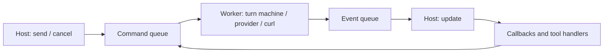

# Scry architecture

Scry is a static C++ library for applications that own their main loop. It sends
requests to an LLM server, streams text, and executes tools. It sends the tool
results back to the server, and it commits the conversation history when a turn
succeeds. The host calls `Harness::update()` to run tools and to deliver
callbacks on the host thread.

The public headers under `include/scry/` define the API. For a complete program,
see [README.md](../README.md). For build and test instructions, see
[contributing.md](contributing.md).

## Public API

| Type | Responsibility |
|---|---|
| `Config` | Provider endpoint, credentials, model, sampling, retries, timeouts, and resource limits |
| `Conversation` | System prompt and committed message history |
| `ToolRegistry` | Standalone additive registry of reflected and dynamic tools. A Harness takes ownership of it at `create()` |
| `Turn` | Handle to an accepted exchange: identity, completion query, cancellation, and callback disconnection |
| `ResponseFormat` | Response tool and answer validator that make a turn end with a [structured answer](#typed-completions) |
| `Harness` | Configured runtime, worker thread, registry, and callback pump |

`Harness::validate(config)` runs the configuration checks that `create()` uses.
It does not initialize libcurl, and it does not start a worker. A successful
validation does not guarantee that the runtime initialization succeeds.
Operations that can fail return `Result<T>` (`std::expected<T, Error>`) or
`Status` (`Result<void>`).

`send()` validates admission and returns without a wait for network I/O. It
rejects these inputs:

- Empty user text, with `invalid_argument`.
- An inactive handle, with `invalid_state`.
- A busy Conversation, with `busy`.
- A request that exceeds an admission limit or the Conversation payload limit,
  with `resource_limit`.

Each Conversation has a maximum of one queued or active turn. Different
Conversations can queue turns on the same Harness.

Scry does not load model weights, and it does not own the main loop of the
application. Its public extension points are configuration and tool callables.
The provider and transport interfaces are internal.

## Threading and lifetime

Use a Harness, its registry, its Turns, and their Conversations from one host
thread. The public handles do not synchronize concurrent access by the
application. A registry that no Harness owns yet is a plain move-only value on
the thread that built it. `Harness::create()` adopts the registry and makes the
source inactive.

All callbacks, tool handlers, and answer validators run inside `update()` on
the thread that calls `update()`. Thus they can directly access host state that
this thread owns.

One worker per Harness owns the network transfers, the provider decoding, and
the turn machine. The worker processes accepted turns in FIFO order, with one
active turn at a time. Later turns wait while the active turn retries or waits
for tool results. Each Harness instance has its own worker and its own runtime
state.

```mermaid
flowchart LR
    App["Host: send / cancel"] --> Commands["Command queue"]
    Commands --> Worker["Worker: turn machine / provider / curl"]
    Worker --> Events["Event queue"]
    Events --> Pump["Host: update"]
    Pump --> Callbacks["Callbacks and tool handlers"]
    Callbacks --> Commands
```

The command queue and the event queue use mutexes. Per-turn cancellation uses an
atomic flag. Harness shutdown uses the stop token of the worker. Accepted
requests share immutable snapshots of the history and of the schemas. If a
snapshot still holds the history, Scry copies the history before it changes it.
Callbacks, tool handlers, and the mutable Conversation state stay on the host
side.

`update()` ingests worker events, processes terminal state, and delivers pending
callbacks and tool calls. Its time budget is soft. `update()` checks the budget
between events and callbacks, and it cannot interrupt a handler. When work is
available, it ingests at least one event before it checks the time. It also
delivers at least one pending callback or tool call if `max_callbacks` allows
it. One tool dispatch counts as one unit against that limit, and this unit
includes the optional `on_tool_call` observer.

`max_callbacks = 0` prevents dispatch and callback delivery. But terminal events
can still commit history and clear the busy state. Route cleanup runs on every
update. When the budget runs out, `update()` defers only the release of
discarded events.

The event queue coalesces adjacent text events from the worker, and the pump
combines the pending text for each turn. The byte count of the queue includes
the events that the pump keeps until it delivers or discards them. Coalescence
decreases the callback traffic. The configured payload limits supply the byte
bound.

Callbacks can call `send()`, `cancel()`, and `disconnect()`, and they can
register tools. A reentrant `update()` does no work and returns
`budget_exhausted = true`. If an observer callback throws an exception, the
exception propagates out of `update()` after that event counts as delivered. The
Harness stays valid. Scry catches tool-handler exceptions and converts them into
tool-error results.

`send_and_wait()` runs `send()` and then pumps `update()` until the requested
turn finishes. `ask<Answer>()` does the same for a typed turn. These functions
also run callbacks and handlers for other accepted turns. `send_and_wait()`
does not expose the Turn handle of the turn that it waits for. If a callback or
a handler calls `send_and_wait()`, it returns `invalid_state`. If `update()`
throws while `send_and_wait()` pumps it, the exception propagates out of
`send_and_wait()`, and `send_and_wait()` disconnects the waited turn. That turn
continues to run and still commits its history.

| Operation | Effect |
|---|---|
| Drop a `Turn` | Work and callbacks continue. Destruction does not wait |
| `Turn::cancel()` or `Harness::cancel(id)` | Request cooperative cancellation. The terminal callback stays attached |
| `Turn::disconnect()` or `Harness::disconnect(id)` | Clear callbacks. Tool processing and history processing continue |
| Destroy a `Harness` | Request worker shutdown, join the worker, clear the busy state, and discard undelivered callbacks |

If a cancellation occurs before a queued turn starts, the turn sends no network
request. Scry cannot interrupt a tool that runs. If Scry sees the cancellation
after the tool returns, Scry suppresses the result of that tool and the other
calls that remain. Cancellation does not reverse a terminal outcome that the
worker already produced.

A disconnect inside a callback applies to the subsequent deliveries. The
callback that executes stays alive until it returns or throws. If a tool handler
disconnects, Scry also suppresses the `on_tool_call` observer for the call of
that handler. A disconnect does not cancel tools. The host must continue to pump
until the turn finishes.

`Turn::finished()` becomes true after the delivery of the terminal callback. If
no terminal callback is attached, it becomes true after terminal processing.
When a turn is finished, the runtime releases its callbacks and its tool
snapshot, even if the host still keeps a handle. The handle then reports only
identity and status. Moved-from handles and handles whose Harness no longer
exists also report true. A drop of a Conversation handle does not cancel an
accepted turn, because the runtime keeps the state of the Conversation.

Harness destruction waits for the worker. The transport checks for shutdown
between curl operations. It uses `timeouts.shutdown` to limit each curl poll
wait. This setting is not a timed join, and it is not a hard wall-clock deadline
for the destructor.

## Turn processing and retries

The turn machine in `src/machine/` does no I/O and does not read a clock. It
consumes explicit events and emits commands that the worker executes. Its states
are queued, awaiting model, streaming, retry wait, awaiting tool, and terminal.
If a transition is not valid, the machine returns diagnostics. It does not
change state, and it does not issue work. Tests inject time and event sequences
directly.

A successful model response completes the turn or starts a tool round. In a
[typed turn](#typed-completions), the model completes the turn when it calls
the response tool. The round that holds that call ends the turn when the host
accepts the answer. Scry admits the calls from one response to the event queue as one batch. If the full
batch cannot fit, no handler in that batch runs. The pump dispatches the calls
in provider order. For each call, it posts the result to the worker and invokes
the optional `on_tool_call` observer. The worker sends the request again when
all the results are ready.

A fatal failure of dispatch or of the payload budget suppresses the later
handlers in the batch.

Tool-call IDs must be unique in a turn. Scry rejects reused IDs and does not
execute them again. `Config::max_tool_rounds` sets the limit of the loop.
`Config::tool_round_limit` sets what occurs when a response asks for one round
more than that limit. Under `ToolRoundLimitPolicy::fail`, which is the default,
the turn fails with `max_tool_rounds` and commits nothing. Under
`ToolRoundLimitPolicy::complete`, the turn stops but does not fail:

- Scry commits the rounds that ran and the text of the final response.
- Scry removes the tool-call blocks of that response and puts them in
  `Completion::unexecuted_tool_calls`.
- The finish reason is `tool_round_limit`.

If the response has no text after this removal, Scry commits no assistant
message. Thus the transcript ends with the tool results of the previous round.

Scry automatically retries network failures and rate-limit failures that are
retryable, including HTTP 5xx responses. It does this only before it consumes
semantic output. Text or tool-call content disables the retry, even if no text
callback ran. After partial output, a failure ends the turn. The `retryable`
flag of the failure still shows if a new request can succeed. Scry does not
retry authentication failures or protocol failures.

Backoff is exponential with jitter, and each Harness seeds its jitter
independently. A valid `Retry-After` can increase the delay, but `max_backoff`
limits the final delay. The retry limits for attempts and for elapsed time reset
for each model request in the tool loop. The elapsed-time limit controls retry
eligibility and wake times, but it does not stop an active transfer.
`Completion::attempt_count` is the total of the attempts across the turn, and
`usage` accumulates the usage from completed model responses.

## Tools and JSON

The host declares tools in C++, and Scry registers them by reflection.
`ToolRegistry::add()` takes one of these:

- A toolbox object.
- An annotated function, or a namespace of annotated functions.
- An argument aggregate with a callable.

From the declaration, `add()` generates the argument schema of each tool, its
strict argument decoder, and its result encoder.
[Dynamic tools](#dynamic-tools) are for tools that exist only at runtime. The
host registers them with `add_dynamic()`.

A registry is a standalone value. A host builds a registry, and
`Harness::create(config, std::move(tools))` adopts it. `Harness::tools()` keeps
the registry open for later registrations.

A registry is additive. Scry rejects duplicate names, and there is no operation
that replaces or removes a tool. Each registration call is atomic. A call that
registers many tools, such as a toolbox or a namespace, first validates all of
them:

- Each name must not be empty. It must be different from the other names in the
  call and from each tool that is already registered.
- Each schema must be a JSON object.
- Each handler must not be empty.

Only after these checks does the call insert the tools. Thus a failed call
leaves the registry exactly as it was. This is also true when the failure is an
allocation failure.

Each accepted turn keeps the registrations that were visible at `send()`. Scry
uses the same immutable snapshots of the registrations and the schemas again
until the host adds another tool. Handlers stay on the host thread.

Each tool handler, reflected or dynamic, has two possible shapes. One shape
receives only its arguments. The other shape also receives a `ToolCallContext`
that identifies the call that the handler services. The context has these
fields:

- The `TurnId`.
- The `call_id` that the provider assigned.
- The registered `tool_name`.
- The one-based `round`.
- The zero-based `index` in the batch of that round.

These values are the same values that the later `on_tool_call` observation
carries. Thus a handler can correlate its work with the turn, and it does not
have to count calls. The context is borrowed. Its two string views point into
the call block that Scry dispatches, and they are valid only until the handler
returns. If a handler keeps one of them after it returns, the handler must copy
the text. Internally, a registration stores one handler shape. Thus each
registration form exports the same kind of tool contract, and the model sees no
difference.

Before a handler runs, a call goes through two admission gates in a fixed order:

1. `Config::max_tool_calls_per_turn`. This limit applies to the calls that one
   turn can dispatch across all rounds. `max_tool_rounds` alone cannot do this,
   because one response can request many calls.
2. `TurnCallbacks::on_tool_request`, which is the policy of the host. It
   receives a `ToolRequest` that identifies the call and its canonical
   arguments. It returns nothing to admit the call, or a `ToolRejection` to
   refuse it.

Each call that gets to the route counts against the limit. This includes a call
to a tool that nobody registered, because the model used the budget of the turn
when it asked. Dispatch refuses an unknown tool with its own message. An unknown
tool never gets to the hook, because there is no handler for the host to admit.
A refused call runs no handler, so it cannot have a side effect.

The model gets `{"error": message}`, flagged as a tool error. The message is one
of these:

- For the limit, the fixed text `tool call limit for this turn reached; respond
  without calling tools`.
- For a hook refusal, the `model_message` of the host.

A typed turn still requires a tool call, and it ends only on its response tool.
Thus, in a typed turn, the text for the limit is different. It tells the model
to call the response tool, by its name, alone, with the final answer.

That result gets to `on_tool_call` with `is_error`. Scry posts it to the worker
like any other result, so the turn continues and commits normally. If the hook
throws, Scry handles it exactly like a handler that throws. Scry refuses the
call with the same fixed text as for a handler that throws, and the turn
continues. The hook runs under the same
invocation guard as all other callbacks. Thus a `disconnect()` from inside the
hook is deferred until the call returns, and it suppresses the `on_tool_call`
observation of that call.

If a hook cancels the turn, Scry obeys the cancellation before the handler runs.
This is true if the hook admits the call and if it refuses the call. Scry reads
the cancel flag again immediately when the hook returns. If the flag is set, no
handler runs, Scry posts no result, and no `on_tool_call` fires. The turn then
ends through the ordinary cancellation path of the worker. A handler that runs
at this point is the one thing that the rollback cannot repair for the host. The
reason is that the effects of a handler on host state stay after the turn
discards its transcript.

This check does not change the counts. The call still used one unit of the
per-turn limit. But a call that cancellation suppressed is not a refusal, and
Scry does not count it as one.

Tool side effects are not transactional. If a turn fails or is cancelled, the
Conversation history does not change, even if a handler already changed host
state. The host owns rollback, idempotency, and reconciliation for such effects.
For this reason, a cancel from inside a handler is rarely what a host wants. The
cancel discards the pending transcript, so Scry discards the results of the
executed tools and the full turn rolls back. But the side effects that those
handlers already had on host state stay.

If a host wants the turn to finish but wants no more tools to run, it sets its
own flag. It can set this flag from the handler or from `on_tool_call`. Then it
refuses every later request from `on_tool_request`. The model gets the reason,
the turn completes, and the history commits.

`ToolRegistry::to_json()` exports a version-1 JSON manifest. The manifest has a
`tools` array in registration order. Each entry has the registered `name`,
`description`, and `input_schema` object, and the schema includes reflected
parameter annotations. This manifest is the provider-neutral tool contract.
Provider adapters apply their own wire envelopes.

The export includes reflected tools and dynamic tools. It invokes no
handlers and makes no provider request. It reads the current registry, not the
frozen snapshot of an active turn. It returns owned text that later
registrations do not change. If the text must go to a file, the host writes it.
If the export must run as a build step, the host runs it.

The export includes only the tools that the host registers on that execution
path. The export does not need a Harness. A registry that the host builds alone
exports the same document without provider configuration, libcurl, or a worker.
The manifest version is independent of the library version. Incompatible
changes to its structure or to the meaning of its fields increment the version.
Additive fields keep the version. We recommend that consumers ignore unknown
fields.

### Reflected tools

A host declares a reflected tool in one of three forms. Each form lowers to the
same registry entry, which has these parts:

- A name.
- A description.
- A schema that the [reflected codec](#reflected-codec) generates.
- A handler. The handler strictly decodes the arguments, calls the C++ code,
  and encodes the return value.

One compile-time model of the argument types and the result types drives the
schema, the decoder, and the encoder. Thus these three cannot disagree.
`examples/toolbox.cpp` shows each form.

- **A toolbox.** `ToolRegistry::add(std::shared_ptr<T>)` registers each member
  function of `T` that has the `scry::reflection::tool` annotation. Each tool is
  bound to that one object. `add(T&&)` first moves the object into the registry
  and then does the same. Thus the registry owns the only copy.
- **Annotated functions.** `add<^^forecast>()` registers one annotated function.
  `add<^^npc_tools>()` registers each annotated function that the namespace
  `npc_tools` declares directly, in declaration order. It does not search nested
  namespaces. A static member function registers as a free function does. A
  non-static member function needs an object, so register it through its class
  as a toolbox.
- **An argument aggregate and a callable.** `add<Args>(ToolMetadata, handler)`
  registers any callable that takes `Args`. This form is good for a lambda that
  captures host state. `ToolMetadata` supplies the name and the description.

Registration reads only the declarations that come before the call in its own
translation unit. Thus, declare the tools of a namespace before you register the
namespace. Each unit registers what it sees:

- The tools of the namespace up to that point.
- The annotations and the parameter names that the declarations of a function
  give up to that point. An out-of-class definition of a toolbox member can add
  to them.

These facts are a defaulted template argument of each reflected `add()`
overload. Thus units that see different declarations instantiate different
specializations, and the linker cannot merge them.

An annotated function has the name of its identifier. A
`scry::reflection::name{"..."}` annotation on the function replaces this name.
The description is the text of the `tool` annotation, and this text must not be
empty. These are errors:

- A `description` annotation on a function, because the `tool` text is already
  the description.
- More than one `tool` or `name` annotation.
- A `tool` annotation on a variable, a data member, or a class. `tool` applies
  only to functions.
- A toolbox class or namespace that declares no tool function.

Tool names in one toolbox or namespace must be different from each other. Scry
checks this at compile time. Scry checks the names against the registry at
registration.

The tools of a toolbox are the member functions that its class declares itself.
Scry does not include inherited member functions. Each tool must be public, not
deleted, and not `&&`-qualified. A toolbox that is registered as
`std::shared_ptr<const T>` admits only `const` member functions. A function
template cannot be a tool. GCC 16 cannot read annotations on a template. Thus
Scry does not see an annotated function template in a namespace or a class.

A tool member function can take a C++23 explicit object parameter, such as
`int read(this const Box& self)`. The registry calls the function on the toolbox
that it holds. This toolbox is an lvalue, and it is `const` when the toolbox is
`const`. Thus that parameter is never an argument. The lvalue initializes the
parameter as it initializes any argument:

- `const T&` always binds.
- `T&` binds a non-const toolbox, and it refers to the object that the host
  shares.
- A by-value `T` copies the toolbox for each call. Thus `T` must be
  copy-constructible from that lvalue.
- A base-class reference or another type binds when the lvalue converts to it.
- An rvalue reference never binds.

Any other form is a compile error. `this auto&& self` makes the function a
template, and Scry does not see a template.

After an optional explicit object parameter and an optional
`const ToolCallContext&`, the parameters of a tool function have one of three
forms:

- **None.** The tool takes no arguments. Its schema is the empty closed object,
  `{"additionalProperties":false,"properties":{},"required":[],"type":"object"}`,
  and decoding accepts only `{}`.
- **One aggregate.** Exactly one parameter remains. Without references and
  cv-qualifiers, its type is a plain aggregate class. This type must not be
  `std::string`, `std::optional`, or another standard type. Then that class is
  the argument object, exactly as for `add<Args>()`.
- **Anything else.** Scry synthesizes the argument object with
  `std::meta::define_aggregate`. The object has one required member for each
  parameter. Each member has the name of its parameter and the type of that
  parameter without references and cv-qualifiers. It has no description. Scry
  ignores default arguments. GCC 16 cannot read annotations on function
  parameters. Thus, if the parameters of a tool need descriptions, defaults, or
  optional members, use an argument aggregate. Each parameter must have a name
  in some declaration of the function, and its type must be a `SupportedValue`.
  If a single aggregate is to be one member of the argument object, put it in a
  wrapper aggregate or add a second parameter.

Scry moves the decoded arguments into the call. Thus each parameter takes a
value, a `const` reference, or an rvalue reference. These are compile errors:

- A non-const lvalue reference.
- A `volatile` parameter.
- A `ToolCallContext` that is not the first parameter. If there is an explicit
  object parameter, the context must come immediately after it.

Scry also invokes an `add<Args>()` handler with moved arguments, and this
handler can take a leading `const ToolCallContext&`. `ToolHandlerFor` accepts
either arity, and it prefers the contextual form. If the context is the last
parameter of a handler, the handler does not compile.

Handlers and tool functions return a supported value, a `Result` of one, `void`,
or `Status`. Scry encodes a value as the tool result. `void` and a successful
`Status` both send `{}`, because a tool that acts for its side effects has
nothing to report other than success. A failed `Status` or `Result` is a handler
error, as any other handler error is. Scry encodes the returned object without
an additional copy or move. This is also true for aggregates whose
user-declared destructor suppresses an implicit move constructor. Raw `Json`,
references, futures, and awaitables are not reflected result types.
`reflection::encode(value)` uses the same value encoder, and it does not require
registration.

Handlers run synchronously on the host thread, inside `Harness::update()`. Thus
the state of a toolbox needs no locking. Each registration from a toolbox holds
a copy of its `std::shared_ptr`. Thus the toolbox stays alive while the registry
stays alive, or while a turn that has a snapshot of the registry stays alive.
Scry releases the toolbox on the host thread. The registry never borrows an
object. An lvalue passed to `add(T&&)` is a compile error. Instead, a host can
pass a `std::shared_ptr` with a no-op deleter and own the lifetime.

Parameter descriptions come from P3394 `scry::reflection::description`
annotations on members. If one member has more than one such annotation, the
compilation fails. `scry::reflection::description_of<View>()` builds the same
annotation from a `std::string_view` with static storage duration. Thus a host
can keep its parameter text in one catalog.

`scry::reflection::schema_v<Value>` is the same generator for any
`SupportedValue`, including handler result types. Scry sends only
`input_schema_v<Args>` to a provider. Thus a result schema is only for the
contract export of the host.

Argument objects and nested objects must be plain aggregates that are complete,
default-constructible, move-constructible, and move-assignable. They must not
have bases, union layout, reference members, bit fields, unnamed or non-public
members, or `const`/`volatile` members. An aggregate must not be reachable from
its own members.

These member values and result values are supported:

- `bool`; non-character signed and unsigned integers up to 64 bits; finite
  `float` and `double`; `std::string`.
- Nonempty scoped enums with unique underlying values. The JSON value is the
  exact enumerator name.
- `std::optional<T>` with a supported non-optional element.
- `std::vector<T, Allocator>` except `vector<bool, Allocator>`; `std::array<T, N>`;
  and recursively supported aggregates. Containers must support default
  construction, move construction, and move assignment.
- `std::variant<A, B, ...>` whose alternatives are supported aggregates. Each
  alternative has a different `scry::reflection::tag`. Scry does not support an
  untagged variant, or a variant with an alternative that is not an aggregate.

Only a default member initializer, or `skip_null` on a `std::optional<T>`
member, allows omission. Only `std::optional<T>` allows JSON `null`. Thus
`std::optional<int> value;` is required and nullable, and `int value = 1;` is
omittable and non-null. If a field is omitted, the member keeps the value of its
C++ initializer. But an omitted `skip_null` member decodes as disengaged.

The schemas that Scry generates use closed inline objects, numeric range bounds,
exact array lengths, and a provider-neutral subset of JSON Schema. They use
these keywords: `additionalProperties`, `anyOf`, `description`, `enum`, `items`,
`maxItems`, `minItems`, `minimum`, `maximum`, `properties`, `required`, and
`type`. Object keys and required names are sorted by their final JSON key. Enum
values and variant alternatives keep the declaration order.

A tagged variant is an `anyOf` of the object schemas of its alternatives. Each
of these schemas has a required `type` property, and the `enum` of this property
holds the tag of that alternative. An optional variant adds `{"type":"null"}` to
the same `anyOf`. Schemas do not include `$schema`, references, definitions,
`title`, or `default`.

The decoder recursively rejects these errors:

- Unknown or missing fields.
- Incorrect JSON kinds.
- A `null` where `null` is not allowed.
- Numbers that are out of range or not finite.
- Unknown enum names.
- Missing or unknown variant tags.
- Incorrect fixed-array lengths.

Only a number that has digits alone is an integer. Thus `1.0` and `1e2` do not
decode into an integer member. `-0` also does not decode into an integer member,
because it is the double -0.0. The canonical parse merges duplicate object keys
into one key before dispatch, and the last occurrence wins. Thus handlers do not
see the original lexical duplicates.

If the decode fails, Scry fills `Error::model_message` with the host `message`
without its `reflected JSON at ` prefix. This text gives the JSON path of the
incorrect value and what the schema required at that path. If an enum value is
not known, the text also gives the declared enumerator names. If the `type` of a
variant is missing or not known, the text gives the declared tags. If the
argument text is not JSON at all, the text is `tool arguments are not valid
JSON`. Each word of this text comes from the schema that the model already has.
Thus the model can correct itself, and it learns nothing new.

A failure of the result encoding fills no `model_message`. Such a failure
describes the result type of the handler, and the model never sees the schema of
that type. Thus the model receives the fixed diagnostic.

If a declaration or a type breaks a rule above, it fails to compile at `add`,
`schema_v`, or `input_schema_v`. A `static_assert` gives the function, the member
path, or the namespace, and the reason. An example is `ForecastArgs does not
satisfy scry::reflection::ToolArguments: ForecastArgs::window.when:
std::chrono::duration<long int> is not a supported reflected value`. These entry
points have no constraints, so the compiler prints this text. The concepts
`SupportedValue`, `ToolArguments`, `ToolHandlerFor`, and `Toolbox` are the
SFINAE-friendly form of the same checks.

### Reflected codec

The reflection layer is the serialization engine of Scry. Reflected tools are
its first consumer. Their schemas, argument decoding, and result encoding are
this codec applied to the argument types and the result types.

One compile-time model of a type drives schema generation, encoding, and
decoding. This model holds the shape of the type, its fields in canonical key
order, and its annotations. Thus the three cannot disagree about a key, an
omission, or a tag.

Three concepts name what the codec accepts:

- `SupportedValue` is the closed family of the previous section. Each value has
  a schema, encodes, and decodes.
- `Encodable` adds two leaves that only encode. `std::string_view` is written
  as a JSON string, for wire text that is borrowed from a different location.
  The validation scan that request encoding uses checks `scry::Json`, and the
  encoder splices it verbatim. Encoding only reads. Thus an `Encodable`
  aggregate does not have to be default-constructible or movable. It can have
  `const` members, or reference members through which it borrows a value that
  it writes.
- `Decodable` adds `scry::Json`. This leaf captures the canonical text of the
  value at its position, `null` included, as `JsonView::to_json()` writes it.
  `std::optional<scry::Json>` reads `null` as disengaged.

These leaves have no schema. Thus they cannot be in tool arguments, in handler
results, or in `schema_v`.

`reflection::encode(value)` accepts any `Encodable` value and returns canonical
JSON. The writer writes object keys in canonical order, and strings with the
escapes of the canonical writer. It writes numbers in the shortest spelling that
reads back as the same value of their own type. Thus a `float` 0.7 is written
`0.7`. The result then goes once through the canonical writer. This writer sets
the exponent spelling and makes spliced `Json` text canonical.

The encode fails with `tool` and the path of the value for these inputs:

- A number that is not finite.
- An enumerator value that is not declared.
- `Json` text that is not JSON.
- A variant that an exception made valueless.

`reflection::decode<T>(json)` and `decode<T>(view)` accept any `Decodable` `T`,
and they apply the decoding rules of the previous section. They report a failure
as `invalid_argument`. The failure has the same path-based `message` and
`model_message` as a tool-argument failure. Thus a host can give the failure of
a typed answer back to the model. If the text is not JSON, the failure is
`reflected JSON text is not valid JSON`. The tool path keeps
`ErrorCategory::tool`. A type outside the family fails to compile, and the
diagnostic gives the member path and the reason. `Encodable` and `Decodable` are
the SFINAE-friendly checks.

`<scry/annotations.hpp>` declares the annotations. A compiler without reflection
can include this header, because its types are plain structural types. Only the
`[[= ...]]` syntax requires C++26. Put a class annotation between the class-key
and the class name, as in `struct [[= scry::reflection::tag{"text"}]]
TextBlock { ... };`. If one entity has many annotations, each annotation takes
its own `=`. Put them in one bracket, `[[= a, = b]]`, or in separate brackets.

| Annotation | Applies to | Effect |
|---|---|---|
| `description{"..."}` | Data member | The `description` of the member schema |
| `name{"key"}` | Data member, or tool function | Replaces the JSON key of the member in encoding, decoding, schemas, and failure paths. On a tool function, replaces the tool name |
| `tool{"..."}` | Function or member function | Declares a [reflected tool](#reflected-tools) and supplies its description |
| `tag{"value"}` | Class | The `type` value of the class as a variant alternative. No effect in other positions |
| `skip_null` | Class, or a `std::optional` member | Omits a disengaged optional. Its absence decodes as disengaged |
| `emit_null` | `std::optional` member | Restores `null` output for one member of a `skip_null` class |
| `ignore_unknown` | Class | Decoding ignores members that the class does not declare |

The codec writes objects in the lexical byte order of their final keys. The
object of a variant alternative carries `"type":"<tag>"` at its sorted position.
Decoding reads `type` first and dispatches on it, and the tag is not an unknown
member of the alternative. A tagged class outside a variant does not write or
accept `type`.

The `required` list of the schema does not include a `skip_null` member. The
absence of that member overrides its initializer. Thus each encoded value
decodes to itself. `ignore_unknown` relaxes only the class that it annotates.
The values of its members and any enclosing class stay strict. Its schema stays
closed, because a schema tells a producer what to send.

Each of these fails to compile with a diagnostic that names the class or the
member:

- Two members of one class with the same final key.
- A variant alternative that is not an aggregate, has no tag, shares its tag,
  or has a member whose final key is `type`.
- `skip_null` or `emit_null` on a member that is not a `std::optional`, or both
  on one member.
- More than one `name`, `description`, or `tag` on one entity.
- `tag` or `ignore_unknown` on a data member, or `name` or `emit_null` on a
  class.
- `tool` on a data member or a class. The tool registration checks also report
  `tool` on any other entity that is not a function.

The public message model is also reflected. `TextBlock`, `ToolCallBlock`, and
`ToolResultBlock` carry the tags `text`, `tool_call`, and `tool_result`. Thus
`ContentBlock` is a tagged variant. A host can give a `Message`, or a vector of
them, to `reflection::encode()` and `decode()`. The encoding is the shape of
each message in the `Conversation::to_json()` document.

Each member of the model has an initializer. Thus `decode()` reads an absent
member as its initial value, but `Conversation::from_json()` requires each
member. The blocks carry annotations. Thus an include of `<scry/message.hpp>`
needs a C++26 compiler, as the rest of the public API does.

### Dynamic tools

`ToolRegistry::add_dynamic(ToolDefinition, ToolHandler)` registers a tool. It
takes a JSON schema object that the host writes and a move-only
`Json -> Result<Json>` callable. `add_dynamic(ToolDefinition, ContextualToolHandler)` accepts a
move-only `(const ToolCallContext&, Json) -> Result<Json>` callable. Use them
for tools that exist only at runtime, where there is no C++ declaration to
reflect. Examples are tools from a scripting language, another process, or a
plugin manifest. Register a tool that has a C++ declaration with `add()`. Then
Scry generates its schema and its argument checks, and they cannot become
different.

The arity of the handler selects the overload. Thus a lambda of either shape
selects one of the overloads without a cast. Registration validates the schema
as a JSON object and makes it canonical. Scry does not implement general JSON
Schema validation.

Registration rejects an empty handler of either shape. The handler receives
canonical object arguments, and it owns the validation against its schema. Scry
checks only that the arguments parse and form an object. Scry does not check
that they match the schema that the model received. If a handler rejects the
arguments with `scry::tool_error()`, the model gets the reason. The turn
continues, so the model can correct the call.

`on_tool_request` can do the same check before any handler runs. A handler must
synchronously return valid JSON or an error. Scry does not support asynchronous
or deferred tool results.

### Tool errors

Unknown tools, reflected decode failures, handler errors, exceptions, and
invalid result JSON produce bounded error results that the model can see. Scry
forwards the `model_message` of a handler error inside `{"error": ...}`, subject
to the byte cap for results. Scry does not forward its `message` or any
exception text. `scry::tool_error(model_message, host_message)` builds such an
error. If `model_message` is empty, Scry keeps its fixed diagnostic,
`tool handler returned an error`. If any error text, a `model_message`
included, is too large for the cap, Scry replaces it with the generic
`tool execution failed`.

Reflected decode failures and unknown-tool errors carry `model_message` text
that comes from the schema. For an unknown tool, this text gives the requested
tool name and the registered tool names. The tool list of the request already
carried these names. Scry does not redact `model_message`. Thus, if a host puts
a secret in a `model_message`, the host publishes that secret. If a result is
too large, or if an error result cannot fit its bound, the turn fails with
`resource_limit`.

`on_tool_call` observes the canonical result and its `is_error` flag after Scry
posts the result to the worker. It does not confirm that the server received the
result. Cancellation or a fatal framework failure can suppress this observer.

`Json` owns serialized text. `JsonView::parse()` creates a shared immutable
parsed document. This document has scalar accessors, `find()`, `at()`, and
ordered `key_at()` lookup. Child views can outlive their parent. `to_json()`
writes the canonical text of only the viewed value. Invalid input returns
`invalid_argument`.

`escape_json_string()` makes a quoted JSON string for results that the host
builds by hand. It uses exactly the escapes of the canonical writer:

- `\"` and `\\`.
- The short escapes `\b \f \n \r \t`.
- `\u00XX` with uppercase hexadecimal digits for each other byte below 0x20.

All other bytes, `/` and non-ASCII included, go through with no change.

The code of Scry parses and writes JSON. This code is the JSON layer of the
kernel, under `src/kernel/json/`. Scry links no JSON library and exposes none.
The rest of `src/` reads parsed JSON through `JsonView`, and it maps its own
data shapes with the reflected codec. `src/kernel/json/document.hpp` gives the
full contract:

- **Accepted text** is RFC 8259 JSON that holds exactly one value. Only space,
  tab, line feed, and carriage return can surround this value. The parser
  rejects empty or whitespace-only input, a byte order mark, comments, trailing
  commas, a second value, and trailing bytes, a NUL included. A validation pass
  that does no allocation accepts exactly what the parser accepts.
- **Nesting** has a limit of 256 arrays and objects that are open at the same
  time, and an empty one counts. The parser rejects deeper input. Thus the
  recursion has a limit.
- **Strings** must be strictly valid UTF-8 in keys and values. Overlong forms,
  encoded surrogates, values above U+10FFFF, and truncated sequences are not
  valid. Control characters must have an escape. A `\u` escape of a surrogate
  must be a high surrogate, and an escaped low surrogate must follow it
  immediately. The parser rejects a lone or reversed surrogate. `\u0000`
  decodes to a NUL byte.
- **Numbers** that are an optional `-` and digits alone are integers when they
  fit. A non-negative value in 64 bits is `unsigned_integer`, and a negative
  value is `signed_integer`. All other numbers are correctly rounded doubles.
  This includes a number with a fraction or an exponent (`1.0`, `1e2`). It also
  includes `-0`, which is not negative and keeps its sign as -0.0. The parser
  rejects a number whose magnitude rounds to infinity, and a nonzero number
  that rounds to zero.
- **Duplicate keys** collapse to the last occurrence, at all levels.
- **Canonical text** has no insignificant whitespace, and its object keys are
  in lexical byte order. It uses the string escapes above, and it writes
  integers in plain digits. It writes doubles in the shortest spelling that
  reads back as the same double. For a decimal exponent from -4 through 15,
  this spelling is positional (`0.0001`, `1`, `1500000000000000`). Otherwise
  it is scientific, with an uppercase `E`, no `+`, and no leading zeros in the
  exponent (`1E-5`, `1E20`). Zero is `0`, and negative zero is `-0`. Canonical
  text reads back as the same tree, and it writes back as itself.

Golden fixtures in `tests/fixtures/json/goldens.tar.xz` lock the acceptance
boundary and the canonical bytes.

## Typed completions

A turn can end with a structured answer instead of free text. The answer is a
C++ type. Reflection supplies three things: the schema that the model gets,
the strict decoder that checks the reply, and the error text for corrections.

`ask<Answer>(conversation, text)` blocks like `send_and_wait()`, and it returns
`Result<Answered<Answer>>`. This result holds the decoded `value` and the
`Completion` of the turn. The `Completion` carries what the value alone does
not: prose, usage, attempts, and counts.

`send<Answer>(conversation, text, callbacks)` is the form for a host that polls.
Its `Completion::structured` holds the canonical JSON of the answer for
`reflection::decode<Answer>()`. `Answer` must satisfy `ToolArguments`, because
the tool input of a provider is always a JSON object. Any other type fails to
compile, and the diagnostic gives the member path and the reason, as for
`add<Args>()`.

A typed turn is the ordinary tool loop plus one response tool. A
`ResponseFormat` describes the response tool with these fields:

- `name`, which is `respond` by default.
- `description`. If it is empty, Scry uses its own instruction: call the tool
  exactly once, alone, with the final answer.
- `schema`, which is a JSON Schema object.
- `validate`, which is optional and runs on the host thread.

`reflection::response_format<Answer>()` pairs `input_schema_v<Answer>` with a
`decode<Answer>()` validator. `send<Answer>()` and `ask<Answer>()` use it. For a
different name, a different description, or a schema that the host writes, use
`send_structured(conversation, text, format, callbacks)` or
`send_and_wait_structured(conversation, text, format)`. These functions have
different names for two reasons:

- `send(conversation, text, {})` continues to mean "no callbacks".
- The compiler never selects `send<Answer>()` without its explicit template
  argument.

Before acceptance, these functions reject a format with `invalid_argument` in
these conditions:

- Its name is empty.
- Its name is the name of a registered tool.
- Its schema is not a JSON object.

The request lists the response tool after the registered tools, and it requires
a tool call. For Anthropic, the request sends `"tool_choice":{"type":"any"}`.
For OpenAI-compatible servers, it sends `"tool_choice":"required"`. A request
without a response format is byte for byte the same as before Scry had typed
turns. The model can still call registered tools for the number of rounds that
`max_tool_rounds` allows.

Scry classifies each response of a typed turn by its tool calls:

- A response that calls no tool fails the turn with `protocol`. The error names
  the response tool. It also tells if the server ignored the tool choice or if
  the output got to its token limit.
- A lone response-tool call is a candidate answer. Scry validates it inside
  `update()` on the host thread, as one delivery unit. If the validator accepts
  the answer, the turn completes. If the validator rejects it, the model gets
  `{"error": model_message}` as the tool-error result of that call. The
  rejection uses one tool round. For a reflected type, the text comes from the
  schema of the decoder, such as `$.supported is a required member`.
- A response-tool call can be beside other calls, or there can be more than
  one. Then Scry refuses it with `call respond exactly once, on its own, after
  your other tool calls have returned`. The real calls dispatch as usual.

Only real calls make an ordinary round. A server that forces a tool call can
report a plain `stop`. Thus a typed turn accepts calls with a normal finish
reason as a tool response.

Scry handles a validator as it handles a tool handler. If the validator returns
an error without a `model_message`, or if it throws, the model gets the fixed
text of the handler. The turn then continues. Without a validator, Scry accepts
any JSON object. Scry does not implement general JSON Schema validation.

The validator runs under the invocation guard of the handler. If the validator
cancels the turn, Scry obeys the cancellation before any verdict gets to the
worker. A disconnect from the validator stops later deliveries, but it does not
stop the verdict.

If Scry accepts an answer, the turn completes with `finish_reason` `completed`.
`Completion::structured` holds the canonical arguments. `Completion::text`
holds only the prose beside the call, and this prose can be empty. The committed
transcript has these parts:

- The user message.
- Each round of real calls, with its results.
- A final assistant message. It has that prose, followed by one text block that
  holds the canonical JSON of the answer.

Scry commits no response-tool call. Scry also does not commit a rejected attempt
that the model saw in the turn. Scry removes those calls, their error results,
and any message that they leave empty. Real calls in the same rounds stay. There
are three reasons for this:

- Each committed call needs its result.
- A result for the accepted call ends the history on a user message.
- Later requests do not declare the response tool, and a provider can refuse a
  history that names an undeclared tool. These later requests include plain
  turns and Conversations restored from JSON.

When Scry removes a rejected round, two assistant messages can be adjacent. The
Anthropic adapter merges them, and the OpenAI-compatible dialect accepts them.
The OpenAI adapter joins the text blocks of a message without a separator.
`Conversation::to_json()` saves the answer as the text block that it is. A
restored Conversation encodes again for either dialect. Scry reserves the answer
against the Conversation byte limit, as for any reply. Scry never charges the
`structured` copy to the queued-event limit.

Response-tool calls are part of the Scry protocol. They are not host tool calls.
They never get to a handler, `max_tool_calls_per_turn`, `on_tool_request`, or
`on_tool_call`. They are not in `tool_call_count` and not in
`rejected_tool_call_count`. `Completion::answer_attempt_count` counts each of
them, the accepted one included.

The `ToolCall::index` of a real call keeps its position in provider order. Thus
a response-tool call beside it still uses an index. `tool_round_count` includes
rounds whose only call was a rejected answer. The response that carries the
accepted answer is the final response, not a round.

Scry validates a lone response-tool call even when all rounds are used, because
it can end the turn. At the round limit, any other response fails with
`max_tool_rounds`, and a rejected answer also fails. This is true under each
`ToolRoundLimitPolicy`, because there is no answer to complete with.
`Completion::unexecuted_tool_calls` is always empty for a typed turn.

In all other respects, a typed turn fails, cancels, retries, and persists as
any turn does:

- Retries apply before semantic output.
- A failed or cancelled turn commits nothing.
- `on_finished` is the single terminal channel.

`ask()` reports what `send_and_wait_structured()` reports. It can also report a
decode failure of an accepted answer, but the validator makes this failure
unreachable.

## Providers and transport

The public `Message` model has user and assistant roles with text blocks,
tool-call blocks, and tool-result blocks. Provider adapters translate this model
into HTTP requests and decode the streamed replies. The provider code is under
`src/provider/`. It has three parts: request encoding, stream decoding, and
content helpers. The decode state for each attempt is separate from the adapter.

Request encoding describes each body as reflected wire structs. It writes them
directly to JSON text with the reflected codec, and it does not build a document
tree. The structs borrow what they write. Text is a `std::string_view`, and
tool-call arguments and tool input schemas are `const Json&` members. One
validation scan, which does no allocation, checks each embedded payload. This
includes tool results, which go as JSON strings. Then the encoder uses the
payload as canonical text. The turn machine, tool dispatch, and registration
already made this canonical text.

Thus a retry or a tool round encodes again only the frame of the request. It
never builds the history again as a document tree. The encoder still rejects
malformed embedded text with `invalid_config`.

Scry does not make a body canonical after it writes it. Thus the body relies on
the codec, which writes keys in canonical order and strings with the canonical
escapes. The canonical writer spells `temperature` and `top_p` before the
encode. For small and large exponents, the shortest spelling of a double by the
codec is different from the canonical spelling (`1e-07` against `1E-7`).

Stream decoding parses each SSE `data` payload once. It decodes the payload
with the reflected codec into event types that ignore members that they do not
declare, because providers add fields. For Anthropic, the event type is a
tagged variant keyed on `type`. For OpenAI, it is one chunk type. If the codec
rejects a shape, the result is a `protocol` error that names the JSON path.

The protocol lifecycle stays hand-written: event order, block indices, finish
reasons, usage accumulation, and the argument byte limit. The reads of the
error token and the request identifier also stay hand-written, and they are
best-effort. Each value is independently optional. A value of the wrong type
reads as absent, and the event does not fail.

| Setting | Anthropic Messages | OpenAI-compatible Chat Completions |
|---|---|---|
| Endpoint | `/v1/messages` | `/v1/chat/completions` |
| Authentication | Required `x-api-key` | Optional bearer token |
| `temperature` | 0–1 | 0–2 |
| `top_p` | Greater than 0, at most 1 | 0–1 |
| `max_tokens` | Required, positive | Optional; positive when set |
| `seed` | Rejected during validation | Optional; sent when set |
| Disabled reasoning | Rejected during validation | Sends `reasoning_effort: "none"` |

Scry passes `SamplingConfig::seed` through, but it does not enforce it. Scry
sends the same value with every request, including retries and tool rounds, and
it does nothing more. The server decides if the same seed, model, prompt, and
sampling values repeat an output. The server treats this as best-effort. No seed
carries across models, servers, or server versions.

The Messages API has no seed. Thus the Anthropic dialect rejects a seed and does
not drop it. If the dialect dropped the seed, a host can think that its runs
used a seed.

For Anthropic, use an origin or the full `/v1/messages` endpoint. The OpenAI
adapter accepts an origin, a `/v1` base, or the full `/v1/chat/completions`
endpoint. Both adapters always request `stream: true`. The default reasoning
mode omits the reasoning controls.

An OpenAI-compatible server must implement the subset that Scry sends. This
subset includes the optional reasoning field when it is enabled. It also
includes `tool_choice: "required"` for a typed turn. Scry does not implement
Azure-specific endpoints, the Responses API, server-side structured output modes
such as `response_format`, or other server extensions.
[Typed completions](#typed-completions) use tool calling instead, which both
dialects have.

The Anthropic adapter merges consecutive messages with the same role into one
message. The content array of this message concatenates their blocks. The
adapter does this because the Messages API takes one message per role turn.
Also, a history that stopped at the tool-round limit can end with the user
message that carries the results of that round.

OpenAI requests encode system text and function tools. They emit a separate,
ordered `role: "tool"` message for each result. Thus a `user` message can follow
tool results directly, and no merge is necessary. The stream decoder accumulates
bounded tool-call fragments by index. At finish, it requires complete contiguous
calls. A finish reason followed by `[DONE]` completes the stream.

After the finish reason and before `[DONE]`, the stream can have a chunk that
has only usage. These
conditions are protocol errors: missing, duplicate, or early terminal markers,
and semantic content after finish. For Anthropic streams, Scry decodes Messages
content blocks, usage, stop reasons, and tool-use arguments.

The incremental SSE parser is in the kernel (`src/kernel/sse.cpp`). It handles
byte splits at any position. A CR, LF, or
CRLF ends a line immediately when it arrives. If a lone CR ends a blank line,
the parser dispatches the event and does not wait for the next byte. The parser
can ignore unknown optional events. Malformed required content fails with
`protocol`. Scry has no non-streaming response path and no public logging API.

The transport uses libcurl through an internal injectable interface. The
interface and its libcurl implementation are kernel code under
`src/kernel/transport/`. Each Harness keeps a curl multi handle and its connection cache across retries, tool
rounds, and turns. It runs one transfer at a time. Curl objects use RAII, and C
callbacks catch exceptions. Scry attempts the process-wide curl initialization
once and caches its result. At startup, Scry requires libcurl 7.84 or newer with
thread-safe global initialization and asynchronous DNS.

TLS peer verification and hostname verification are enabled by default.
`ca_bundle_path` selects a CA bundle, and `proxy` selects a proxy. Empty values
keep the curl defaults for the trust store and the proxy, including proxy
environment variables. Scry validates extra header names and values, and it
rejects collisions with headers that Scry manages. `Harness::validate()` checks
configuration values. It does not check if the server is reachable or if the
server accepts the credentials.

The SSE decoder does not receive non-2xx bodies. Scry keeps a maximum of 8 KiB
of such a body. From this text, Scry extracts a sanitized `error.type` or
`error.code` token into `provider_detail`, with the dialect name as a prefix.
Scry does not show the message of the provider or the raw body. When they are
available, HTTP errors carry their status and the sanitized request identifier.
Scry uses fixed diagnostics, and it removes matches of the configured API key
from the worker error fields and the request-ID fields.

## Resource limits and timeouts

`include/scry/config.hpp` defines the defaults:

| Setting | Default |
|---|---:|
| Pending turns per Harness | 64 |
| SSE event bytes | 256 KiB |
| Response bytes per transfer | 8 MiB |
| Tool argument bytes per call | 1 MiB |
| Tool result bytes per call | 4 MiB |
| Queued event payload per turn | 2 MiB |
| Conversation payload | 16 MiB |
| Tool rounds | 8 |
| Tool calls per turn | Unset |
| Maximum output tokens | 1024 |
| Retry attempts / elapsed window per model request | 3 / 30 s |
| Initial / maximum retry backoff | 250 ms / 10 s |
| Retry jitter ratio | 0.2 |
| Connect / idle / shutdown | 10 s / 120 s / 2 s |
| Total transfer timeout | Unset |

Resource limits must be positive. The queued-event limit must be at least 1024
bytes. `max_tool_calls_per_turn` is optional. If it is unset, the number of
calls is unlimited. Scry rejects a value of zero with `invalid_config`. An
admission failure rejects `send()` immediately. If an accepted turn exceeds its
limit, the turn fails with `resource_limit`.

The Conversation accounting includes the system prompt, text, tool identifiers
and names, tool-result error flags, and serialized arguments and results. It
includes these items across the history and the pending exchange. It excludes
JSON envelope syntax and allocator overhead, so it is not the size of
`to_json()`. The pump and the machine reserve exchange payloads before resend
and commit.

When the machine reserves a completion payload, Scry charges it to the
Conversation budget, never to the queued-event limit. Thus a completion that
fits the Conversation limit is always deliverable. The queued-event limit
applies to the text deltas, tool-call batches, and error diagnostics that wait
for delivery. `from_json()` has no Harness configuration and does not apply
these byte limits. These limits apply when the host sends the restored
Conversation through a Harness.

`connect` limits the connection establishment, including name resolution.
`idle` uses the curl low-speed check at one byte per second, and Scry rounds the
duration up to whole seconds. `idle` finds long silence, including before the
first byte. But it uses a rolling average, and it can report a stall later than
the configured interval. It is not an exact timer between chunks.

The optional `transfer` setting sets a hard duration limit on one HTTP transfer.
Timeout failures are retryable network errors, subject to the retry eligibility
of the turn. `shutdown` limits curl poll waits.

## Completion, errors, and history

Before acceptance, errors return directly. After acceptance, `on_finished` is
the single channel for the terminal result: completion, failure, or cancellation.
The host must continue to call `update()`. Scry delivers a callback once, unless
the host disconnects it or Harness destruction discards it. Allocation failures
are outside the semantic failure-as-value contract.

| Error category | Meaning |
|---|---|
| `invalid_config` | Configuration or serialized document is not valid |
| `invalid_state` | Operation is not valid for the current object state |
| `invalid_argument` | Caller argument is not valid, including a duplicate tool name |
| `busy` | Conversation already has an accepted turn |
| `authentication` | Provider authentication failure |
| `rate_limit` | Provider rate limit |
| `network` | Network or transport failure, including HTTP 5xx |
| `protocol` | Provider output is not valid |
| `resource_limit` | Admission bound or payload bound exceeded |
| `tool` | Tool arguments, dispatch, or encoding are not valid |
| `max_tool_rounds` | Tool-round limit exceeded |
| `cancelled` | Cooperative cancellation |

If terminal processing in `update()` succeeds, it commits the user message, the
tool rounds, and the final assistant response together. This commit occurs
before the delivery of the terminal callback. These messages arrive as one
transcript. The machine keeps a single message list, sends it again in each
round, and gives that same list to the pump. Failure or cancellation commits
nothing.

`Completion::finish_reason` is `completed`, `length`, `unknown`, or
`tool_round_limit`. `tool_use` is internal to the loop. A response that requests
tools starts another round, or fails with `max_tool_rounds`, or, under
`ToolRoundLimitPolicy::complete`, ends the turn as `tool_round_limit`. If the
application requires an answer that is not truncated, examine
`Completion::finish_reason`. A turn that has a response format completes only
on an accepted answer. It completes with `completed`, and
`Completion::structured` is engaged. [Typed completions](#typed-completions)
describes its transcript and its counts.

`Completion::unexecuted_tool_calls` holds the tool calls that the final response
asked for and that the loop never dispatched. These calls are in provider order.
This list has items only for `tool_round_limit`. During the turn, Scry reserves
these calls against the Conversation byte limit, exactly as for the tool round
that they replace. Scry never charges them to the queued-event limit. Scry gives
them to the host and does not commit them to history.

These calls are not in committed history, and their handlers never ran. Thus
they are not in `tool_call_count` and not in `rejected_tool_call_count`: the
model asked and got no answer.

`Completion::tool_round_count` and `Completion::tool_call_count` report what the
loop ran before that final response. The call count includes unknown tools and
calls whose handler failed. It excludes calls to the response tool of a typed
turn, which `Completion::answer_attempt_count` counts.
`Completion::rejected_tool_call_count` is the subset
of those calls that never got to a handler, because the per-turn call limit or
`on_tool_request` refused them. A refusal is an answer to the model, not a turn
failure, so it is in both counts. Each observed `ToolCall` carries its own
`round` and its `index` in the batch of that round, in provider order.

Text deltas can include intermediate tool rounds. `Completion::text` contains
only the final assistant response. But Scry delivers the deltas of round N+1
only after every `on_tool_call` of round N. Thus a host can count the
`on_tool_call` observations to find the round of each delta.

Each committed message has at least one block and no empty text block. The
machine removes empty text blocks from a model response before it commits or
dispatches anything. Thus, if a response has one empty text block and real text,
only the text commits. If a response announces a tool call together with an
empty text block, only the call commits. If a response has no text and no tool
calls after this removal, the turn fails with `protocol` and commits nothing. As
a result, `to_json()` can always encode committed history, and committed history
never has the empty content that providers reject on resend.

`Conversation::messages()` exposes committed history, without the system prompt.
Its reference is borrowed until an `update()` that commits, or until the handle
is moved or destroyed. Callback views and references are borrowed only for the
invocation. `on_finished` receives its result by value.

`to_json()` writes the system prompt and the committed message blocks as a
canonical versioned document. `from_json()` rejects these inputs with
`invalid_config`: malformed JSON, unknown fields or versions, and invalid block
shapes or roles.

The document is a reflected type that holds `messages`, `system_prompt`, and
`version`. The reflected codec decodes it after it reads only the `version`.
Thus `from_json()` reports another version as unsupported, and not as a shape
failure. A shape failure gives its JSON path, as in `Conversation document at
$.messages[0].role is a required member`. After the codec, Scry checks the
rules that the codec does not express:

- Each member of each message and block is present.
- Tool calls are only in assistant messages, and tool results are only in user
  messages.
- Text, identifiers, names, and content are not empty.
- Arguments are a JSON object.

A save while the Conversation is busy captures the last
committed boundary. The save excludes active work, callbacks, turn IDs, and
tools. Scry does no file I/O for persistence. The host owns storage and any
input-size limit before it loads a document.

## Build and package

The consumer target is `scry::scry`. It is a static library, and it requires GCC
16 or newer with C++26 reflection and annotation support. The supported
platforms are Linux and macOS. Before 1.0, Scry does not promise API, ABI, or persistence-format
stability.

The implementation has two parts. The kernel under `src/kernel/` is the code
that parses untrusted bytes or calculates retry and transport policy. It has
the JSON codec, the SSE parser, retry delays, and the transport seam with its
libcurl implementation. Each build compiles the kernel as C++23 without
reflection. The kernel can include only these public headers:
`<scry/error.hpp>`, `<scry/json.hpp>`, `<scry/config.hpp>`,
`<scry/turn_id.hpp>`, and `<scry/unique_function.hpp>`.

The rest of `src/` is C++26: the turn machine, the provider adapters, the
runtime, and the reflection bridge. This code maps the types of Scry to and
from their wire shapes and JSON shapes. It uses reflection where reflection
replaces hand-written shape code. The build archives the kernel objects into
`scry::scry`. The kernel is not a separate installed target.

This split keeps the layer that sees untrusted bytes available to clang-tidy,
because clang-tidy cannot parse reflection.

The test build replays seed corpora for the SSE parser, the transport response
policy, the JSON layer, the provider stream decoders, and conversation
persistence. These replays are ordinary tests, and the `asan` preset runs them
with ASan and UBSan. No build does a coverage-guided search.

`scry::testing` is an optional second static library. It is installed as the
package component `testing`, and it is built unless
`SCRY_BUILD_TESTING_SUPPORT` is off. It links only `scry::scry` and uses only
the public headers. It publishes `scry::testing::ScriptedServer`, an HTTP/1.1
server on 127.0.0.1 with an ephemeral port. The server answers each request with
the next response of a script, and it records each request.

A test sets `Config::base_url` to the URL of the server and calls
`Harness::create`. Thus a scripted turn uses all of the shipping code: libcurl,
the HTTP response policy, the SSE parser, the provider request encoder and
stream decoder, the retry schedule, the tool dispatch, and the pump. Its
guarantees are the guarantees that this document gives above.

A scripted response has a status, headers, and body chunks. The server sends
each chunk as one HTTP chunk. Each response has `Connection: close`, and the
server closes the connection after the response. A response can hold before
its first byte, or pause after a number of chunks, until the test releases it.
A response can also close the connection after a number of chunks. libcurl then
reports a retryable `network` failure. A request that arrives when the script
is empty gets status 404. Scry reports it as a `protocol` failure.

Retry waits are real time, and the retry policy of the `Config` sets their
bound. The server does not test TLS. The headers of `scry::testing` depend only
on `<scry/*>`.

libcurl is the only linked dependency. The installed package finds curl and
Threads. Tests use Catch2, and only the standalone showcase uses Dear ImGui.

Public headers use types that Scry owns and move-only `UniqueFunction`
callables. Stateful handles use PImpl. [contributing.md](contributing.md)
tells how to build and test Scry.
