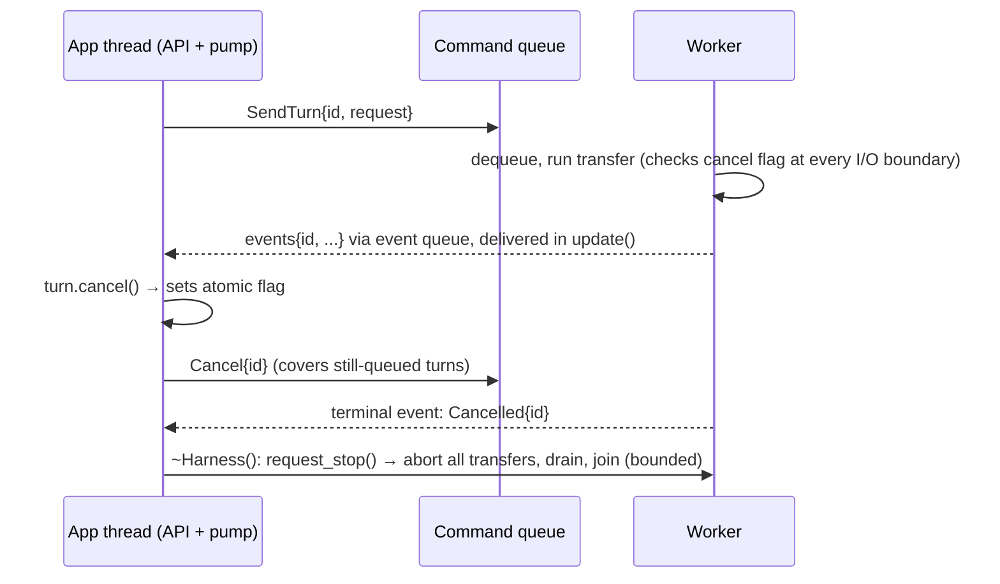

# Architecture: Runtime

## 3. Turn Ownership, Lifecycle, and the Handle Pattern

A `Turn` is a **handle**: a move-only PImpl value holding an immutable `TurnId`, a shared reference to the turn's cancellation flag, and a weak route to pump-side turn state — *not* the worker's turn state itself. It exposes exactly two operations, `id()` and `cancel()`; the callbacks belong to the turn and are supplied to `send()`, so there is nothing to register on the handle afterwards. The weak route makes queued-turn cancellation safe when a Turn outlives its Harness: `cancel()` remains a harmless atomic operation. Copying a handle to in-flight work invites double-cancel ambiguity, hence move-only. This is the `std::future`/`std::stop_source` school: small, thread-safe by narrowness, no behavior hidden in destructors beyond a documented detach.

### Ownership table (implemented invariant)

| State | Exclusive owner | Notes |
|---|---|---|
| Transport handles, curl state, wire buffers, SSE parser state | Worker | Never visible to any other thread |
| Loop state machines (per turn) | Worker | Addressed by `TurnId` |
| Turn callbacks, buffered undelivered events per turn, Turn routes | Pump side (Harness main-thread state) | Callbacks move in at `send()`; read only inside `update()`; handles observe routes weakly |
| Conversation contents | App thread via pump | A live route retains shared lifetime on the pump side; contents are mutated only at terminal-event delivery. `send()` shares the committed-history block immutably with the worker command; the pump reseats it copy-on-write at commit if any request snapshot still shares it. The app reads the same block between `update()` calls through `Conversation::messages()`; the reference is borrowed and not synchronized, so it is valid only until the next `update()` that commits into that Conversation |
| Tool definitions | Pump side; immutable per accepted turn | Worker commands receive a shared registry-level snapshot of neutral schemas, never the live registry |
| Tool handlers | Pump side; immutable per accepted turn | Invoked only by `update()`; never cross the thread boundary |
| Command queue, event queue | Shared, internally synchronized | Sanctioned crossing points |
| Per-turn cancel flag (`atomic<bool>`) | Shared | Third sanctioned crossing point |
| `TurnId` | Immutable value | Freely copied everywhere |

The worker never touches callbacks or buffers; it emits events tagged with `TurnId`. The worker's clock and its retry wait are injected through the internal test seam only, so backoff scheduling can be asserted without real time; the public `Harness::create` always installs the steady clock and the real command-queue wait. The pump owns routing, buffering, and delivery. This split is what makes the shared-state enumeration in the [architecture overview](overview.md) true.

### Send / cancel / shutdown

### Turn lifecycle (normative)

```mermaid
stateDiagram-v2
    [*] --> Queued: send()
    Queued --> AwaitingModel: worker picks up (FIFO)
    Queued --> Cancelled: cancel() before start (no I/O ever issued)
    AwaitingModel --> Streaming: first content event
    AwaitingModel --> Completed
    AwaitingModel --> AwaitingTool: valid tool-use response
    AwaitingModel --> RetryWait: retryable failure before semantic output
    RetryWait --> AwaitingModel: retry wake
    RetryWait --> Failed: retry/elapsed cap reached
    RetryWait --> Cancelled: cancel()
    Streaming --> Completed
    Streaming --> AwaitingTool: valid tool-use response
    AwaitingTool --> AwaitingModel: all ordered results ready; resend
    AwaitingTool --> Failed: framework tool-execution failure
    AwaitingTool --> Cancelled: cancel()
    AwaitingModel --> Failed
    Streaming --> Failed
    AwaitingModel --> Cancelled
    Streaming --> Cancelled
    Completed --> [*]
    Failed --> [*]
    Cancelled --> [*]
```

`AwaitingTool` extends the original chat
states: one valid assistant tool-call batch enters it, every result is retained
in provider order, and the final result starts the next model request
automatically. Tool-round limits and malformed batches fail before handlers are
published. The worker admits every call in one response to the event queue as
one atomic batch, so queue pressure can never expose a dispatchable prefix.
Once the pump observes a fatal framework dispatch failure, it latches that
terminal path and suppresses every later handler in the batch.

The machine also carries the Conversation's remaining payload budget across
the entire exchange. It reserves each assistant tool-call message, each tool
result, and the final assistant message before dispatch, resend, or commit.
Crossing the cumulative bound therefore fails the turn without partially
committing history; resource errors retain the provider request ID that was
available at the failing response boundary.

The pump makes every accepted turn terminal exactly once. Terminal processing
commits or rolls back the Conversation and clears its busy state even when no
terminal observer exists. When `on_finished` is non-empty, it is invoked exactly
once with a `Result<Completion>` holding the completion on success or the
`Error` on failure. Cancellation uses that same result channel with
`ErrorCategory::cancelled`. Harness destruction is the explicit exception:
shutdown aborts work and discards undelivered callbacks, so it does not expose
teardown callbacks. The remaining lifecycle contracts, each of which is a
numbered requirement:

- **Conversation commits are transactional.** History is mutated only by the pump at terminal-event delivery: `Completed` commits the full exchange (user message, all tool rounds, final answer) atomically; `Failed`/`Cancelled` commit nothing. This keeps Conversation retry/resubmission mechanically clean, but does not make external handler side effects reversible or idempotent; side-effecting schemas need app-owned operation keys and reconciliation ([tools design](../design/tools-and-providers.md)).
- **Terminal request release precedes publication.** Every completed, failed, or
  cancelled machine transition drops its immutable model-request snapshot
  before the worker can publish the terminal event. Ordinary completion commit
  therefore appends to uniquely owned history in place; a separately retained
  reader still triggers the pump's COW reseat.
- **Detach semantics.** Dropping the handle detaches: the turn runs to termination, the Conversation still commits on success, and the callbacks supplied at `send()` remain route-owned and deliverable. Dropping loses identity and cancellation control, not callbacks.
- **Atomic callback attachment.** `send()` moves `TurnCallbacks` infallibly into the pump route before it publishes the worker command. No event can precede the immutable callback set, and there is no late registration or replay. An absent callback makes its matching event dead on arrival and returns its bytes to the queue ledger immediately; terminal processing still occurs.
- **Reentrancy.** Callbacks may call `send`, `cancel`, and tool registration APIs.
  Reentrant `update()` performs no work and never recurses into callback
  delivery; it returns immediately, reporting the rejection through
  `UpdateStats::budget_exhausted`. Accepted turns snapshot immutable registry
  records, so later or reentrant changes affect subsequent turns rather than
  in-flight ones.
- **Non-preemption.** The `update()` budget is a soft deadline checked *between* callbacks; an individual callback or tool handler is never preempted and may overrun the budget. The budget bounds Scry's scheduling, not user code. It also never bounds it to nothing: one queued event is ingested and one deliverable callback delivered before the deadline is consulted, so no budget can leave a call with zero progress.
- **Callback exceptions** propagate out of `update()` with the harness valid and
  the event counted delivered, as defined by the
  [library-wide principles](overview.md).
- **Callback ownership follows the signature.** The text-delta view and tool-call reference are borrowed for the invocation only; apps copy data they retain. `on_finished` receives its `Result<Completion>` by value.
- **Shutdown.** `~Harness()` cancels all turns, aborts Scry-owned transport
  waits within their configured bound, joins the worker, and discards
  undelivered events. No callback or tool handler ever fires after destruction begins. Because
  every tool handler runs on the app thread inside `update()`, no application
  code is ever in flight on the worker at teardown, and the shutdown bound
  covers the whole join.

### Conversation persistence

Persistence is a public serialization boundary, not a storage subsystem.
`Conversation::to_json()` emits a canonical versioned document containing the
system prompt and committed neutral messages; `Conversation::from_json()`
strictly validates and restores it. Text, tool-call, and tool-result blocks
round-trip without provider wire shapes or Glaze types. Parsed object keys are
sorted before tool arguments and results enter committed history, so canonical
bytes represent JSON meaning rather than preserving lexical input order. Busy
state, callbacks, turn IDs, registry snapshots, and every uncommitted round are
intentionally excluded. The app owns encryption, files/databases, retention,
and migration between document versions.

**The document format is unstable before 1.0.** The version field exists, but
0.x releases may change the shape or canonical bytes without a migration path:
a document written by one 0.x release is not guaranteed to load in another.
Treat persistence as
session continuity within a pinned Scry version, not an archival format.

## 4. The Agentic Loop: Sans-I/O State Machine

The loop engine — the heart of the library — is written **sans-I/O**: a pure state machine that consumes events (*provider replied with content or a tool call*, *tool result ready*, *stream ended*, *transport failed*) and emits commands (*issue this request*, *run this tool*, *deliver this to the app*), and performs **no I/O itself**. The implemented machine covers chat, retry, cancellation, tool-await, and multi-round completion. The worker thread is a thin driver that feeds it transport events and executes its commands.

Why this is the hill to defend:

- **Testability without a network.** The full agentic loop — multi-round tool use, retries, cancellation mid-tool-call, malformed model output — is tested by feeding event sequences and asserting command sequences. Deterministic, sub-millisecond tests for the most complex logic in the system.
- **Replayability.** A recorded event log reproduces any bug exactly. Given how nondeterministic LLM behavior is, deterministic *harness* behavior is the only debuggable posture.
- **The state machine is explicit, not emergent.** States (queued, awaiting-model, streaming, retry-wait, awaiting-tool, and terminal) are a variant/enum with the transition diagram above, not an implicit property of nested callbacks. An event that is illegal in the current state returns a diagnostic without mutating state or emitting commands, making integration failures observable without relying on debug-only assertions.

Retry policy (backoff + jitter) is machine state driven by *time events*
injected by the driver — the machine never sleeps, it requests "wake me at
T." The driver derives deterministic samples from an independently generated
per-Harness seed, turn ID, and attempt; the internal test seam can inject the
seed without introducing mutable process-global state. Attempt and elapsed caps
reset for each model request, while completion reports aggregate attempts and
usage across the whole tool loop.
