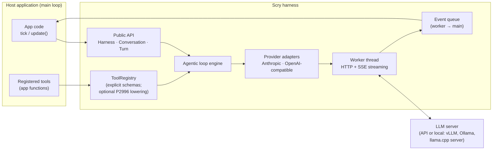
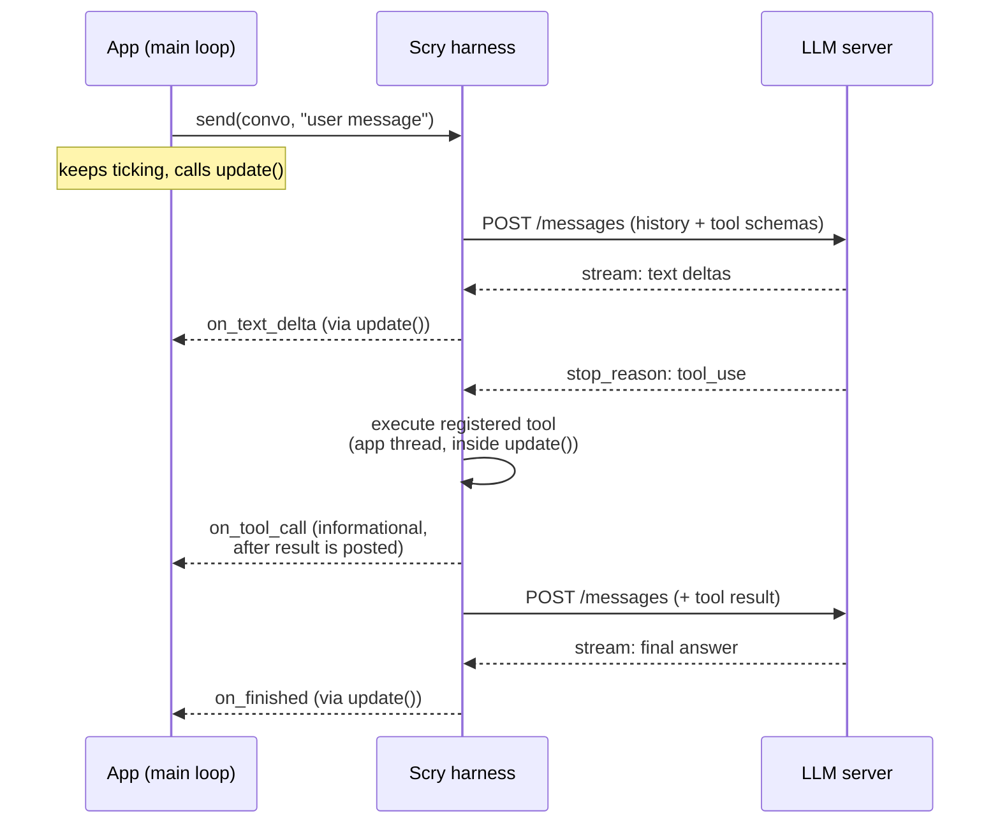

# Design: Public API and Agentic Loop

## 4. Core Concepts (the public surface)

The app touches five core concepts:

| Type | Responsibility |
|------|---------------|
| `scry::Config` | Plain value aggregate: base URL, API key, model, sampling params, reasoning mode, provider dialect. Designated-initializer friendly. |
| `scry::Conversation` | Owns message history (system prompt, user/assistant turns, tool calls/results). Serializable for persistence. |
| `scry::ToolRegistry` | Named tools: description + schema + callable. Owned by a Harness and snapshotted when a turn is accepted. |
| `scry::Turn` | Move-only handle to one in-flight agentic exchange. Exposes `id()` and `cancel()`; the callbacks for the turn are supplied to `send()`. |
| `scry::Harness` | Created from `Config`; owns provider/auth state, the tool registry, worker thread, and event queue. `send()` starts a turn; `update()` pumps completions into the app thread. |

A complete integration looks like this:

```cpp
// Config is a plain aggregate; Harness is the single configured runtime owner.
// Semantic failures are values. Allocation failure remains an ordinary C++ exception.
auto harness = scry::Harness::create(scry::Config{
    .base_url = "https://api.anthropic.com",
    .api_key  = env("API_KEY"),
    .model    = "claude-sonnet-5",
});
if (!harness) { /* invalid configuration, reported as a value */ }

auto conversation = scry::Conversation::create({
    .system_prompt = "Answer briefly and use tools when useful.",
});
if (!conversation) { /* invalid conversation configuration */ }

auto registered = harness->tools().add(
    scry::ToolDefinition{
        .name = "get_application_status",
        .description = "Report whether the host main loop is running",
        .input_schema = {
            .text = R"({"type":"object","properties":{},"additionalProperties":false})",
        },
    },
    [&](scry::Json arguments) -> scry::Result<scry::Json> {
        return app.status(arguments); // validate JSON; return valid JSON
    });
if (!registered) { /* invalid schema, duplicate name, or inactive registry */ }

// Callbacks are part of the send: the turn owns them before it is accepted.
auto turn = harness->send(*conversation, "Is the host application still running?",
    scry::TurnCallbacks{
        .on_text_delta = [&](std::string_view chunk) { ui.append(chunk); },
        .on_finished = [&](scry::Result<scry::Completion> outcome) {
            if (outcome) { ui.show(outcome->text); }
            else { ui.show_error(outcome.error()); }  // includes cancellation
        },
    });
if (!turn) { /* busy, invalid state, or admission/resource limit */ }

// somewhere in the existing main loop:
while (app.running()) {
    harness->update();  // callbacks fire here, on this thread
    app.tick();
}
```

This explicit-schema overload is the implemented C++23 surface. The
[checked-in canonical example](../../examples/main_loop.cpp) registers a read-only
tool through it and drives the complete loop. The optional reflection component
adds `scry::reflection::add<Args>()` schema generation and marshalling as
compile-time sugar over the same registry; it does not introduce a second
dispatch system.

**Conversation persistence.** `Conversation::to_json()` returns a canonical,
versioned Scry-owned JSON document suitable for app-managed storage;
`Conversation::from_json()` validates and restores one. It preserves
the system prompt and every committed neutral text, tool-call, and tool-result
block. Busy state and uncommitted turns are deliberately excluded, so saving
an active Conversation captures its last committed boundary. Scry does no file
I/O and rejects malformed documents, unknown fields or versions, and invalid
role/content combinations with `invalid_config`.

**The document format is unstable before 1.0.** It carries a version field, but
0.x releases may change the shape without a migration path: a document written
by one 0.x release is not guaranteed to load in another. Use it for session
continuity against a pinned Scry version, not as an archival format.

## 5. Architecture Overview



Layering rule: the app only sees the public API; the provider adapter only sees neutral `Message`/`ToolCall` types; only the adapter knows wire formats.

## 6. Interaction Model: the Agentic Loop

The harness owns the loop. The app registers tools and receives a final answer; intermediate tool calls are visible through optional callbacks but require no app participation.



The loop iterates as many times as the model requests tools, bounded by a configurable `max_tool_rounds` to prevent runaways.
