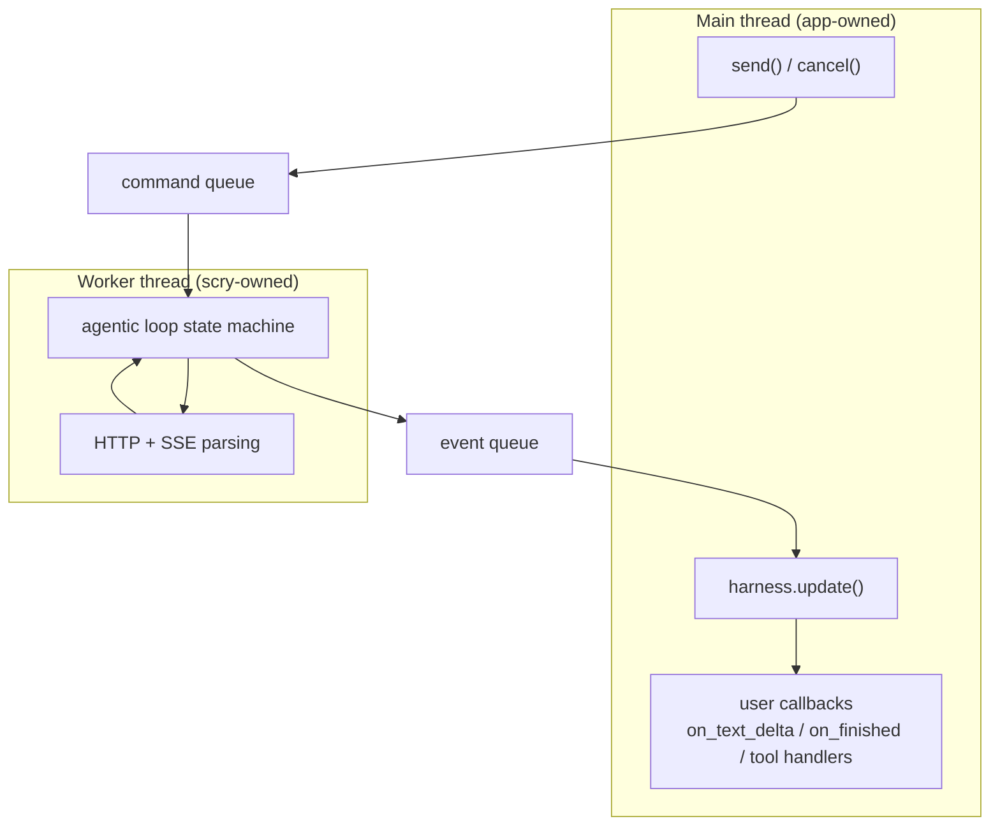

# Design: Runtime Behavior

## 7. Threading Model

One worker thread per `Harness` does all blocking I/O. A lock-free (or mutex-guarded, initially) event queue carries results back. **Every user callback fires inside `update()`, on the thread that calls it.** That is the contract that makes user code lock-free.

**Tool execution policy.** There is one policy: every handler runs on the app
thread, inside `update()`, in provider order. That is the safe mode for
handlers touching host-owned game, GUI, or simulation state, and it is the only
mode — a handler is ordinary app code running on the app's own thread, so there
is no second agent loop, no pool, and no application callable crossing the
worker boundary. The complete provider batch is admitted atomically; `update()`
then walks it, invoking each handler, running the optional `on_tool_call`
observer, and applying the canonical result before admitting the next call.

The cost is explicit: a slow handler spends the host's frame budget, because
Scry never preempts user code. The intended answer is an asynchronous/deferred
tool-result API described in [future directions](roadmap.md), not a hidden
thread executing application callbacks
behind the host's back.

**Callbacks are part of the send.** `Harness::send()` takes a `TurnCallbacks`
aggregate — `on_text_delta`, `on_tool_call`, and the terminal `on_finished` —
and moves it into the turn before acceptance. Every member is optional;
omitting one changes no loop behavior. The immutable callback set is installed
before the worker command becomes visible, so no event can precede that set;
an event with no matching callback is released immediately. The `Turn` handle
needs no registration surface at all: it carries `id()` and `cancel()`.

**One terminal outcome.** The turn becomes terminal exactly once whether or not
it has a terminal observer. When non-empty, `on_finished` is invoked exactly
once and receives a `Result<Completion>` by value — the completion on success,
or the `Error` on failure. Cancellation is not a separate event type: it arrives
on that same channel as an `Error` with category `cancelled`.

**Frame budget.** `update()` accepts an optional time budget; excess events roll to the next tick. The budget is a soft deadline checked between callbacks. Every call still makes one unit of progress — one queued event ingested and, where `max_callbacks` permits, one callback delivered — before the budget is consulted, so a tiny or already-expired budget slows the pump instead of starving it. Scry never preempts user code, so one slow callback or tool handler can overrun it.

**Cancellation.** `Turn::cancel()` sets an atomic flag; the worker aborts the HTTP transfer at the next opportunity, and the turn terminates through `on_finished` with a `cancelled` error. Cancelling a still-queued turn removes it before any I/O is issued. `Turn` handles are safe to drop (detach semantics); dropping does not join, block, or cancel — the callbacks supplied at send still run.

Tool handlers are non-preemptive. Cancellation observed before dispatch skips
the handler. Cancellation requested while one runs takes effect when it
returns: Scry suppresses that result and the remaining calls, does not resend
to the model, and terminates the turn as cancelled. Scry can bound its own
transport shutdown but cannot safely terminate arbitrary C++ user code — which
is exactly why handlers run on the caller's thread, where the host already
governs how long its own code may take.

**Batch and payload atomicity.** All tool calls from one assistant response are
admitted to the worker-to-pump event queue as one batch. If the whole batch
cannot fit, none becomes dispatchable and no handler runs. During pump
dispatch, a fatal framework failure (for example, no remaining space for even
a bounded result) suppresses every later handler in that batch. The
Conversation byte limit is one cumulative exchange budget: assistant tool-call
messages, every tool result, and the final answer are reserved before
dispatch, resend, or commit. It is not a per-message limit.

**Scheduling baseline.** A Harness accepts up to `Config::limits.max_pending_turns`; accepted turns queue FIFO and exactly **one HTTP transfer is active at a time**. Admission beyond that bound fails immediately with `resource_limit`. A second `send()` on a Conversation that already has a turn queued or in flight fails immediately with `busy`. While the active turn awaits a tool result, it retains the serialized turn slot, so queued turns wait (deliberate simplification; its trigger and end state live in the [evolution register](../architecture/quality-and-evolution.md), which moves to curl-multi multiplexing when serialized scheduling measurably limits a real app).

**Registry ownership and snapshots.** A Harness owns exactly one `ToolRegistry`;
there is no Conversation-local or process-global registry. `send()` snapshots
immutable registrations into the accepted turn, so later or reentrant
registration remains safe and affects only subsequently accepted turns. The
public surface cannot move the Harness-owned registry out. Registration appends
to the registry's working list only; after a `send()` passes immediate admission
validation, the first accepted turn following a change freezes one
registry-level immutable snapshot — registrations and neutral schemas as shared
collections — that subsequent accepted turns reuse until the next registration.
Rejected sends neither freeze nor advance a registry generation. The accepted
turn shares those collections with its model requests instead of copying them.
Handlers stay pump-owned and never cross the thread boundary.
Explicit schemas are parsed when registered, must be JSON objects, and are
stored canonically.

**Runtime configuration defaults.** Limits count payload bytes (not allocator
overhead); implementations may reject earlier when a provider's own limit is
lower. These defaults are conservative starting points and remain configurable:

| Setting | Default |
|---|---:|
| Pending turns per Harness | 64 |
| SSE event | 256 KiB |
| Response | 8 MiB |
| Tool arguments | 1 MiB |
| Tool result | 4 MiB |
| Queued event payload per turn | 2 MiB |
| Conversation payload | 16 MiB |
| Tool rounds | 8 |
| Default maximum output tokens | 1024 |
| Retry attempts / elapsed time | 3 / 30 s |
| Retry initial / maximum backoff | 250 ms / 10 s |
| Connect / idle / shutdown timeout | 10 s / 120 s / 2 s |
| Total transfer timeout | unset |

TLS peer verification defaults on. The runtime uses Curl with asynchronous DNS
and applies Curl's connect timeout, which covers name resolution and
connection. The idle timeout is the default liveness bound: it fails a response
that stays silent for that long, including while waiting for the first byte, so
a slow local model is limited by silence rather than by total duration. The
total transfer timeout is optional and unset by default, for hosts that want a
hard cap on one transfer. Each multi-poll wait is capped by the shutdown
timeout. A runtime that cannot provide the required resolver/global
capabilities is rejected. Deterministic tests cover held transfers, cancellation,
and capability rejection; the idle bound is exercised against a held loopback
response, while connect and total bounds remain source-reviewed.
